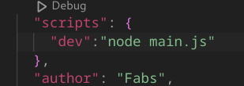
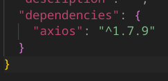
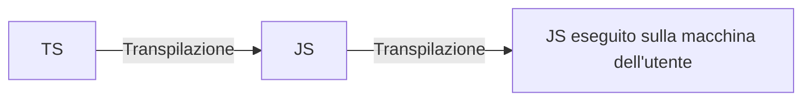
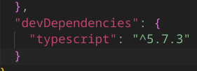
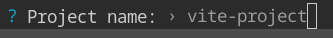
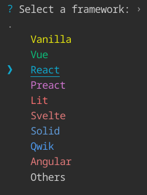
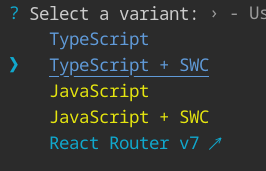
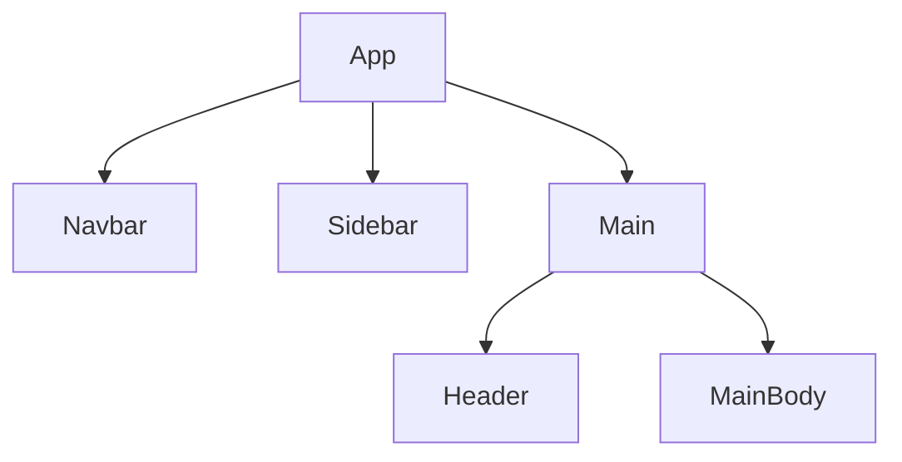
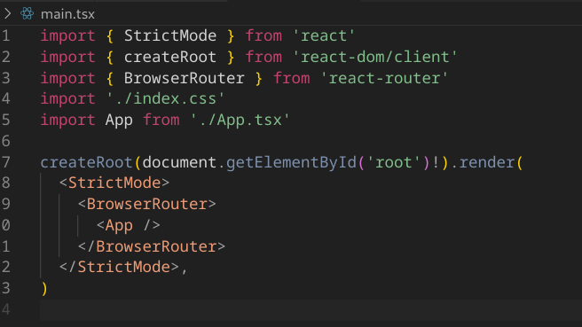
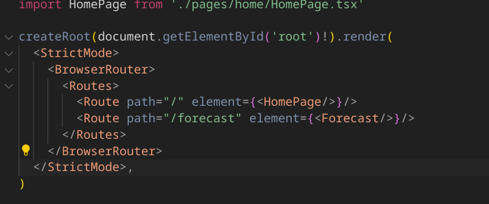

# Lezione 2

Contatto: `marco.raffaello@edalab.it`

Progetto:

- In uni: piu semplice e timeline flessibile ma Edalab/Marco non ti danno nessun aiuto.  Zero supporto. Comunque possiamo arrivare al 30.
- Edalab: danno una mano ma tabella rigida e molto più complesso (hanno una timeline industriale) ma "è maggiormente formativa!!!!!1!!!"
- Altrimenti possiamo presentare un progetto di nostra idea! (imgonnadothis!!!!)

## Costrutti utili di JS

Documentazione: MDN Web Docs

### Spread

```javascript
const ciao = ["a","b","c"]
ciao2 = [...ciao "d"]

>> ciao2 = ["a","b","c","d"]

```

### For each

Prende:

* Funzione anonima dentro
* Arrow function
* Funzione dichiarata fuori

😀

### Array

1. `.map`: partendo da un array crea un array equivalente al quale applica una funzione di trasformazione.
2. `.filter`: vediamo se indivini che fa :')
3. `.find`: dato un elemento ritorna l'indice del primo elemento per cui la funzione passata ritorna tru. or smth.
   Se l'elemento non viene trovato ritorna `undefined`.
4. `.findindex`: ritorna l'indice del primo elemento trovato che soddisfa. or smth. Se non lo trova, ritorna `-1`.

### Comparazioni

```javascript
const user1 = {
  id:1,
  username:"Marco"
}

const user2 = {
  id:1,
  username:"Marco"
}

console.log(user1===user2) // False
console.log(user1==user2) // False
```

**!!! Ritorna false in entrambi i casi !!!**

* Nel primo perché non è lo stesso oggetto
* Nel secondo perché comunque **l'equal non è in grado di confrontare tipi complessi**.

Se avessi comparato due stringhe const, avrebbe dato `true` in entrambi i casi.

## Node.js

> "Insomma ha fatto Deno per sistemare tutto quel che aveva fatto di sbagliato in Node. Vi faccio notare che Deno è un anagramma di Node. Praticamente è una presa per il culo."

>  "WSL non è magia, è emulazione. Emulazione fatta male tra l'altro"

Usiamo `nvm` per installare facilmente più versioni di Node. Lui usa la 20 che è una versione più vecchiotta per motivi di stabilità.

1. Installiamo nvm con il comando

   ```bash
   curl -o- https://raw.githubusercontent.com/nvm-sh/nvm/v0.40.1/install.sh | bash
   ```
 Riavviamo la bash e con il comando `nvm` verifichiamo che l'installazione è andata a buon fine.

2. Per installare una versione di node, `nvm install 20.18.1`

3. Per attivarla facciamo `nvm use 20`.

4. Per salvare che questa è quella attivata sempre, facciamo `nvm alias default 20.18.1`

> Prendo il silenzio come nessuno sa cosa sia VSCode, che è terrificante". Non è un IDE ma è un editor (cosa?).

Ora vediamo come creare un progetto vero e proprio!!!!!!!!!!!!!! 😁

C'è un file package.json che è il manifesto dell'applicazione. Possiamo scriverlo a mano oppure anche generarlo con `npm init`. `npm` è il package manager di JS.

>  "Se qualcuno di voi ha sviluppato in android nativo, prima di tutto condoglianze."

> "npm è proprio terribile, è proprio il peggiore. Non so se vale la pena vedere qualcosa di migliore."

La sezione script contiene degli *alias*. Solitamente contiene almeno una sezione "dev", che è lo script che lanciamo la mattina per metterci in dev; spesso c'è anche prod… ma sono alias nostri per il team che possono avere qualunque nome.

Usando per esempio `npm run dev`,  viene eseguito proprio quello che abbiamo scritto nel manifest:



## Gestione dei pacchetti

Mettiamo di voler installare Axios (client per fare chiamate API). Installiamo con npm install axios. 

> "Se hai bower… licenziati, non dovresti usare bower, è più vecchio di alcuni di noi."



In automatico, nel package.json viene inserita una entry relativa al progetto. 

> [!TIP]  
>
> Nota: versioning semantico. Data una versione `A.B.C`, ogni numero ha un significato:
>
> * `A`: Major
> * `B`: Minor
> * `C`: Patch

Per ogni dipendenza, mettiamo vicino alla versione un simbolo per indicare se/quando aggiornare:

* **Cappellino**: se esce una nuova patch o minor, installala.
* **Niente**: non la aggiorna
* **Tilde**: aggiorna solo le patch

Nel `package-lock.json` vengono salvati i risultati della computazione delle dipendenze.

# Lezione 3

## Destructuring again

Posso assegnare più cose assieme partendo da un oggetto

```js
const user = {
  name:"Marco",
  age:26
}
const {age,name} = user;
```

E posso anche farlo a livelli superiori di annidamento

```js
const user = {
  name:"Marco",
  age:26,
  address: {
    street:"Via roma",
    number:1
  } 
}

const {age,name,address} = user
```

No scherzone non ce lo fa vedere. vabbè. Posso seguire la stessa filosofia con gli array

```js
const fruits = ['apple','ananas','banana'];

const [pippo, ananas] = fruits;

console.log("First element",pippo) // apple, sto selezionando il primo valore
```

E' esattamente quello che si applica quando si fa esportano cose da un file all'altro:

```js
// Utils.js
module.exports = {
  multiply: multiply,
  divide:divide
}

// Main.js
const {multiply, divide} = require('./utils.js')
```

Questo `module.exports` non si usa più; si usa una sua variante più semplice; ci basta aggiungere la keyword export davanti alla funzione 😁

```js
// Utils.js
export function multiply(){
  ...
}
export function divide(){
  ...
}
  
// Main.js
import {multiply, divide} from './utils.js'
  
```

Se facciamo con il nuovo metodo, si lamenta perché dobbiamo dichiarare nel `package.json` che lo stiamo dichiarando! Quindi ci basta aggiungere

```js
type:"module"
```

(mentre il default è `type:commonjs`  or smth)

L'export named corrisponde a scrivere:

```js
export default{
  multiply,
  divide
}
```

Questo che stiamo usando è il `name export`. in alternativa possiao usare il `default export` 

```js
//Utils
function multiply(){
}
export default multiply
                
// Main
import multiply from './utils.js'
```

Noi usiamo il named perché funziona meglio con i tipi.

## Typescript

VIVA LA TYPE SAFETYYYYYYYY

Più o meno... TS ci dà l'illusione della  *type safety* ma non lo è, nè tantomeno è *memory safe*.

Java e C controllano i tipi a tempo di compilazione, ma JS non è compilato. Con TS, il procedimento è:




Possiamo quindi vedere il typescript come dei commenti colorati 🙂 E' una nota per noi, non è una sicurazza.

### Tipi

Molto figo perché così se mi mancano cose o ci sono errori di tipaggio mi dà errore staticamente subbito, senza eseguire. 😀 Di default abbiamo i seguenti tipi:

```ts
let n : number = 3; //In JS abbiamo solo numbers, praticamente sono solo float. 
let s : string = "Marco"
let f : boolean = true
// In realtà qui potremmo anche levare i tipi,
// perché può fare inferenza da solo 😎
```

In genere è sempre meglio farsi inferire i tipi automaticamente.

```ts
const fruits : [string] = ['apple'] const fruits : [string,number] = ['apple',3] //array con un solo elemento, che è una stringa
const fruits : string[] = ['a','b']
// array di stringhe
```

La prima notazione è detta una tupla, ovvero un array che ha una lunghezza predefinita.

Yippy, fine di questa sezione.

#### Tipi custom

In teoria andrebbe fatto nel seguente modo:

```ts
const user : {
  firstName:String,
  lastName:String,
  age:number
} = {
  firstname:"Marco",
  lastName:"Raffaello",
  age:26
}
```

Fortunatamente possiamo dichiarare i tipi fuori, per farlo cagare di meno! 🎊

```ts
type User = {
  firstName:String,
  lastName:String,
  age:number  
}
const user : User = {
  firstname:"Marco",
  lastName:"Raffaello",
  age:26 
}
```

#### Proprietà opzionale

È sufficiente dichiarare un campo nell'oggetto ma come di tipo `undefined`. 

#### Interfacce

Ci sono le interfacce, come in Java. Dichiarare un tipo come *type* o come *interface* è sostanzialmente equivalente.

#### Unioni e intersezioni di tipi

Se una variabile può essere uno di due tipi tocca dichiararlo, non può inferenzarlo da solo :) Si fa nel seguente modo:

```ts
type StringOrNumber = string | number;
let x : string | number = 3;
```

La cosa più comune è roba tipo 

```ts
let address : string | undefined = undefined
```

Invece per quanto riguarda le unioni, le definiamo nel seguente modo e sono sostanzialmente un modo piacevolmente contorto di definire sottotipi:

```ts
type Dog : Animal & {

//nuove cose. basically stiamo definendo un sottotipo…

}
```

#### Enum

Molto controversi. A lui piace scriverli maiuscoli

```ts
enum ROLE_TYPE = {
  ADMIN = "ADMIN",
  USER = "USER"
} // se non diamo un valore di default prendono i numeri 0-n-1.

const userType = ROLE_TYPE.USER
```

#### Tipi funzione

Vabbè per me che ho fatto FLIPS sono banali lol

```ts
const multiply (a:number,b:number) => number = (a:umber,b:number)=>{return a*b;
}
```

### Tipi costanti

Possiamo dare come tipo anche una stringa o whatever cosa costante.

```ts
const color : "red" | "blue" | "green"
```

## Librerie

le troviamo su NPM, e anche altri gestori di pacchetti comunque le scaricano da npm.

Nella pagina di ciascuna libreria abbiamo dei simboli importanti:

* ==TS==: typescript supportato
* ==DT==: la libreria è scritta in JS, ma è stato pubblicato un pacchetto terzo adattatore che dichiara i tipi di TS.

## Creazione manuale di un progetto

- I sorgenti vanno in una cartella `src`
- `index.ts` perchè siamo in ts :)

Dobbiamo inizializzare il progetto a typescript e non JS; si fa con il programma `TSC` che si installa con `npm install typescript`

Nello specifico, poiché TS è una dipendenza esclusivamente per lo sviluppatore, usiamo il comando

```bash 
npm install --save-dev typescript
```

Questo fa si che non viene più inserito nelle dependences ma nelle devDependencias 👍



TSC ci mette a disposizione anche una CLI.

Se proviamo ad avviare TSC (cli) con `tsc –init`, dà errore; questo è perché lo abbiamo installato solo in questa cartella. Per usare un comando da CLI di uno dei nostri pacchetti dobbiamo preporre npx:

```bash
npx tsc --init
```

...che serve a interagire ad esempio con la CLI di una dipendenza.

In alternativa, se installiamo il pacchetto globalmente possiamo evitarci il `npx`; si fa con il comando

```bash
npm install -g typescript
```

(...ma meglio non farlo che si fa casino.)

Fare il comando `tsc --init` crea un file di configurazione `tsconfig.json`. Alcuni punti utili:

* E' un po' brutto avere i file JS in mezzo ai coglioni, quindi di solito vengono buttati in una cartella `build` o `dist`. Per farlo in tsconfig cambiamo l'opzione
  ```bash
  "outDir":"./dist"
  ```

A questo punto, per eseguire, posso avviare il JS con il comando

```bash 
node dist/index.js
```

Ovviamente tutti questi passaggi possono essere fatti in automatico 😄Possiamo usare il tool `tsx`! Installiamola chiaramente come `devDependency`, dato che serve solo a noi sviluppatori.

```bash
 npm install --save-dev tsx
```

e poi la usiamo con

```bash
npx tsx src/index.ts
```

E giusto per renderlo ancora più figo, c'è l'hot reload; le modifiche sono caricate subito senza dover rieseguire e ricompilare tutto.

Per farlo, ci basta avviare il progetto con 

```bash
npx tsx --watch src/index.ts
```

# Lezione 4

Stavo guardando Hacker News mentre sta rispiegando HTML che già so e ho trovato questo interessante articolo: [Moving on from React](https://kellysutton.com/2025/01/18/moving-on-from-react-a-year-later.html). Beeeene.

## REACT FUCKING FINALLY!!!!

Attenzione: facendo ricerche online potremmo finire in [legacy.reactjs.org](legacy.reactjs.org). DA EVITARE COME LA PESTE!

> La Xbox è fatta in React, pazzurdo.

React non è un vero framework; da sola non può renderizzare nulla. E' solo una libreria che permette di definire componenti in un certo modo; è una sorta di motore senza alcuna applicazione integrata. Per renderizzare dovremo usare il pacchetto di npm "react-dom", che ci permette di renderizzare su un browser quello che noi facciamo in React.

### Inizializzare un progetto

Ovviamente ci riferiamo alla relativa [guida ufficiale dalla documentazione](https://react.dev/learn/installation).

Sopra React ci sono numerosi framework, come NextJS, Remix, Gatsby che è morto, Expo (per applicazioni native). Ognuno di questi ci fa creare un bel  progetto presetuppato.

Spesso per spiegare React usano direttamente Next; let's not do that, Next è abbastanza complicato. 

Next è gestito da una compagnia, vercel, che vuole ovviamente i nostri soldi quindi lo fanno passare per semplice...

Possiamo usare React senza framework; le vecchie documentazioni fanno usare `create-react-app` ma è un progetto abbandonato, quindi non facciamolo.

Tutto il mondo ormai usa `vite`. Senza andare nel dettaglio, è un set di strumenti che ci fa fare labuild, avere un server... insomma, il contorno che a React manca.

Partiamo con con `npm create vite@latest`.

1. Diamo un nome
   

2. Scegliamo React
   

3. Scegliamo SWC+Typescript perché "Il Javascript lo lasciamo alle scimmie" 

   

4. Fatto! Possiamo aprire la cartella in code con `code .`

#### Struttura dei file autogenerati

Abbiamo una marea di file di configurazione 🫠

`index.html` è l'entrypoint dell'applicazione.

Inizialmente ci darà errori; dobbiamo dare il comando `npm install`.

Il package jason ha dentro le dipendenze:

- `react`: libreria di rendering

- `react-dom`: prendere la roba e metterla sul browser.

- `devDependencies`: tutte librerie terze che servono a compilare, non ce ne preoccupiamo

- `script`: ricordiamo che sono semplici alias!

  - `"dev":"vite"`
  - `"build":"tsc -b && vite build"`
  - `"lint":"eslint ."`. Ha a che fare col file eslint, che per ora saltiamo
  - `"preview":"vite preview"`. Per ora saltiamo

  Per avviarli facciamo sempre `npm run <script>`.

Avviando la dev, ci butta un bel server su `http://localhost:5173/`.

index.html è l'unico file html che vedremo in tutto il progetto. In questo file c'è un `div` con `id=root`, e uno script `main.tsx`; questo si occuperàdi renedrizzare tutto quello che facciamo in React in HTML.

L'estensione dei file è tsx, non ts.

React si basa sul modello dei componenti riutilizzabili.




La funzione render renderizzerà App, che è un'unica radice, la quale poi renderizzerà a cascata i figli.

Nei file .tsx una larga parte del componente è data da un HTML sotto steroidi, che è un file .jsx.

> io: è HTML sotto steroidi MR: sì, la definizione è praticamente perfetta

In questo HTML abbiamo le graffe, che sono una sorta di template engine nel quale possiamo iniettare dei pezzi di JS.

Ciascun componente è una funzione che ritorna il componente in JSX. In React tutto è una funzione, incluso il componente stesso.

Di solito in uni si usa MVC, ovvero un'architettura in cui si separa interfaccia, modello dei dati e controller. Qui invece è l'esatto contrario; abbiamo una sola funzione che definisce logica, dati, tutto. React vuole dei componenti unici e più piccoli possibili.


Anche qui abbiamo l'hot reload.

React, sostanzialmente, funziona in questo modo:

<div style="text-align:center">ui = f(state)<br>L'interfaccia è una funzione dello stato.</div>

```tsx
import{ useState } from 'react'
//...
function App(){
  const [count,setCount] = useState(0)
  return //...
}
```

C'è una particolare funzione che si chiama useState e viene importata da React, essendone una primitiva.

Ci permette di definire lo stato di un componente.

Un componente può essere:

* stateless: molto raro..... è un componente che non ha uno stato interno.

* stateful: uso useState.
  Perchè dovrei usare quella e non piazzare un bel `let count = 0`?
  Beh, è codice valido ma non funziona un cazzo. Questo è perché il costrutto useState è un hook di React. Ci sono vari *hook*.

  * Il valore che passiamo è il valore iniziale della variabile che sto mandando.

  * useState ci ritorna il valore attuale della variabile in memoria e la funzione necessaria a modificarlo.
    In react, quando andiamo a modificare una variabile andiamo SEMPRE a modificarla e ricrearla; quando un count ad esempio viene aumentato, sto buttando via il precedente e creandone uno nuovo.

    O meglio. Internamente, butta via tutta la return del componente e la ricalcola; lo fa perchè essendo cambiato lo stato, riesegue la funzione per aggiornare la UI.
    Questo causa a cascata il ricalcolo di tutte le foglie. ==> GLI STATI VANNO TENUTI PIÙ IN BASSO POSSIBILE :')
    
    
    
    
    
    
    
    

# Lezione 5


Quindi ogni volta che voglio aggiungere  e rimuovere qualcosa a un array...

```js
// users.push({id:0,username:'mBianchi'}) NO!!!!

// Aggiungere:
const newUsers=[
  ...users,
  {id:2, username:mBianchi} //Shiiiii
]

//Togliere: uso filter

```

## Mostrare una lista

Usiamo `map`!!!

```jsx
<div>
	{
    users.map(user => {
      return(  // praticamente li concatena da solo?
      <div>
      	{user.id} {user.username} 
      </div>)
    })
  }
</div>
```

Lui si rende conto che usando questa funzione map abbiamo creato una lista di elementi. per le sue logiche interne, ha bisogno che ogni elemento abbia una chiave univoca.

Semplicemente, per ognuno degli elementi che generiamo dobbiamo adre una funzione key

```jsx
<div key={user.id}>
 <!--   ....   !-->
</div>
```

## Rimuovere elemento da lista

```jsx
<button onClick={() => {
    const newUsers = usres.filter(
      user => {return user.username !== 'mRaffaello'}
    ) //quelli a TRUE LI TIENE!!!!
  }}
  Remove mRaffaello user
  </button>
```

## Mostrare un componente custom

Mettiamo il tag col nome del componente, es. `<Test/>`

## Nota

fa cagare vedere le funzioni in mezzo all'interfaccia; meglio metterla fuori dalle balle, sopra la return del componente

```jsx
function funzione(){
  ...
}

return <button onClick={fuzione}></button>
```

Questo è vantaggioso anche in termine di performance! Definendo una funzione inline, quando rirenderizziamo il componente lo spazio in memoria viene riallocato.perché la funzione vecchia verrebbe distrutta insimee al componente "vecchio" e ridichiarata.

## Inseriamo un input

Innanzitutto ci serve un input.  Poi ci serve uno stato in react dov tenere quel che scrivo. Per salvarlo quindi ci servono delle proprietà di input:

-  `value={}`
- `onChange={}`

```jsx
function Test(){
  // State
	const [userInputValue, setUserInputValue] = useState('');
  const [users, setUsers] = useState([
    {id:0,username:'mRaffaello'}, // Se vedete qualcosa di diverso scappate vuol dire che dovrebbero vendere la frutta. La vendevo anche io la frutta eh, non c'è niente di male
    {id:1,username:'gBianchi'}
  ])
  
  //Methods
  const addUser = () => {
    let maxId = 0;
    for (const user of users){
      if (users.id > maxId)
        maxId = user.id
    }
      
    const newUsers = [
      ...users,
      {id:, username:userInputValue}
    ]
    
    //Pulire il campo!
    setUserInputValue("")    
  }
  
  const removeUser = () => {
    const newUsers = users.filter(user => {
      return user.username !== 'mRaffaello'
    })
    setUsers(newUsers)
  }
  
  
return (
  <input value={userInputValue} onChange={ e => {setUserInputValue(e.target.value)}} />
<!-- input controllato: è il modo più facile di prendere input. E' un input a due vie.  !-->)
}

```

Attenzione che se si modificano cose con onchange, la seconda modifica non vede il risultato aggiornato.

## Memo

E' sempre meglio usare meno stati possibili. Es. se ho un double count e un count, quindi la prima è totalmente derivabile. Si chiama quindi stato derivato/computato. Questa roba è meglio tenerla in const normali, senza stato.

Solitamente questi stati in react si chiamano `memo`. E' un altro *hook*, `useMemo`, che viene usato di solito per getire questa roba.

  Prende come parametro una funzione, ovvero la funzione che vogliamo fare, e il risultato viene tornato. 

 Come secondo parametro prende un array "dependency list"

```jsx 
const doubleCount = useMemo(()=>{ return count+2},[count])
```

Il comodo di usare questa cosa, è che nel caso in cui io abbia più stati il memo viene modificato SOLO SE una delle sue dipendenze viene modificata, e non se viene modificato qualunque altro punto dello stato.

> Questo è react 18. Noi siamo alla versione 19 di react. Se dio vuole, ce l'abbiamo fatta.

> [!WARNING]
>
> in modalità dev i componenti sono renderizzati twice la prima volta. Non ci dice il perchè ma c'è un perché.

> Io sono qui per portarvi in edalab, del progetto base mi interessa relativamente. Dico che mi interessa relativamente per essere elegante.

## Componenti figli

INIZIAMO COSE SERIE ALEEEE OOOOO ALEEEE OOOOOOO

- Al posto di class usiamo classname come proprietà dei tag HTML.
- I tag singoli si chiamano "self closing tag"
- Per importare usiamo l'intellisense ihihi


> Float lo usava vostro nonno, lasciamolo riposare. Nel 2025 si usano flex e grid.


```jsx
import './Navbar.css'


const navbarElements = [
    {label: 'Home', href:'/'},
    {label: 'Projects', href:'/projects'},
    {label: 'Contacts', href:'/contacts'},
]

function Navbar(){


//Render

return (
    <nav className="navbar">
        <ul>
        {
            navbarElements.map(element =>{
                return(
                    <li key={element.href}>
                        <a href={element.href}>{element.label}</a>
                    </li>
                )
            })
        }
        </ul>
    </nav>
)
}

export default Navbar
```

Facciamone una versione dove gli elementi sono componenti, e dove l'itemino della navbar deve avere come input l'href a cui puntare e qual è la label da mostrare. Per fare questo introduciamo il concetto di props.

le props vanno dichiarate come tipo. Una convenzione di react dice che il primo elemento, anche sottointeso,, è sempre props!

Per passare i props semplicimente i tipi definiti dentro l'oggetto tipo di props è quello che dobbiamo passare come elemento.


Possiamo passare un componente come "`prop`"! C'è un prop speciale che si chiama children. 

# Mi ha cancellato le note della lezione 6, che culo!

recupera,,,

# Lezione 7

Finalmente scopriamo perché vedo tutto bianco!!!!

Basta fare attenzione ad aprire la cartella giusta in vscode.

A me rimane tutto rotto ma vabè. 

Oggi iniziamo finalmente l'app!

Partiamo dalla specifica.

## Specifica

Due pagine.

1. Prima magina: campo di testo dove mettiamo la località, premiamo invio, ci porta alla II pagina.
   poi aggiungiamo opzioni tipo selezionare quali metriche mostrare, unità di misura...
2. Vediamo le previsioni della città

Per avere i dati delle previsioni usiamo API e Axios.

Normalmente dopo la specifica si fa la prototipazione su figma. 


## Lesfucking gooo

- npm create vite#latest
- entra nella cartella, npm install
- facciamo pulizia di tutto. leviamo tutto da index.css, App ritorniamo un div vuoto


1. Inizializziamo react router. Il modo migliore che non ci fa mai sbagliare è guardare la documentazione :P
   1. npm install react-router
   2. wrappiamo l'app con BrowserRouter
      
   3. dichiariamo le rotte (ci facciamo la cartellina pages)
      
2. I nostri codici daranno cagare; quindi usiamo una bella cosina che sistema per noi. Il formatter più famoso è Prettier, npm install --save-dev --save-exact prettier lo mettiamo in dev dato che serve solo a noi dev. installiamo anche l'estensione vs code.


diamo un po' di spazio che qui è tutto claustrofobico


# Lezione 8


* Useref è una variabile che manteniamo nel componente ma che non causa un rerender della pagina. Praticamente equivale a una normale variabile.
* Usiamo i tipi generici con getState<etc> oppure con axios con 
* .get<tipo>(....

> Dovreste essere familiari con il conceddo di dominio... demoni delle superiori

Perchè vogliamo avere tipi separati per il mio tipo e per quello della API?
Perchè è il server della API ad essere in controllo. Domani potrebbero cambiarlo, e mi troverei inculato con un tipo di data che fa cagare e che non è nemmeno più utile per la mia applicazione.

Facendo entrare il dominio di un'applicazione esterna nel dominio della mia applicazione, 

> Dovete pensare alle applicazioni come una guerra, una linea che divide noi da loro (server). Quello che sta dalla  nostra parte va bene, am quello che arriva non è safe e va sempre validato. Quinid in pratica prendiamo il dominio, lo validiamo (a meno che è un'app del pokedex, non molto critica..)


> dopo questo pippone molto veloce... metto a caricare il computer.


Ci serve quindi una funzioen di trasformazione; meglio farne un metodo fuori dalla UI.


https://transform.tools/json-to-typescript

> La documentazione potrebbe dire che passare prop fra fratelli è una bbuona cosa, ma non è vero è una cosa terribile.
>
> 


per passare parametri, usiamo usenavigate le cui options ci permettono di passare dati dal link :)

Il problema di questo è che nella specifica vogliamo che andando a caso sulla pagina di forecast dobbiamo "trovarci" l'ultima cosa salvata. Quindi bocciatooooh

Quindi quel che facciamo è usare la barra degli indirizzi come se fosse lo stato della nostra applicazione.

facciamo `/forecast?latitude=...`


per leggere le query params ci sono delle primitive direttamente di javascript, ma possiamo usare la nostra libreria di routing

https://api.reactrouter.com/v7/functions/react_router.useSearchParams.html

è un hook custom che ci fa accedere a queste cose.


 

per fare la conversione latitude-longitude si usano dei servizi di geocoding; le migliori sono google e dovrebbero essercene abbastanza gratis.

se non vogliamo usare google possiamo usare semore open-meteo nella parte di geocoding.