# Azienda 2030 - 1: Cos'è lo sviluppo sostenibile

> [!TIP]   
>
> *Lo sai che le imprese che stanno avendo una maggiore crescita sono quelle che hanno avviato un percorso di trasformazione verso lo sviluppo sostenibile?*
>
> Le imprese che hanno scelto la sostenibilita come criterio guida hanno un **vantaggio** in termini di **produttivita** molto significativo rispetto alle imprese classiche: uno studio dell’Harvard Business School rappresenta l'evoluzione nel tempo di un dollaro investito nel 1992 in un paniere di aziende contraddistinte da un numero superiore alla media di politiche e iniziative di sostenibilità con quello di società di intensità inferiore. 

Come vedi dal grafico, le aziende che hanno maturato una robusta cultura della sostenibilità registrano nel tempo performance migliori. Improntare il proprio modello di business alla sostenibilità determina **miglioramento della reputazione**, **attrazione di nuova clientela** e maggiore motivazione e **soddisfazione del personale**. Può facilitare il reperimento di risorse finanziarie, aiutare le aziende a identificare ulteriori opportunità di innovazione e a mitigare i rischi associati alle crisi geopolitiche, alla volatilità dei costi delle  materie prime e alla scarsità delle risorse. Può ridurre i costi di produzione e operativi con un minor consumo di energia e di risorse. Questo corso ha lo scopo di introdurre il tema  ello sviluppo sostenibile e il ruolo centrale ricoperto dalle imprese per la transizione verso un nuovo modello di sviluppo.

In particolare, 

* in questo modulo forniremo alcuni elementi per capire **cos'è lo sviluppo sostenibile** e come sta trasformando l'economia e il business.
* Nel secondo modulo, approfondiremo le **opportunità della trasformazione delle imprese** verso la sostenibilità.
* Nel terzo, vedremo quali sono i **nuovi modelli di produzione, consumo e offerta** di beni e servizi a cui far riferimento permettere in atto la trasformazione sostenibile.
* Infine, nel quarto modulo, indicheremo il **cammino da seguire per avviare il cambiamento**, evidenziando i fattori critici di successo della trasformazione verso un nuovo modello sostenibile. 

Buona partecipazione!

---

## La sostenibilità in economia

>  [!TIP]  
>
> Perché la sostenibilità è fondamentale per l'economia e per il business?

 Ogni anno il World Economic Forum pubblica un report sui rischi globali. Da molti anni i rischi ambientali (quali i cambiamenti climatici) vengono evidenziati come i maggiori rischi globali per l'economia. Ciò dimostra che **il perseguimento degli obiettivi ambientali è essenziale per la nostra stabilità economico- finanziaria.** Gli stessi fattori e rischi sociali (quali aumento della povertà e delle diseguaglianze, le migrazioni involontarie) e  eopolitici sono collegati in maniera sistemica a quelli ambientali ed economico-finanziari. 

Con ciò riconosciamo anche che “**Il Business non può vincere in società che falliscono**”.

Come avremo modo di approfondire nel seguito, la trasformazione sostenibile aiuta le imprese: 

*  **a rispondere a una domanda di mercato non ancora soddisfatta** e crescente;

*  ad essere lungimiranti **prevenendo i rischi economici** futuri;

*  a **prepararsi alle modifiche normative** in corso.

Per garantire la continuità del proprio business e in quanto forza di trasformazione di cambiamento positivo, le imprese dovranno necessariamente attuare una trasformazione che persegua in maniera integrata **obiettivi di profitto**, **tutela dell'ambiente** e dei **diritti umani** in ogni aspetto delle loro attività, comprendendone le interdipendenze.

Consulta l'approfondimento per saperne di più.

> ### Approfondimento
>
> “Il Business non può vincere in società che falliscono” e Investire negli Obiettivi di sviluppo  sostenibile (SDGs) vuol dire supportare i pilastri del successo. L'implementazione degli SDGs contribuirà a:
>
> * **liberare milioni di persone dalla povertà**, così incrementando il mercato mondiale dei consumatori;
>
> * **rafforzare l'educazione**, così favorendo che la forza lavoro sia più preparata e impegnata;
>
> * far **progredire l'uguaglianza di genere** e l'empowerment delle donne, così creando un “mercato emergente virtuale” equivalente alla dimensione e al potere d'acquisto della Cina e dell'India;
>
> * assicurare che l'economia globale operi **in sicurezza nel rispetto della capacità del pianeta di fornire le risorse essenziali**, quali acqua, suolo fertile, metalli e minerali, così  sostenendo le risorse naturali da cui le imprese dipendono per la produzione;
>
> * sostenere le istituzioni ben governate e responsabili così come **sistemi di scambio commerciale e finanziario aperti e ben regolati**, riducendo costi e rischi per le imprese.
>
> *Fonte: GRI, UN Global Compact, wbcsd - SDG Compass, The Guide for Business Action on the SDGs - 2015*

## L'economia della ciambella

### Cos'è?

**Un'azienda prospera se anche il contesto in cui è inserita prospera**: per cui, è interesse dell'impresa fare in modo che l'ambiente in cui opera sia sano.

Perseguire uno sviluppo sostenibile è fondamentale per consentire a tutta l'umanità di soddisfare i propri bisogni quali cibo, acqua, assistenza sanitaria ed energia. Allo stesso tempo, però, lo  sfruttamento delle risorse naturali da parte dell'uomo non deve mettere in pericolo i processi del sistema Terra, causando per esempio cambiamenti climatici o perdite della biodiversità.

* La **base sociale** forma un **confine interno**, sotto il quale ci sono le dimensioni della privazione umana. 
* Il **limite massimo ambientale** forma un **confine esterno**. oltre il quale ci avviamo al disatro ambientale.

Tra i due confini si trova un'area - a forma di ciambella - che rappresenta uno **spazio ecologicamente sicuro e socialmente equo** dove l'umanità può prosperare. E anche lo spazio in cui ha luogo uno sviluppo economico inclusivo e sostenibile. 

Il diagramma è stato proposto nel 2012 dall'economista **Kate Rawortt**.

### Come siamo messi?

Ma dove si trova il mondo rispetto allo spazio sicuro ed equo della ciambella? C'è ancora molto “rosso”, perché **non siamo in grado di garantire la “base sociale”** e **siamo andati oltre alcuni dei limiti planetari** necessari a soddisfare i bisogni della base sociale oggi e in futuro. Non c'è molto tempo. Molti economisti e scienziati concordano nel ritenere questo decennio come quello decisivo.

La grande sfida consiste nel creare economie - dal livello locale a quello globale - che contribuiscano a portare tutta l'umanità nello spazio sicuro ed equo della ciambella. E comprendere quali sono le modalità sociali ed economiche necessarie a rispettare le capacità rigenerative e ricettive dei sistemi naturali che ci sostengono.

## Oltre il PIL 

Il PIL è lo strumento adatto a misurare il nostro benessere e la nostra speranza di futuro?

Sono ormai decenni che è perta la discussione sulla **non adeguatezza del PIL** nel misurare lo stato di salute delle nostre economie. Già nel 1968 Robert Kennedy in un famoso discorso dichiarava che “*il PIL misura tutto eccetto ciò che rende la vita veramente degna di essere vissuta.*” 

Nel 2023 è il Segretario Generale dell'ONU **Antonio Guterres** a chiedere di passare dal dibattito finalmente all’azione, giustificandone la necessità con queste parole: “*nel cuore della politica globale esiste un dannoso anacronismo: i nostri modelli economici e le nostre misurazioni trascurano molti aspetti che sostengono la vita e contribuiscono al benessere umano, mentre attribuiscono un valore sproporzionato alle attività che impoveriscono il pianeta*”.

ll Segretario Generale propone dunque ai leader mondiali un accordo globale, nell’ambito del Patto sul Futuro delle Nazioni Unite, che **affianchi al PIL misure** che valutino l'economia considerando benessere e partecipazione, riduzione delle diseguaglianze, rispetto della vita e del pianeta, assicurando il rispetto dei diritti anche per le future generazioni.

## Pensiero sistemico e complessità

Alla luce di questa complessita, quali sono gli strumenti per comprendere le interdipendenze tra l'attività economica delle imprese e gli aspetti ambientali e sociali? L'**approccio sistemico** aiuta a **vedere il contesto in cui l'azienda opera nel suo insieme** e comprendere di conseguenza le complesse interazioni tra i diversi componenti del sistema.

Quest’analisi consente alle aziende di **identificare le leve per attuare soluzioni** piu efficaci e sostenibili. 

Un esempio di applicazione del pensiero sistemico è l'**economia circolare** poiché, ad esempio, il riutilizzo degli scarti come materie prime di produzione ha evidenti benefici:

* **ambientali**, perché non vengono estratte nuove risorse dagli ecosistemi e non vengono prodotti rifiuti da smaltire;

* **economici**, perché l'uso  efficiente delle risorse permette di ridurre i costi di acquisto di materie prime;

* **sociali**, perché la transizione a un'economia circolare permette la creazione di nuovi posti di lavoro su tutta la catena di riuso e di produzione dei beni.

##  Timeline di avvicinamento allo sviluppo sostenibile

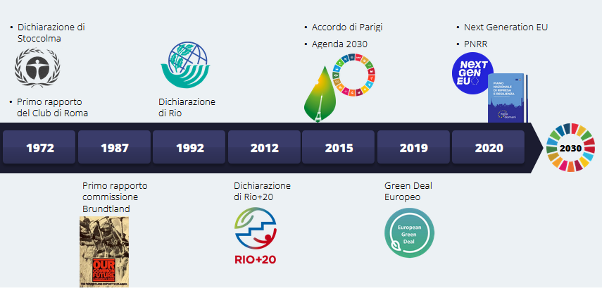

Il tema della sostenibilità potrebbe sembrare una preoccupazione recente: non è così, in realtà. Di sviluppo sostenibile si discute da molti anni. Ci sono stati molti studi, incontri, conferenze e rapporti,
dichiarazioni istituzionali dall'ONU, all'Unione europea ai governi nazionali su questo tema, come si può vedere in questo schema che illustra le principali tappe dello sviluppo sostenibile.

### 1972 

Nella **Conferenza di Stoccolma** del 1972 i Paesi si erano impegnati a proteggere e migliorare l'ambiente per le generazioni presenti e future. 

Nello stesso anno, il **Club di Roma** pubblica il suo primo rapporto “The Limits to Growth” - I limiti della crescita, in cui si manifesta l'**impossibilità di perseguire una crescita illimitata** in un pianeta caratterizzato da risorse in esaurimento.

### 1987

Di sviluppo sostenibile si inizia a parlare ufficialmente nel 1987, con il rapporto della **Commissione Brundtland**, denominato “Il nostro futuro comune”, in cui viene definito come “lo sviluppo che è in grado di soddisfare i bisogni delle generazioni attuali senza compromettere la possibilità che le generazioni future riescano a soddisfare i propri”. Lo sviluppo sostenibile  viene dunque associato al concetto di **giustizia intergenerazionale**.

### 1992

La **Dichiarazione di Rio** del 1992 prevede che la **protezione dell'ambiente debba costituire una parte integrante del processo di sviluppo**. A seguito della dichiarazione sono state adottate tre principali Convenzioni su cui stiamo ancora lavorando: una convenzione sui cambiamenti climatici, una sulla diversità biologica e una dedicata al contrasto alla desertificazione. L'insieme
delle tre Convenzioni, nelle diverse Conferenze delle Parti, le cosiddette **COP**, ha definito iniziative determinanti per le politiche europee e nazionali di sviluppo sostenibile, per l'ambiente, il clima e l'energia.

### 2012

La conferenza di **Rio+20** del 2012 si conclude con la dichiarazione “Il futuro che vogliamo”, con cui viene lanciato il processo che **porterà all'adozione** dei 17 Obiettivi dell'Agenda 2030.

### 2015

ll 25 settembre 2015 l'**Assemblea Generale delle Nazioni Unite** ha adottato l'**Agenda 2030** per lo sviluppo sostenibile, corredata da una lista di 17 Obiettivi (Sustainable Development Goals o SDGs) e 169 Target relativi ad ambiti che riguardano i diritti umani, lo sviluppo economico e l'ambiente, che i Paesi si sono impegnati a raggiungere a partire dal 1° gennaio 2016 ed entro il 2030.

L'ambizione dell'Agenda 2030 è il coinvolgimento di tutti i Paesi e di tutti gli individui verso obiettivi comuni. Per la prima volta, le Nazioni Unite riconoscono la **necessità del contributo del settore privato** per il conseguimento degli Obiettivi di sviluppo sostenibile: le imprese possono così allineare il proprio modello di business a uno sviluppo inclusivo, sostenibile e facilmente  comunicabile ai propri consumatori.

A dicembre 2015 viene sottoscritto l'**Accordo di Parigi**, che rappresenta una pietra miliare della
governance mondiale per la lotta al cambiamento climatico. Firmato da 197 Stati, l'accordo pone l'**obiettivo di mantenere l'aumento della temperatura media mondiale al di sotto dei 2 °C**, compiendo tutti gli sforzi per limitarlo al di sotto di 1,5 °C rispetto al periodo preindustriale.

Per raggiungere questi obiettivi è fondamentale che anche il settore privato sia chiamato a far parte della soluzione, portando innovazioni nel proprio modello di business, riducendo drasticamente i propri impatti ambientali e investendo nella ricerca tecnologica in grado di garantire nuove soluzioni di mitigazione e adattamento. L'Accordo di Parigi è parte integrante dell'Agenda 2030.

### 2019

ll **Green Deal europeo** è tra le priorità dell'Unione Europea. Annunciato a fine 2019 dalla Commissione presieduta da Ursula von der Leyen, il Green Deal è una nuova strategia di crescita mirata a trasformare l'Unione Europea in una società più giusta e prospera, dotata di un'economia moderna, efficiente dal punto di vista delle risorse e competitiva, che nel 2050 sarà in una condizione di neutralità climatica e in cui la crescita economica sarà dissociata dall'uso delle risorse.

### 2020

Lo scoppio della pandemia del COVID-19 rende necessarie misure di finanziamento pubblico
straordinarie. In particolare, l'istituzione di un fondo per la ripresa denominato **Next Generation EU**. La novità del fondo è la possibilità per gli stati di poter beneficiare di un meccanismo di **finanziamento coerente con le politiche dell'Unione Europea** volte a combattere i cambiamenti climatici e a garantire l'equità fiscale globale, quale la tassazione dell'economia digitale. **Il Piano Nazionale di Ripresa e Resilienza si inserisce all'interno del programma Next Generation EU**. Il Piano si sviluppa intorno a tre assi strategici condivisi a livello europeo: digitalizzazione e innovazione, transizione ecologica, inclusione sociale. Si tratta di un intervento che intende riparare i danni economici e sociali della crisi pandemica, contribuire a risolvere le debolezze strutturali dell'economia italiana, e accompagnare il Paese su un percorso di transizione ecologica e ambientale. Il PNRR intende contribuire in modo sostanziale a ridurre i divari territoriali, quelli generazionali e di genere.

Un'attenzione particolare è stata rivolta a **sostenere la crescita e la resilienza delle piccole e medie imprese**, per le quali sono stati stanziati ulteriori finanziamenti con l'obiettivo di supportare la loro transizione digitale e aumentarne la produttività, diminuendo i divari territoriali.

## L'evoluzione del modello di impresa

L’evoluzione del contesto ha fatto sì che il mondo aziendale non solo abbia assistito a un cambio epocale nell’approccio alla sostenibilità, ma anche, parallelamente, a una **profonda trasformazione del modello economico di impresa.** 

La scena del mondo aziendale è stata dominata fino ai primi anni ‘80 dalla **Teoria degli Shareholder,** secondo cui l'unica responsabilità di un'impresa è quella di massimizzare i profitti per gli azionisti. Tenere conto solo delle istanze degli azionisti rischia pero di mettere a repentaglio la sostenibilita economica dell'impresa.

Infatti, il modello evolve quando si prende atto che l'operato dell'azienda deve necessariamente tenere conto degli interessi di un'ampia serie di attori che le ruotano intorno. Questi “portatori d'interesse” (in inglese **stakeholder**) mirano a raggiungere i loro obiettivi attraverso l'impresa stessa, ponendosi nei suoi confronti in modo sia cooperativo sia competitivo.

### Azienda e stakeholder

Gli stakeholder sono **tutti i soggetti che hanno un interesse rilevante nell’'azienda**, per i loro investimenti specifici o per i possibili effetti positivi o negativi che li riguardano, derivanti dall'attività dell'impresa. Gli stakeholder hanno aspettative diverse e si dividono abitualmente in «interni» ed «esterni».

Il processo produttivo di un'azienda deve **soddisfare soglie critiche di aspettative diverse e specifiche per ogni stakeholder**. Ad esempio, il cliente che non si sente rappresentato dai valori dell'impresa cambia fornitore, i dipendenti insoddisfatti si dimettono e la sostenibilità economica dell'impresa ne risente.

### Cambio di modello d'azienda

Questo porta ad un'ulteriore evoluzione del modello che prevede l'introduzione del concetto di **“Triple Bottom Line”,** secondo il quale le imprese devono concentrarsi su tre «linee di base» - le cosiddette tre P - ugualmente importanti e distinte: **profit** (benessere economico), **planet** (tutela dell'ambiente), **people** (equità sociale). 

**Solo le imprese che gestiscono, valutano e misurano tutte e tre le performance prendono davvero in considerazione il costo reale del loro modo di fare business**. L'evoluzione dell'approccio a tre dimensioni porta a una svolta fondamentale nei primi anni 2000, quando all'impresa viene riconosciuto un ruolo centrale all'interno della società.

Poiché la competitività di un'impresa e le condizioni della comunità che la circonda sono chiaramente interconnesse, **la crescita sociale dev'essere considerata l’obiettivo centrale dell'impresa**. Confrontarsi con le esigenze attuali e future della società porta le imprese a cercare soluzioni innovative che contribuiscono allo sviluppo di vantaggi competitivi, alla miglior gestione dei rischi e alla redditività di lungo termine.

La visione delle imprese come forza di cambiamento sociale ¢ di bene comune si è evoluta ulteriormente nel concetto di **purpose**, una ragion d'essere ispirata dall'intento di produrre soluzioni **profittevoli ai problemi delle persone e del pianeta** anziché **trarre profitto dal produrre problemi alle persone e al pianeta.**

Per l'impresa diventa pertanto più che mai fondamentale **agire in un'ottica di lungo termine**. L'operato dell'azienda viene così a ruotare intorno ai concetti di **purpose, affidabilità e capacità di diffondere valori « cultura**, portando ad una radicale riformulazione dello storico concetto di business, dei suoi ruoli e delle relative responsabilità.

Questo ha anche un impatto sulla nascita di nuove entità giuridiche, come le società benefit, di cui parleremo nel Modulo 3.

## L'evoluzione del mondo della finanza

Dunque, grazie al suo ruolo di attore sociale e al forte legame con la comunità, l'impresa ha maturato nel corso del tempo la necessità di conciliare il suo sviluppo economico con azioni e processi che garantiscano il benessere dell'ambiente e delle persone. Non solo: la crescita di consapevolezza dei governi e degli investitori sui temi legati alla sostenibilità ha determinato un cambio di passo decisivo per le imprese.

A gennaio 2020 il gruppo Blackrock, la più grande società di investimento nel mondo, ha annunciato una completa trasformazione della finanza, che vede la sostenibilità come nuovo standard per gli investimenti. In particolare, il gruppo ha espresso l'intenzione di **votare contro i consigli di amministrazione delle società di cui è azionista se non svolgeranno progressi sufficienti in materia di sostenibilità** e non predisporranno piani industriali che puntano al rispetto per l'ambiente.

L'adozione di questa strategia ha contribuito a portare un cambiamento radicale nel settore finanziario e a rendere le imprese parte attiva di questo processo. Per indicare tutte le strategie, gli strumenti e i prodotti orientati a uno sviluppo sostenibile, si parla in particolare di **“finanza sostenibile”**. La finanza sostenibile è uno dei driver principali della trasformazione responsabile delle aziende. Riprenderemo questo tema ne prossimo modulo.

## La spinta della legislazione sovranazionale

A fronte di questo scenario in grande evoluzione, è aumentata la necessità di **trovare strumenti normativi utili a stimolare ulteriormente e a supportare il cambiamento in atto**.

La Commissione europea nel 2018 ha varato a tal fine un Piano d'Azione per favorire e finanziare lo sviluppo sostenibile - aggiornato nel 2021 - che si appoggia su una serie di direttive, alcune delle quali particolarmente rilevanti per il mondo aziendale.

Questo Piano ha tre obiettivi principali:

* **aumentare la trasparenza** verso gli investitori attraverso la Sustainable Finance Disclosure Regulation;

* **stabilire quando un'attività economica può definirsi sostenibile** dal punto di vista ambientale e/o sociale secondo i criteri definiti dalla “Tassonomia” aumentare il numero di imprese soggette all'obbligo di pubblicare informazioni standardizzate e comparabil sulla loro sostenibilità attraverso l’entrata in vigore della Corporate Sustainabilit Reporting Directive.

L'effetto combinato di queste normative (che avremo modo di approfondire meglio nel modulo 4), insieme ad altre, quali ad esempio quelle relative alla Corporate Sustainability Due Diligence Directive e al Green Public Procurement, cambia di molto il quadro di riferimento dell'impresa.

# Markmap

````markmap
---
  colorFreezeLevel: 2
---

# Timeline
## 1972
- Conferenza di Stoccolma
  - Prima volta che si parla di sostenibilità
## 1987
- Commmissione Bruntland
	- Giustizia intergenerazionale
## 1992
- Conferenza di Rio
  - Centralità dello sviluppo
  - Inizio delle COP
## 2012
- Conferenza Rio+20
	- Inizio del processo che porterà all'Agenda 2030
## 2015
- Assemblea Generale delle Nazioni Unite
	- Agenda 2030
- Accordo di Parigi
	- Rimaniamo sotto i 2°C besties
## 2019	
- Green New Deal europeo
## 2020
- Next Generation EU
- Piano Nazionale di Ripresa e Resilienza
````


```markmap
---
  colorFreezeLevel: 2
---

# L'economia della ciambella
- Due cerchi
	- esterno 
		- limiti di sfruttamento del pianeta
	- interno
		- bisogni minimi della società
- By Kate Rarwott
# il PIL
-	Non descrive sufficientemente lo stato di un paese
- Necessario affiancare altre misure

# Evoluzioni
## Impresa
- Prima: teoria degli shareholder
	- Teoria degli stakeholder
- Prima: profit only
	- Triple bottom line
		- People
		- Profit
		- Planet
  - Crescita sociale al centro
 ## Finanza
 - nuovo conceto di finanza sostenibile
## Legislazione
- Definire criteri per aziende sostenibili
- Imporre maggiore trasparenza


```

# Azienda 2030 - 2                                                                                    I drive del cambiamento nelle aziende

## Introduzione

> [!TIP]  
>
> *Perché un'impresa dovrebbe avviare un processo di trasformazione verso modelli di sviluppo sostenibili?* 

In questo modulo vedremo i principali driver del cambiamento.

Le imprese che sapranno innovare e cavalcare l'onda della trasformazione sostenibile, saranno più
competitive e prospere. Inoltre, se opereranno in modo responsabile, anticipando e preparandosi al cambiamento, non si troveranno impreparate i fronte alle normative adottate come risposta alle sfide globali che stiamo affrontando.

La sostenibilità rappresenta oggi un punto cardine nella relazione tra l'azienda e il proprio mercato, tanto che secondo dati Istat, circa il **60% delle imprese manifatturiere e circa il 50% delle imprese di servizi hanno già intrapreso nel 2022 azioni in questa direzione**.

Nel rapporto del 2022 dell’Osservatorio Socialis sulla Corporate Social Responsibility, le imprese interpellate affermano che i vantaggi maggiori legati alle loro attività di CSR e sostenibilità sono il
**miglioramento della reputazione e dell'immagine corporate** (44%)**, l'aumento della motivazione del personale** e il conseguente **miglioramento del clima interno** (41%) e la **crescita delle opportunità di mercato e fidelizzazione della clientela** (40%).

A proposito, sai qual è la differenza tra CSR e sostenibilità?

Leggi il testo in approfondimento per scoprire cosa sono i Green Claims.

### Qual è la differenza tra CSR e sostenibilità?

Per CSR - **Corporate Social Responsibility** - si intendono comunemente quelle **attività che le imprese rivolgono a favore delle comunità in cui hanno insediamenti produttivi o anche della società in senso più allargato, attraverso il supporto di cause o progetti benefici** - di tipo sociale o ambientale - **realizzato attraverso la messa a disposizione di risorse finanziarie, di beni e servizi e di competenze e tempo di lavoro dei propri dipendenti**. 

Si tratta quindi di iniziative **diverse** da quelle di governo degli impatti e di revisione strategica, finalizzate ad **allineare il modello di business con la prospettiva dello sviluppo sostenibile**, descritte in questo corso. 

Va tuttavia precisato che questa distinzione si è affermata nell'uso corrente, anche per derivazione da approcci anglosassoni, mentre nei documenti della UE - a partire dal Libro Bianco sulla CSR del 2001 - la CSR è sempre stata intesa come integrazione delle problematiche sociali e ambientali e degli interessi degli stakeholder nelle attività di business, in assonanza con quanto oggi viene più frequentemente denominato corporate sustainability.

## I vantaggi

### Vantaggio competitivo per il mercato B2C

L'impresa nasce per offrire beni e servizi al proprio mercato di riferimento, sia esso composto da clienti o da consumatrici e consumatori. Rispondere alle loro esigenze è pertanto da sempre il suo impegno principale. Comprendere come anche il mercato abbia modificato i suoi driver d'acquisto è quindi fondamentale per garantire la competitività del proprio business.

Per quanto riguarda il mercato B2C, secondo l'edizione 2024 dell’Osservatorio Packaging del Largo Consumo di Nomisma, gli italiani sono sempre più consapevoli delle problematiche legate al cambiamento climatico. 

* Il **59% sostiene di considerare gli aspetti di sostenibilità in fase di acquisto**
* Addirittura **il 32% li considera il fattore determinante**.
* Il 50% dichiara di adottare scelte di consumo più sostenibili con maggiore frequenza rispetto a 5 anni fa, in particolare per quanto riguarda l'acquisto di prodotti alimentari e bevande e la mobilità. 

Un'azienda deve quindi preoccuparsi dell'impatto del proprio business nel complesso ed essere in grado di offrire beni e servizi che siano attenti in particolare agli aspetti sociali e ambientali.

Sempre più ricerche dimostrano inoltre che mentre alcune generazioni di acquirenti non modificano facilmente i propri consumi, i **Millennial e la Generazione Zeta sono invece estremamente attenti alle tematiche di sostenibilità** in fase d'acquisto, in particolare se si tratta di giovani coppie con figli. Tenere in considerazione queste loro aspettative significa quindi rispondere ai bisogni del mercato potenzialmente più interessante.

In questa dinamica é fondamentale il rapporto di fiducia che si crea tra l'impresa e i suoi consumatori, all’interno del quale la comunicazione gioca un ruolo imprescindibile.  La comunicazione dev'essere **non ingannevole**, **verificabile**, **specifica**, **chiara** e non soggetta a errori di interpretazione.

A fronte di aziende solide nel loro approccio di sostenibilità, il rischio di una comunicazione fuorviante e non veritiera è però sempre più diffuso: termini come **greenwashing**, pink washing, social washing ecc. raccontano purtroppo di pratiche scorrette. Per evitare questo rischio l'Unione Europea sta lavorando a importanti normative utili a far crescere il  mercato in questo senso. Ma in alcuni Paesi europei è già una realtà. In Danimarca, per esempio, **non è possibile pubblicizzare un prodotto come ‘sostenibile’ se non a fronte di adeguata certificazione**.

>  #### Approfondimento: la Direttiva Green Claims7
>
>  Nel processo di transizione un ruolo fondamentale è giocato dalla capacità di consumatori e utenti di fare scelte informate e sostenibili.
>  Tra le barriere che rendono difficoltoso questo passaggio c'è sicuramente la **mancanza di fiducia nelle dichiarazioni di sostenibilità delle aziende** unitamente allo **sviluppo incontrollabile di pratiche commerciali ingannevoli** relative alla sostenibilità ambientale di prodotti e servizi, quali sd esempio **greenwashing, obsolescenza precoce, uso di marchi/etichette di sostenibilità e strumenti di informazione inattendibili** e non trasparenti.
>
>  Dalla consapevolezza di questo problema nasce la proposta di **Direttiva sui Green Claims** che riguarda messaggi (testi) o rappresentazioni (immagini, grafiche, simboli) in qualsiasi forma, comprese etichette, marchi, nomi di prodotti ecc. che, nel contesto della comunicazione commerciale, affermano o implicano che un prodotto o un servizio abbiano un impatto positivo o nullo sull'ambiente o che siano meno dannosi per l'ambiente rispetto ad altri.
>
>  Le linee-guida della direttiva faranno in modo di **garantire che le dichiarazioni ambientali siano veritiere, non contengano informazioni false e vengano presentate in modo chiaro, specifico, accurato e inequivocabile**. Sarà necessario avere tutte le prove, scientifiche e non solo, utili a comprovare le affermazioni ed essere pronti a fornirle alle autorità. Questo per garantire una comunicazione corretta e solidamente fondata, nonché verificata da una terza parte.
>
>  La direttiva, che dovrebbe entrare in vigore nel **2027**, comporterà la sparizione dei claim generici (eco- friendly, zero CO.....a fronte di claim specifici e circostanziati la cui definizione e comunicazione saranno frutto della scelta dell'azienda di affrontarne i relativi costi.

### Vantaggio competitivo nel mercato B2B

Le imprese più sostenibili sviluppano un vantaggio competitivo anche nel mercato  B2B, in quanto hanno i requisiti per diventare fornitori sia delle aziende che hanno già integrato la sostenibilità nelle loro strategie, e che quindi richiedono certificazioni delle  loro attività, sia della Pubblica Amministrazione, che è soggetta alle indicazioni del Green Public Procurement per i propri acquisti. 

Secondo il rapporto Greenltaly di Unioncamere e Symbola, nella scelta dei fornitori, le aziende intervistate che hanno previsto criteri di valutazione ambientali sono state il 77% nel 2023 rispetto al 56% nel 2021.
Il possesso di requisiti ambientali e sociali, sempre più regolati da normative dettagliate, diventa progressivamente un **elemento necessario per poter accedere all'albo fornitori delle aziende clienti, per partecipare a gare in ambito pubblico**, e garantirsi l’accesso a una fetta di mercato crescente.
Le richieste da parte dei clienti vertono soprattutto sulla **disponibilita di un Codice Etico e di certificazioni:**

*  **gestionali**, come le ISO 9001, 14001 e 45001, 
*  **etiche**, come la SA 8000,
*  **di prodotto**, come l’analisi del ciclo di vita.
   Al contrario, non essere in grado di produrre evidenza di questo percorso implica il precludersi di molteplici opportunità di business, con un conseguente impatto anche sulla reputazione.

Consulta l'approfondimento per analizzare alcune delle principali certificazioni.

> #### Approfondimento: Le principali certificazioni
>
> Le certificazioni **ISO** rappresentano una tra le attestazioni più importanti per fornire **evidenza del rispetto delle norme (ambientali, sociali e di governance)** a enti pubblici e stakeholder interi ed esterni, awalendosi degli appositi strumenti professionali che comprovino la conformità dei propri sistemi di gestione a standard dettati da norme tecniche.
>
> * La **ISO 9001** si rivolge a qualsiasi tipologia di organizzazione pubblica o privata, di qualsiasi settore e dimensione, manifatturiera o di servizi. È lo standard di riferimento internazionalmente riconosciuto per la **gestione della Qualità** di qualsiasi organizzazione che intenda rispondere contemporaneamente:
>   * all'esigenza dell'aumento dell'efficacia ed efficienza dei processi interni quale strumento di organizzazione per raggiungere i propri obiettivi;
>   * alla crescente competitività nei mercati attraverso il miglioramento della soddisfazione e della fidelizzazione dei clienti.
> * La **ISO 14001** è una norma internazionale ad adesione volontaria, applicabile a qualsiasi tipologia di Organizzazione pubblica 0 privata, che specifica i **requisiti di un sistema di gestione ambientale.**
> * Con la norma **ISO 45001** migliorano le politiche di prevenzione e l'impresa ha uno strumento riconosciuto a livello internazionale per contrastare in maniera sempre più efficace **infortuni e malattie professionali**.
> * Lo standard internazionale **SA 8000** è un modello gestionale che si propone di **valorizzare e tutelare tutto il personale** ricadente nella sfera di controllo e di influenza delle  Organizzazioni che lo adottano. È uno standard che permette di:
>   * migliorare le condizioni del personale;
>   * promuovere trattamenti etici ed equi del personale;
>   * includere le convenzioni internazionali dei diritti umani.
>
> * Il **Life Cycle Assessment (LCA)** è una metodologia analitica e sistematica che **valuta l'impronta ambientale di un prodotto o di un servizio lungo il suo intero ciclo di vita** dalla produzione / estrazione delle materie prime a monte del processo fino al suo smaltimento o fine vita.
>
> Ad oggi un ruolo importante è giocato anche dalle **eco-etichette** che si suddividono in: 
>
> * **obbligatorie** (es. le etichette energetiche per gli elettrodomestici);
> * **volontarie**: sono le aziende a decidere se certificare o meno un bene o servizio. 
>   Di queste ne esistono di 3 tipi:
>   1. **Etichette ambientali Tipo I - ISO 14024**: sono sviluppate su base scientifica, prevedono il rispetto di valori di soglia minimi, necessitano di un controllo da parte di un ente terzo certificato. Es. Ecolabel.
>   2. **Autodichiarazioni ambientali Tipo II - ISO 14021**: prevedono il rispetto di specifici requisiti per i contenuti e le modalità di diffusione delle informazioni, non è prevista la certificazione da terza parte, non ci sono valori minimi da rispettare. Es. i marchi “riciclabile” e “compostabile” riportati  sui packaging.
>   3. **Le Dichiarazioni Ambientali di Prodotto Tipo III - ISO 14025**: sono certificazioni che si basano su diverse analisi relative al Ciclo di Vita di un prodotto, basate su standard condivisi che definiscono i dati alla base di ogni comunicazione. Es. Forest Stewardship Council (FSC), PEFC, Etichetta Energetica.

### Vantaggio competitivo verso i mercati finanziari

Dunque, abbiamo visto i vantaggi della trasformazione sostenibile per i mercati B2C e B2B. Analizziamo ora i vantaggi per i **mercati finanziari**.

Sono sempre piu numerosi gli investitori che scelgono le aziende in grado di operare secondo criteri ESG perché presentano un minor rischio nel medio-lungo periodo.

>  [!TIP] 
>
>  *Ma cosa intendiamo con l'acronimo ESG?*
>
>  Con criteri ESG - Environmental, Social e Governance - si intendono **i requisiti che contribuiscono a qualificare un'attività come sostenibile dal punto di vista ambientale, sociale e di governance.** 

In particolare:

* la dimensione ambientale riguarda principalmente l'esigenza di favorire processi
  aziendali che riducano le emissioni di carbonio o rafforzino il riciclo dei rifiuti;

* la dimensione sociale riguarda l’attenzione rivolta a tematiche quali l'inclusione, il rispetto dei diritti umani e il benessere delle persone;

gli aspetti di governance riguardano le politiche impiegate all'interno dell'azienda per garantire il rispetto dell'ambiente e degli stakeholder nelle decisioni prese a livello strategico e organizzativo.

Sebbene le normative in questo ambito siano ancora in evoluzione, rispettare, monitorare e rendicontare i criteri ESG è un fattore determinante per rimanere competitivi sui mercati finanziari, che significa:

* **attirare investimenti**

* **accedere a nuovi strumenti finanziari**

* **accedere a finanziamenti dedicati alla trasformazione sostenibile.**

Secondo un'indagine Consob sulle scelte di investimento delle famiglie italiane, la quota di investitori che si dichiarano disposti a finanziare imprese che rispettano i criteri di sostenibilità è passata dal 60% nel 2019 al **74% circa nel 2021**.

Il piano di azione europeo per finanziare la crescita sostenibile avrà come risultato una maggiore trasparenza sull'effettiva sostenibilità dei prodotti finanziari in cui investire.

Quindi, le imprese che decidono di operare nel rispetto dei criteri ambientali, sociali e di governance riescono ad aumentare la propria competitività sul mercato e attrarre investitori.  Tra questi si considerano anche gli investitori istituzionali, come la Banca Europea degli Investimenti e la BCE, sempre più attenti ai criteri di sostenibilità.

L'impresa che intraprende il cammino verso la sostenibilità potrà mantenere favorevoli condizioni di accesso al credito e di costo dell’indebitamento nonché accedere a **strumenti finanziari destinati allo sviluppo sostenibile tra i quali Green Bond, Social Bond, SDG Bond**.

Inoltre, sempre più **finanziamenti sono dedicati alla trasformazione sostenibile. È il caso, ad esempio, del PNRR**, ai cui fondi hanno avuto accesso soprattutto le aziende che avevano già intrapreso un percorso di sostenibilità, come dimostrano i dati del Rapporto Greenltaly.

Consulta l'approfondimento per saperne di più sugli strumenti finanziari per le imprese che si impegnano nello sviluppo sostenibile.

> #### Approfondimento: gli strumenti finanziari per le imprese che si impegnano nello sviluppo sostenibile
>
> Gli strumenti finanziari per le imprese che si impegnano nello sviluppo sostenibile i Green Bond e i Social Bond sono strumenti obbligazionari associati a progetti con ricadute positive rispettivamente in termini ambientali e/o sociali.
>
> L'emissione di **green bond o “obbligazioni verdi”** ha l'obiettivo di finanziare progetti con un impatto positivo per l'ambiente, come per esempio l'efficienza energetica, la produzione di energia da fonti pulite e l'uso sostenibile dei terreni.
>
> I **Social Bond** possono rappresentare un valido strumento di finanziamento anche per l'imprenditoria sociale, la cooperazione e il terzo settore in genere.
>
> Occorre sempre tenere presente che le dinamiche ambientali e sociali sono strettamente interconnesse: per esempio, progetti di riduzione dell'inquinamento hanno ricadute positive sia per l'ambiente, sia per la salute degli esseri umani.
>
> La classificazione dei bond in “green” e “social” dipende dalla priorità assegnata agli obiettivi dei progetti finanziati.
>
> Una terza categoria di strumenti obbligazionari sostenibili, oggi in crescita, è quella dei **Sustainability Bond**, che vengono utilizzati per finanziare o rifinanziare progetti a impatto sia ambientale, sia sociale.
>
> Esistono anche gli **SDG Bond** che sono legati all'impatto sui target dell**'Agenda 2030** e obbligazioni emesse per far fronte agli impatti economici e sociali, come quelli causati ad esempio dal COVID-19.
>
> Al momento non esiste uno standard globale per certificare i bond come “verdi”, “sociali” o “sostenibili”; vi sono **standard volontari,** ampiamente riconosciuti a livello internazionale, quali quelli elaborati dall'International Capital Market Association (ICMA), che ha definito i Green Bond Principles (GBP), i Social Bond Principles (SBP) e le Sustainability Bond Guidelines (SBG).
>
> A livello europeo é stato approvato un nuovo standard con cui si definiscono per la prima volta i “green bond". Tra le nuove regole, la società che emette l'obbligazione dovrà impegnarsi a predisporre una strategia per la transizione verde dell'impresa e dimostrare come tali investimenti contribuiscono alla sua realizzazione. La nuova normativa consentirà così agli investitori di indirizzare i loro fondi verso tecnologie e imprese sostenibili con maggiore fiducia. Ciò dovrebbe aumentare l'interesse per questo tipo di prodotto finanziario e sostenere la transizione dell'UE verso la neutralità climatica.

### Vantaggio competitivo sui mercati esteri

Quanto detto finora è valido per tutte le imprese, ma lo è ancor di più per quelle che **esportano**. 

La capacità di mettere in atto un approccio sostenibile, infatti, è legata a doppio filo con la proiezione internazionale delle imprese esportatrici: **le imprese sostenibili esportano di più**, e allo stesso tempo, le imprese esportatrici **investono di più nella sostenibilità**, innescando un circolo virtuoso in cui tutti hanno qualcosa da guadagnare.

In base a quanto emerge da un'indagine condotta nel 2022, le imprese eco-investitrici, infatti, sono **più dinamiche sui mercati esteri** rispetto a quelle che non investono. Nel  biennio 2020-21, le imprese che hanno effettuato investimenti in processi e/o prodotti a maggior risparmio energetico e/o minor impatto ambientale sono infatti **il 14% tra quelle esportatrici contro il 7% tra quelle non esportatrici**.

La propensione verso gli investimenti green, inoltre, aumenta anche al crescere dell'apertura internazionale: tra le imprese che vendono all’estero, **tale quota passa dal 10% nel caso di quelle con basso grado di esportazioni al 21% con alto grado di esportazioni**.

```markmap
---
colorFreezeLevel: 2
---
# Mercato B2C
## Vantaggio
- 59% considera la sostenibilità
- 32% la considera determinante
- 50% fa più attenzione di 5 anni fa
- Millennials e GenZ sono più attenti
## Fiducia nella comunicazione
### Com'è
- Non ingannevole
- Chiara
- Verificabile
- Certificazioni
### Direttiva Green Claims
- 2027
- Comporterà claim
 verificabili e specifici

# Mercato B2B
## Vantaggio
- Certificazioni richieste nei bandi pubblici
- 70% delle aziende ricerca fornitori certificati
## Certificazioni
 ### ISO 9001
 - Qualità del prodotto
 ### ISO 14001
 - Requisiti di gestione ambientale
 ### ISO 15001
 - Infortuni e malattie professionali
 ### SA 8000
 - Valorizzazione e tutela del personale
 ### LCA (Life Cycle Assessment)
 - Impronta ambientale del prodotto sull'intero ciclo di vita
 ### Ecoetichette
#### Obbligatorie
- Classi energetiche  elettrodomestici
#### Volontarie
- Tipo I / ISO 14024
	- Su base scientifica 
con controllo terzo
		- Ecolabel
- Tipo II / ISO 14021
	- Requisiti minimi, 
no controllo terzo
		- "compostabile", "riciclabile"
- Tipo III / ISO 14025
	- Analisi sul LCA
		- FSC
		
# Mercati finanziari
## ESG = requisiti environmental social governance
### Più scelti dagli investitori
- 74% dei privati preferisce ESG
- Nel pubblico prioritizzano chi ha ESG
  - es. PNRR
### Finanziamenti dedicati
### Strumenti finanziari specifici
- Green Bond
- Social Bond
- SDG Bond (Agenda 2030)

# Mercati esteri
## Le aziende green esportano di più
- 14% green fra le esportatrici 7% green fra le non green
```

## Produttività e fiducia nel futuro

Secondo il rapporto Greenltaly di Unioncamere e Symbola, chi investe nella sostenibilità ambientale ottiene un **aumento di produttività di circa il 9%**.

Analogamente, si registra un vantaggio per le imprese che avviano la **transizione digitale quantificabile in un aumento della produttività fino al 12%**.

Le medie imprese sono più fiduciose sul futuro quando investono nella duplice transizione, digitale e green. Prevedono infatti in modo più netto un aumento del giro d'affari tra il 2023 e il 2025, che cresce ulteriormente a fronte di un investimento nella formazione.

Proprio per questo, oltre il 60% prevede di investire nella duplice transizione tra il 2023 e il 2025.

## Maggiore efficienza e innovazione

L'attenzione alla gestione delle risorse implica che i costi operativi delle aziende, come il costo energetico o delle materie prime, si riducano garantendo una maggiore produttività.

L'innovazione di prodotto e di processo, in risposta a bisogni sociali e ambientali emergenti, consente, inoltre, di **evitare i rischi** legati a:

* **scarsità di materie prime**, 

* discontinuità di forniture legata a **crisi geopolitiche**,

* **obsolescenza** dei prodotti,
* **disaffezione** dei clienti.

L'innovazione offre inoltre l'opportunità di sviluppare il proprio business e aprire nuovi mercati, aumentando la competitività dell'azienda.

## Capacità di attrarre talenti e di contenere il turn-over

Essere sostenibili si traduce pertanto in **attenzione al capitale umano e maggiore apertura alla relazionalita con altri soggetti del territorio**. Le imprese eco-investitrici presentano, ad esempio, una maggiore propensione a costituire comunita energetiche rinnovabili, con uno stacco ancora piu elevato per le micro-piccole imprese.

Le imprese che investono nella trasformazione sostenibile riescono ad attrarre e trattenere i talenti, in particolare giovani, molto più motivati se possono contribuire al  aggiungimento di uno scopo sociale.

Le imprese che investono sul proprio capitale umano sono anche in grado di contenere il
turn-over, contribuendo all'innovazione e a costruire resilienza nelle persone, attraverso una formazione continua.

## Miglioramento della reputazione

Un cambio effettivo della cultura e della strategia dell'azienda porta di conseguenza un **vantaggio in termini di reputazione**. Ma quali sono i fattori che influenzano la reputazione?

I principali sono:

* la qualita del prodotto o del servizio offerto,

* le relazioni con tutti i propri stakeholder (dal personale agli investitori)

* le scelte strategiche che l'azienda fa

* la sua comunicazione e l'immagine pubblica che ne deriva.

Per accrescere il proprio valore, l'azienda deve dunque mettere in atto una propria **strategia** di sostenibilità aziendale, e saper **comunicare** i risultati ai propri stakeholder.

Questi, infatti, sono ormai molto sensibili alle tematiche ambientali, all’equita e alle questioni sociali, al punto da richiedere beni e servizi che rappresentino in modo chiaro questi valori, a volte anche a costo di spendere di più.

Riconoscersi negli stessi valori impatta positivamente sulla fiducia che lega le parti coinvolte a tutti i livelli e alimenta i rapporti che uniscono l'azienda ai suoi interlocutori.

Una migliore reputazione mitiga infatti il rischio di insoddisfazione e sfiducia degli stakeholder generando impatto positivo sul riconoscimento del ruolo dell'impresa e della “licenza a operare”.

Questa cultura, patrimonio non solo dei vertici aziendali ma anche di dipendenti e collaboratori, ne rappresenta la base ed è la piu significativa testimonianza di cambiamento verso l'esterno.

```markmap
---
colorFreezeLevel: 2
---

# Effetti positivi
## Produttività
- investire nel green
	- +9% produttività
- investire nel digitale
	- +12% produttività
## Innovazione/efficienza
- Evitare crisi geopolitiche
- Evitare obsolescenza
- Evitare scarsità di materie prime
- Evitare disaffezione clienti
## Reputazione
- Strategia ambientale
- Comunicazione della suddetta agli stakeholder

```


## Un nuovo modo per far crescere il proprio business

|  |  |  |  |  |  |  |  |
| ------------------------------------------------------------ | ------------------------------------------------------------ | ------------------------------------------------------------ | ------------------------------------------------------------ | ------------------------------------------------------------ | ------------------------------------------------------------ | ------------------------------------------------------------ | ------------------------------------------------------------ |
| Katie Kross - Managing Director, Center for Energy, Development and Global Environment (EDGE) Duke University | Tim Mohin - Chief Executive Global Reporting Initiative (GRI) | Linda Fisher — Vice President and Chief Sustainability Officer (retired) Dupont | Amanda Bushell — MBA Student Duke University                 | Chris Viahoplus — Partner and Clean Tech & Sustainability Practice Leader ScottMadden | Dan Vermeer - Executive Director, EDGE, Duke University      | Lisa Shpritz - Senior Vice President, Environmental Operations Executive, Bank of America | Paula Alexander - Director, Sustainable Business, Burt’s Bees |

### ll futuro del business sta cambiando

| .................                                            |                                                              |
| ------------------------------------------------------------ | ------------------------------------------------------------ |
|  | Quando pensiamo al futuro del business e al futuro delle aziende, ci sono alcuni importanti cambiamenti globali impossibili da ignorare. Il primo è la crescita della popolazione globale: siamo una popolazione di 7 miliardi di persone su questo pianeta che sta per raggiungere i 9 miliardi entro il 2050. |
|  | Dare da mangiare a una popolazione di 9 miliardi di persone entro il 2050 sara<br/>impossibile se non troviamo nuove tecnologie per farlo. Fornire energia e alloggio a quella popolazione sara impossibile se non identifichiamo modi piu sostenibili per produrre e utilizzare l'energia. |
|  | Stiamo cominciando a sperimentare nuovi vincoli sulla disponibilità di molte risorse naturali e nei fattori di produzione agricoli che devono produrre i beni di cui questi 9 miliardi di persone avranno bisogno.<br /> Quindi le aziende innovative dovranno essere  molto innovative nel pensare a come produrre e distribuire le merci in futuro per garantire i volumi e il passo di crescita richiesto. La sostenibilita aziendale è un approccio di fare business che riconosce che rispondere alle problematiche sociali e ambientali può essere un bene per il business perché mitiga i rischi e crea nuove opportunità. Quindi, quando parliamo di sostenibilità, parliamo dell'intersezione di tre cose: le persone, il pianeta e il profitto (tripla linea di base). |
|  | La sostenibilità è una questione aziendale perché le aziende sono ora più grandi di molti paesi. Le multinazionali fanno affari in tutto il mondo; hanno ricavi superiori al prodotto nazionale di alcuni paesi e con questo tipo di dimensione è fondamentale che le aziende portino i loro valori nei paesi in cui operano. |
|  | Quando ero alla business school, la sostenibilita era un concetto relativamente nuovo per me. |
|  | Pensavo di voler fare il medico perché mi piacevano le scienze e volevo aiutare le persone e mi sono resa conto, dopo aver fatto alcuni corsi di scienze ambientali, che nel lungo periodo l'uso delle scienze per aiutare le persone sarebbe stato più rivolto alla gestione delle risorse naturali che alle innovazioni mediche. E la prossima ondata di fattori critici su cui lavorare per l'umanità si riferirà a come soddisfare l'esigenza di cibo, acqua ed energia più che le esigenze di medicine e cure mediche. Ecco perché ho deciso di occuparmi di sostenibilità. |
|  | Sono rimasta subito affascinata dall'idea di poter utilizzare il potere e la portata del settore privato per affrontare le sfide sociali e ambientali su larga scala. È un'idea molto convincente. Che dite? Possiamo prendere il capitale finanziario, le risorse umane, le competenze, la disciplina aziendale e applicarle per trovare soluzioni innovative per alcuni dei più grandi problemi del mondo. |

### Ridurre gli sprechi alimentari 

| .................                                            |                                                              |
| ------------------------------------------------------------ | ------------------------------------------------------------ |
|  | Una delle migliori esperienze che ho fatto da quando sono entrata nella Business School è stato uno stage a Walmort. Lavoravo nell'approvvigionamento alimentare globale ed erano molto focalizzati sulla riduzione dello spreco di cibo. È un problema molto significativo in tutti i settori del sistema alimentare in questo momento dato che buttiamo via troppo cibo. E' una sfida di business. E' anche una sfida ambientale e una sfida per i consumatori. Quindi Walmort la sta prendendo molto sul serio. E' stato davvero interessante far parte di quel progetto, mi ha aperto gli occhi su diverse soluzioni a cui non avevo mai pensato, dal packaging alla logistica, a quanto tempo un prodotto rimane sul camion. Ci sono cosi tante opportunita per affrontare questo problema ambientale che consente anche di risparmiare denaro. Ed è per questo che aziende come Walmort stanno<br/>prendendo la riduzione degli sprechi alimentari così sul serio in questo momento. |

### La sostenibilità incorporata nelle attività di business

| .................                                            |                                                              |
| ------------------------------------------------------------ | ------------------------------------------------------------ |
|  | Consideriamo la sostenibilità non solo come uno strumento di gestione del rischio, ma come qualcosa che dovrebbe essere incorporata nel business. Se non è completamente incorporata nel modo in cui si svolge l'attività, allora non sarà veramente duratura. |
|  | ll ruolo delle aziende e le aspettative dei leader aziendali stanno cambiando: i consumatori chiedono maggiore trasparenza, si preoccupano non solo di cosa sia il prodotto e di quanto costi, ma anche di come e dove sia stato realizzato. |
|  | La sostenibilita consiste nell'internalizzare i rischi nella catena di fornitura, della forza lavoro, fino al modo in cui il prodotto è realizzato, distribuito e poi buttato. Si tratta di riconoscere che le nostre risorse naturali sono limitate, che il modo in cui trattiamo i nostri lavoratori è fondamentale per il modo in cui operiamo business. |
|  | Quando ho iniziato a lavorare in Du Pont nel 2004, la maggior parte dei leader aziendali pensava alla sostenibilità in termini di impatto che le loro aziende avevano sull'ambiente. Quindi quali erano le emissioni provenienti dagli impianti di produzione, l'inquinamento delle acque che venivano dai loro impianti. E la maggior parte delle attività si è concentrata sulla riduzione di questi impatti. |
|  | Ai tempi avevamo il governo da una parte, i gruppi ambientalisti dall'altra e le aziende nel mezzo. Ora le aziende stanno invece prendendo la guida sulle questioni ambientali. |
|  | Non è più possibile per le aziende lasciare solo al governo l’identificazione di soluzioni per le problematiche ambientali e sociali. Le aziende che vogliono guardare al futuro, devono essere consapevoli del contesto globale e di come sta cambiando e pensare a come innovarlo, a volte molto radicalmente, per mantenere il proprio business in questo contesto così mutevole. |
|  | Si è dunque passati dalla riduzione dell'impatto  dell'impresa sull'ambiente all’ identificazione di nuove opportunità di business. Come si può garantire la crescita delle attività creando prodotti che renderanno la società più sostenibile? Penso che la mentalita aziendale sia cambiata di nuovo dal guardare internamente a guardare esternamente. |
|  | Le aziende che lavorano sulla sostenibilita si rendono conto che ci sono davvero opportunita strategiche se si considera la sostenibilità come un modo per guidare l'innovazione dei propri prodotti o anche un modo per conoscere meglio la propria catena di fornitura e trovare modi più efficienti ed efficaci per gestire il sistema aziendale, nonché per capire dove ci sono rischi incorporati nel proprio sistema di business che devono essere affrontati prima di diventare passività per l'azienda. L'aspetto positivo è che le aziende stanno davvero prendendo sul serio tutto ciò, si comincia a vedere un passaggio delle aziende da un focus tradizionale sull'impatto ecologico (in altre parole tutti gli impatti che hanno e come si gestiscono e minimizzano tali impatti), alla consapevolezza che il business è un incredibile veicolo per diffondere soluzioni per superare questo tipo di problemi. |
|  | Penso che le opportunità di innovazione nell'ambito della sostenibilità siano davvero infinite. Penso che dovremmo iniziare a considerare le sfide legate ai cambiamenti climatici e quelle relative all'evoluzione del mondo, non solo come sfide e problemi, ma come opportunità commerciali. Le opportunità sono infinite, dal creare nuovi tipi di energia, nuovi modi per alimentare il nostro pianeta. Penso che in realtà questo sia uno dei momenti più incredibili della nostra esistenza. |
|  | Le opportunita sono davvero enormi. Gli studenti di oggi saranno alla guida del cambiamento e dell'innovazione futura. |
|  | Sono molto ottimista sul futuro perché credo fermamente che le persone agiscano nel loro migliore interesse e i migliori interessi delle persone sono in linea con gli interessi dell'ambiente. Vogliamo cibo sano, vogliamo un mondo sano, vogliamo comunità sane e possiamo realizzarle attraverso un mix unisce il prendere decisioni più intelligenti e lo sviluppare tecnologie più intelligenti. Credo che queste soluzioni siano alla nostra portata, si tratta di identificarle e poi aiutare a svilupparle, a farle diventare centrali nella nostra vita quotidiana. |
|  | Credo che ci sia stato un cambiamento fondamentale nella mentalita delle organizzazioni verso pratiche piu sostenibili, verso una mentalita sostenibile e una visione di lungo termine. Tutto questo mi fa essere ottimista sul fatto che possiamo affrontare le sfide attuali ed essere ricompensati. Sempre piu i mercati premiano le azioni sostenibili delle imprese, i consumatori le valorizzano e credo che possiamo continuare a concentrarci su questa sfida, ora piu che mai. |
|  | Non importa in quale settore si decida di lavorare, per il resto della tua carriera puoi  essere un champion di sostenibilita. Se pensi di lavorare nel marketing, puoi lavorare per<br/>garantire scelte di progettazione del prodotto e di imballaggio che riducano al minimo gli sprechi, se lavori nella supply chain o nelle operations puoi garantire una maggiore attenzione alla sostenibilita ed agli standard di lavoro dei fornitori, se lavori nel settore bancario puoi essere un champion per l'impact investing (obbligazioni verdi o portafogli Low Carbon), e ovunque lavori puoi portare nel tuo ufficio un cambio di cultura verso la mentalità della sostenibilità. Non sottovalutare il tuo potenziale e la tua capacità di portare un cambiamento. |

# 3 - I nuovi modelli di produzione e consumo

## Introduzione

Abbiamo visto fin qui come sia necessario per le imprese integrare i principi dello sviluppo sostenibile e quali siano le loro opportunità. 

Ma quali sono i nuovi modelli di produzione, consumo e offerta di servizi a cui far riferimento per mettere in atto la trasformazione sostenibile? Lo scopriremo in questo modulo!

Qui, infatti, approfondiremo modelli come l'economia circolare e la sharing economy e le grandi potenzialità offerte dall’innovazione nel rendere possibile il cambiamento verso modelli di sviluppo sostenibile. Vedremo, infine, le nuove certificazioni e forme d'impresa, quali le B Corp, le Società Benefit e la Steward Ownership.

## Cosa vuol dire mettere in atto una produzione responsabile

> [!TIP]    
>
> *Cosa vuol dire mettere in atto una produzione responsabile?*
>
> “La produzione responsabile consiste nella realizzazione di prodotti e servizi con **modalità che siano socialmente vantaggiose**, **economicamente sostenibili** ed ambientalmente compatibili durante tutto l’intero ciclo di vita.”

* intervenire sul proprio modello di business e sulle proprie modalità produttive **adottando processi innovativi**, come ad esempio l'economia circolare, in grado di ridurre gli impatti negativi su ambiente e persone e di immettere sul mercato prodotti e servizi sostenibili; e selezionare i propri fornitori in base al loro rispetto dei valori della sostenibilità;
* **rinnovare il sistema di governance aziendale** per integrare nella strategia di business gli impatti generati sull'economia, sull'ambiente e sulle persone;

* Operare in una logica di **vera legalità,** secondo principi di **equità** e **responsabilità fiscale;**
* favorire un **clima collaborativo e partecipativo per tutti gli stakeholder**, anche attraverso strumenti come il report di sostenibilità;
* assistere e **comunicare in maniera trasparente** con la clientela.

L'adozione dei principi di produzione responsabile non solo determina minori esternalità negative
sull'ambiente e sulla società, ma può determinare un significativo impatto positivo per la comunità e il territorio.

## Cos'è l'economia circolare?

> [!TIP]
>
> *Sai cos'è l'economia circolare?*
>
> L'economia circolare contempla tutte le **attività finalizzate ad aumentare l'efficienza nell'uso delle risorse sia nella progettazione sia nella produzione**: dal riuso al riciclo, dalla riparazione fino al ricondizionamento dei prodotti.

Economia circolare non significa fare meno con meno risorse, ma fare di più con le risorse disponibili. Si tratta dunque di sostituire l'approccio lineare del modello consumistico (produco-uso- getto) con un nuovo approccio finalizzato a progettare i prodotti in modo che le **risorse preziose siano riutilizzabili e rientrino nel ciclo produttivo.**

L'economia circolare afferma un modello di produzione sostenibile nel lungo periodo, volto a creare relazioni di circolarità tra ciò che si produce, minimizzando ciò che viene rilasciato nell'ambiente lungo tutta la filiera produttiva. Esplora la schermata per saperne di più.

* **Riciclo**
  L’economia circolare afferma un modello di produzione sostenibile nel lungo periodo, volto a creare relazioni di circolarità tra ciò che si produce, minimizzando ciò che viene rilasciato nell'ambiente lungo tutta la filiera produttiva.

* **Ricondizionamento**
  Prodotti come i dispositivi elettronici, usati o guasti, possono essere ricondizionati secondo le specifiche del produttore originale e rimessi sul mercato.
* **Riuso**
  Prodotti come le bottiglie di vetro possono essere riutilizzate un gran numero di volte prima di essere scartati.
* **Riparazione**
  Oggi  i prodotti sono generalmente meno resistenti e riparabili rispetto al passato. Agevolare e promuovere le riparazioni, per esempio mettendo facilmente a disposizione pezzi di ricambio o informazioni utili, può riportare in vita i vecchi prodotti.

### Opportunità di business

Il modello dell'economia circolare rappresenta un'opportunità di business per le aziende poiché consente: 

* L'aumento di competitività attraverso **modelli di produzione meno legati all'utilizzo e all'estrazione di materie prime**;

* Una spinta verso un'innovazione basata sullo **sviluppo tecnologico** e sull'utilizzo di risorse green;

* La **fidelizzazione del cliente** e l'**apertura di nuovi mercati** in espansione;

* L'**aumento dell'occupazione** attraverso la riduzione della quantità di materie prime utilizzate e la crescita di servizi a valore aggiunto nella produzione, con **spostamento dei costi dalle materie prime al lavoro** e conseguente crescita dell'impatto occupazionale soprattutto a livello locale.

Secondo il Parlamento europeo, abbracciando l'economia circolare le imprese europee potrebbero **ridurre le emissioni totali annue di gas serra del 2-4%**, in linea con gli obiettivi del Green Deal europeo. Ma avrebbero anche dei vantaggi economici, ottenendo un risparmio netto di circa 600 miliardi di euro.

Consulta l'approfondimento per saperne sugli strumenti per l'economia circolare utili alle imprese.

> ### Approfondimento
>
> #### Quadro di riferimento normativo europeo
>
> La Commissione europea I'11.3.2020 ha adottato il nuovo piano d'azione per l'economia circolare “per un'Europa più pulita e più competitiva”, nel quadro del Green Deal europeo. Scopo dichiarato del piano è **accelerare la transizione verso un modello di crescita rigenerativo** che restituisca al pianeta più di quanto prenda.
>
> L'economia circolare integra il principio di autonomia strategica aperta a cui sono improntate le politiche economiche europee.
>
> Integrati nel piano sono state adottate diverse proposte legislative a livello europeo per trasformare il sistema produttivo affinché la sostenibilità dei beni venduti sul mercato passi “dall’eccezione alla regola” prevedendo misure per ripensare i prodotti fin dalla loro progettazione (con l'ecodesign), con regole per allungare la vita utile dei beni favorendo anche la riparazione, norme di settore sui cicli dei materiali più impattanti (quali relativi ai beni alimentari, tessili, prodotti da costruzione, imballaggi), e sui cicli strategici di rilevanza per la transizioni verde e digitale (nome per le batterie e per le materie prime critiche), responsabilizzazione dei consumatori e protezione dal greenwashing. 
>
> Si veda il link al nuovo sito appositamente istituito [https://ec.europa.eu/environment/circular-economy/indexen.htm](https://ec.europa.eu/environment/circular-economy/indexen.htm   )
>
> #### Quadro di riferimento normativo italiano
>
> A livello nazionale, nel quadro delle riforme previste dal PNRR a giugno 2022 è stata adottata la **Strategia Nazionale per l'Economia Circolare (SEC)** inquadrata efficacemente all’interno delle politiche europee, indicando nelle premesse come scopo il perseguimento degli Obiettivi dell'Agenda 2030 e l'Accordo di Parigi per il clima.
>
> In particolare, la Strategia intende definire i **nuovi strumenti amministrativi e fiscali** per potenziare il mercato delle materie prime seconde, affinché siano competitive in termini di disponibilità, prestazioni e costi rispetto alle materie prime vergini. Inoltre, costituisce uno strumento fondamentale per il raggiungimento degli obiettivi di neutralità climatica e definisce una roadmap di azioni e di target misurabili da qui al 2035.
>
> #### Strumenti per l'attuazione dell'economia circolare 
>
> La Commissione Europea e il Comitato Economico e Sociale Europeo hanno promosso l'avvio della **Piattaforma Europea degli stakeholder per l'economia circolare - ECESP (European Circular Economy Stakeholder Platform).** La realizzazione di una iniziativa speculare a quella europea è stata avviata da ENEA con l'istituzione della **Piattaforma Italiana degli attori per l'Economia Circolare - ICESP (Italian Circular Economy Stakeholder Platform)**. ICESP nasce per far convergere iniziative, esperienze, criticità e prospettive che il nostro Paese vuole e può rappresentare in Europa in tema di economia circolare, e per promuovere l'economia circolare in Italia anche per attraverso specifiche azioni dedicate. Per saperne di più, visita il sito https://www.icesp.it

### Economia circolare e made in italy

Economia circolare, made in Italy e qualita sono tutti fattori cruciali per la competitività delle imprese, in particolare delle piccole e medie imprese che caratterizzano il tessuto industriale italiano.

In base al rapporto 2023 del Circular Economy Network, l’Italia si conferma **leader di circolarità fra le principali cinque economie dell’Unione Europea** (oltre l’Italia, Spagna Francia, Germania e Polonia), contando tra i valori migliori quelli per il riciclo dei rifiuti e tra quelli più bassi il consumo del suolo e la riparazione dei beni. 

Negli ultimi anni il **67% delle piccole e medie imprese italiane ha intrapreso attività legate all'economia circolare**, in particolare per ridurre i rifiuti tramite riciclo e riuso, agendo quindi sulla leva della prevenzione: è importante sottolineare che le aziende italiane hanno la minore quantità di rifiuti per euro prodotto, rispetto alle concorrenti europee, e sono seconde in Europa in termini di
innovazione di processo e di prodotto.

In Italia l'economia circolare rappresenta un comparto economico che offre lavoro a 519mila persone e che vale 3,5 miliardi di euro di PIL, cifra superiore al valore medio europeo fermo a 2,2 miliardi di euro.

## Economia collaborativa

L'economia collaborativa, che forse conoscerai come **sharing economy,** crea nuove opportunita per i consumatori e gli imprenditori. 

Lo sviluppo di **piattaforme digitali che semplificano la collaborazione tra utenti e l'impresa**, come ad esempio le app per il car sharing, incentiva nuove opportunità di occupazione, flessibilità e nuove fonti di reddito.

Per i consumatori i vantaggi dell'economia collaborativa sono, tra gli altri, **l'accesso a nuovi servizi**, a un'**offerta più ampia** e a **prezzi più bassi**.

L'economia collaborativa può inoltre incoraggiare la **condivisione e l'uso più efficiente delle risorse**, contribuendo in questo modo alla transizione verso l'economia circolare.

Facciamo un esempio. La condivisione dei prodotti come il car sharing, servizio che consente l'utilizzo di un'auto da parte di diversi utenti, o il car pooling, servizio che consente a diversi utenti di unirsi per effettuare un percorso comune condividendo l'auto, aumenta il rendimento e riduce il loro impatto ambientale.

```markmap
---
colorFreezeLevel: 2
---
# Produzione responsabile
- Realizzazione di prodotti e servizi con modalità socialmente vantaggiose, 
economicamente sostenibili e ambientalmente compatibili per tutto il ciclo di vita.
- Come?
	- Adottare processi innovativi e selezionare fornitori responsabili
	- Cambiare governance per integrare nella strategia l'impatto generato
	- Responsabilità fiscale
	- Partecipazione di tutti gli stakeholder
	- Comunicazione trasparente
# Economia circolare
- Attività finalizzate ad aumentare l'efficienza nell'uso
 delle risorse sia nella progettazione che nella produzione.
- Come?
	- Riciclo
	- Ricondizionamento
	- Riuso
	- Riparazione
- Opportunità
	- Meno materie prime
	- Sviluppo tecnologico
	- Aumento dell'occupazione
	- Riduzione emissioni del 2-4%
	- 600 mld di gettito
- Economia circolare in Italia
	- Top 5 europea
	- 67% PMI vi aderisce
	- 3,5 mld di gettito
- Enti
	- Strategia Nazionale per l'Economia Circolare - SEC
	- Piattaforma Europea degli stakeholder per l'economia circolare - ECESP
	- Piattaforma Italiana degli attori per l'economia circolare - ICESP
	
# Sharing economy
- Piattaforme digitali per far incontrare utenti e impresa
- Opportunità
	- Accesso a nuovi servizi
	- Offerta più ampia
	- Prezzi più bassi
	- Uso efficiente delle risorse
	
```

## Dal concetto di consumatore a quello di utilizzatore

La nostra attuale economia lineare si basa su risorse ed energia fossile a basso costo: prendiamo, realizziamo, usiamo e smaltiamo; basandoci su una disponibilità finita di materiali e generando rifiuti. Cos'altro? Le risorse e l'energia stanno diventando sempre più difficili e costose da sfruttare. Quindi, per quanto potrà funzionare?

E' da qui che nasce l'idea di un'economia circolare basata sulel prestazioni (performance).

Cosa succederebbe se non comprassimo i prodotti, ma i servizi? Cosa succederebbe se optassimo per avere accesso ad un prodotto e ci fossero garantite le prestazioni di un servizio? ~~In questo modello i produttori o i rivenditori resterebbero i proprietari dei prodotti: la manutenzione e la riparazione rientrerebbero nei costi del business. Ancora meglio se includessimo i costi di esercizio, quali ad esempio l'elettricità. Per le aziende ha senso conservare materiali preziosi quando la disponibilita futura è incerta e quando si prevede un aumento dei prezzi.~~

**PROPAGANDA DI MERDA!!!! RICORDIAMO CHE NON POSSEDERE I TUOI BENI VUOL DIRE CHE POSSONO ESSERTI TOLTI IN QUALUNQUE MOMENTO: VEDI AD ESEMPIO STEAM, AMAZON PRIME O PLAYSTATION, CON MOLTEPLICI CASI IN CUI GIOCHI/FILM _PAGATI_ SONO STATI RIMOSSI DALLA LIBRERIA SENZA MOTIVO IMPEDENDO AGLI UTENTI PAGANTI DI ACCEDERVI!!!**

L'obsolescenza precoce verrebbe gradualmente eliminata. Si potrebbero progettare i prodotti senza doversi far carico dell'acquisto di beni costosi in anticipo. Succede già oggi con auto e telefoni cellulari. Perché non anche con frigoriferi, lavatrici, utensili elettrici e così via? Naturalmente, c'è una grande varietà di esigenze, di individui, di imprese. E non dobbiamo pensare ad una proposta unica che possa andar bene per tutti. Centinaia di soluzioni diverse possono essere progettate con contratti su misura: varietà, libertà, flessibilità e aggiornamenti frequenti. Prendiamo ad esempio il car sharing: possiamo utilizzare veicoli di proprietà di produttori, società di car sharing o iscriverci a una rete locale di servizio tra persona e persona. Le tecnologie di comunicazione hanno consentito al nostro mondo di diventare rapidamente una piattaforma in cui troviamo servizi di scambio o persino beni da ri- ommercializzare. E tutta una questione di accesso e funziona sia per casa che per l'ufficio. Un contratto per un certo numero di copie o usi di elettrodomestici di fascia alta non potrebbe essere più vantaggioso sia per i venditori che per gli utenti? Potrebbe offrire un servizio migliore ad un prezzo più basso. Vincerebbero anche le aziende. L'estrazione e la preparazione di materiali costituiscono fino al 75% dell'energia utilizzata per la produzione dei prodotti. Quindi, se un nuovo modello di produzione e consumo venisse introdotto su larga scala, si ridurrebbe drasticamente il nostro fabbisogno energetico. E ciò aiuterebbe anche il passaggio a fonti  innovabili. Un sistema che funziona a lungo termine progettando i rifiuti e mantenendo i prodotti di
valore nel ciclo, crea posti di lavoro necessari per il processo. Il passaggio a un modello basato sulel prestazioen fa parte della soluzione quando si tratta di accelerare la transizione verso un'economia circolare. C'è un mondo di opportunità per le imprese e per gli individui e il cambiamento è già iniziato.

## Esempi virtuosi in Italia

Tra i numerosi esempi di realtà italiane che hanno scelto la via della sostenibilità, ne abbiamo identificati alcuni che hanno portato innovazione e creazione di valore in diversi ambiti dell'economia green. Esplora la schermata per conoscerle.

* ll primo esempio è quello di un'impresa che produce **vasi per piante, piatti, ciotole e bicchieri** realizzati con le **bucce del riso scartate durante la raffinazione del cereale.** I prodotti si biodegradano anche in tempi programmabili, solo però quando vengono a contatto con il terreno o con i batteri di biodegradazione. A fine vita, non ci sarà alcun problema di smaltimento  essendo assimilabili a rifiuti organici. 
* Un altro esempio interessante è quello delle **comunità energetiche rinnovabili** in cui imprese produttrici di energia elettrica da fonti pulite si associano a cittadini e attività commerciali per **condividere l'energia prodotta** sia per il consumo immediato sia per conservarla in sistemi di accumulo e utilizzarla quando necessaria.
* Esistono anche molte start-up che affidandosi alla sharing economy creano un **mercato sostenibile dell'usato** e contengono gli sprechi. Tra queste, è il caso di un'impresa che dà la possibilità di scambiare abiti per bambini o anche vestiti poco usati. In questo modo si favorisce l'allungamento del ciclo di vita dei prodotti tessili, che sono tra i più inquinanti.

Tutti questi esempi ci ricordano che il saper guardare oltre i limiti di quello che abbiamo già e di quello che ci viene imposto dalle normative, focalizzandoci sulle esigenze delle generazioni future, ci consente innovazione sostenibile e creatività.

Ci piace qui riportare le parole di un imprenditore che abbiamo intervistato per questo corso: “L'empatia e l'amore per il nostro territorio ci ha consentito di creare ecosistemi ‘solidi’ che stanno resistendo anche ad una crisi terribile come quella del COVID-19. 

Siamo tutti anelli di una stessa catena, la nostra forza non è nel singolo ma nelle nostre filiere. Se cede un anello, cede l'intera catena ed è quindi interesse di ciascun anello supportare gli altri nel migliore dei modi.”

## Nuovi modelli di governance e certificazioni

### B Corp


### Società Benefit


### Steward Ownership


In diversi ambiti dell'economia sostenibile l’Italia è in posizione di vantaggio rispetto ad altri paesi europei. L'Italia, infatti, è tra le nazioni europee con il maggior numero di cooperative sociali e imprese sociali. 

Nell'approfondimento potrai leggere maggiori dettagli sulle cooperative e imprese sociali, sulle B Corp e sulle Società Benefit.

> ### Approfondimento
>
> Le cooperative italiane sono molto diffuse sul territorio e rappresentano una realta capace di
> grande inclusione socio-economica. Secondo i dati relativi all'Alleanza delle cooperative italiane, le persone occupate al 2023 sono circa 1.150.000, di cui il 52% sono donne. Inoltre, si stima che le
> cooperative italiane abbiano un'incidenza sul PIL pari all'8%.
>
> Le cooperative sociali e le imprese sociali contano oltre 500mila occupati in Italia.
>
> Le **cooperative sociali** sono state istituite nel 1991 (D. Lgs. 381) con lo scopo di **“perseguire l'interesse generale della comunità alla promozione umana e all'integrazione sociale dei cittadini attraverso la gestione di servizi socio-sanitari ed educativi (Tipo A) o lo svolgimento di attività finalizzate all'inserimento lavorativo di persone svantaggiate (Tipo B).**”
>
> Le **imprese sociali** sono state istituite nel 2006 (D. Lgs. 155). Sono enti privati che “**esercitano in via stabile e principale un'attività economica diretta a realizzare finalità di interesse generale**”.
>
> Sia le cooperative sia le imprese sociali sono Enti del Terzo Settore.
>
> La comunita delle B Corp é in rapida crescita e vede protagoniste societa di ogni tipo, dalle startup socialmente responsabili alle grandi multinazionali. A febbraio 2024, le imprese certificate B Corp sono circa 8.250 nel mondo e circa 270 in Italia, coprendo solo nel nostro Paese più di 90 settori. Fonte: bcorporation.eu
>
> Le Società Benefit italiane, introdotte nel 2016, sono oltre 3.000 al 2023. Sono tipicamente di
> piccola dimensione (mediamente 38 dipendenti) e Srl con base proprietaria familiare, localizzate
> prevalentemente (circa due terzi) al Nord.
>
> Oltre quella di B-Corp, una certificazione che si sta diffondendo in Italia, soprattutto tra le PMI, è quella proposta da Next Economia con il **NeXt Index ESG**. Si tratta di un sistema di valutazione che permette di ottenere un **Rating ESG** e, in caso di performance positiva, anche il relativo marchio di certificazione NeXt Index ESG - Impresa Sostenibile®, riconosciuto dal Ministero delle Imprese e del Made in Italy. Il NeXt Index® ESG garantisce un **percorso di crescita nel rispetto della normativa comunitaria e nazionale sulla sostenibilità**. Inoltre, grazie a un accurato confronto con i portatori d'interesse, consente di pianificare strategie sempre più efficaci e sostenibili. Non è quindi solo uno strumento per fotografare, ma anche un metodo per pianificare la sostenibilità integrale delle imprese. Fonte: Nexteconomia org


``` markmap
# Certificazioni
### B Corp
- Organizzazione internazionale B Lab
- valuta l'impresa nella sua globalità secondo rigorosi standard
	- lavoratori
	- comunità
	- impatto ambientale
	- modello di governance
### Società Benefit
- perseguono per statuto una o più finalità di beneficio comune
	- responsabile
	- sostenibile
	- trasparente
### Steward Ownership
- tramandare la mission dell'impresa attraverso le generazioni
### Italia
- Cooperativa sociale
	- perseguire l'interesse generale della comunità
		- gestione di servizi socio-sanitari ed educativi (Tipo A)
		- inserimento lavorativo di persone svantaggiate (Tipo B)
- Impresa sociale
	- attività economica diretta a realizzare finalità di interesse generale
- NeXt Index ESG
	- garantisce un percorso di crescita nel rispetto della normativa sulla sostenibilità
```

## Trasformazione digitale e sviluppo sostenibile

Alla luce di quanto visto finora, è chiaro che esiste un legame biunivoco tra innovazione e sostenibilità:

* la trasformazione verso nuovi modelli incentrati sulla sostenibilità richiede l'adozione di approcci innovativi;

* allo stesso tempo, soluzioni innovative devono essere incentrate sulle sfide globali per essere vincenti nel medio- lungo periodo.

Trasformazione sostenibile diventa dunque spesso sinonimo di innovazione che molto spesso si basa su avanzamenti tecnologici. La sostenibilità si traduce infatti in innovazione per poter identificare nuove soluzioni che rendano la società più sostenibile, nell’'adottare una visione di lungo periodo e una mentalità aziendale che passi dal guardare internamente (a costi, ricavi, risorse dell'azienda) a saper guardare esternamente confrontandosi con le sfide globali nel tentativo di comprendere le esigenze future e farsi guidare da queste. Le aziende che riusciranno in questa impresa saranno quelle che sapranno resistere ai cambiamenti e a sopravvivere a situazioni di crisi.

**Le tecnologie digitali possono abilitare processi di trasformazione a una velocita molto maggiore del passato**, consentendo di accelerare il percorso verso la decarbonizzazione in tutti i settori, rendere possibile l'economia circolare e la sharing economy, la dematerializzazione, l'efficientamento nell'uso di risorse ed energia, il monitoraggio e la conservazione dei sistemi ecologici, la promozione di modelli di produzione e di consumo sostenibili. 

È evidente che, come ogni cosa, **le soluzioni tecnologiche non sono immuni da rischi**. Se non anticipati, i loro impatti negativi su alcuni obiettivi potrebbero neutralizzare i vantaggi ottenuti su altri. 

In particolare, è importante **diffondere all’interno dell'impresa le competenze digitali a tutto il personale per evitare di creare situazioni di digital divide al suo interno**. È anche importante valutare gli impatti ambientali della digitalizzazione dal momento che non è neutrale rispetto all'ambiente.

Ad esempio, secondo l'Agenzia Internazionale dell'Energia, il consumo di elettricità dei data center nel mondo raggiunge all'incirca 220-320 TWh/anno,  pari a circa l'1% del consumo totale. Per confronto, nel 2020 il fabbisogno annuale di energia elettrica in Italia è stato pari a 301,2 TWh.

Il nostro successo dipenderà dunque dalla nostra capacità di anticipare i rischi e identificare i giusti compromessi tra vantaggi e svantaggi della diffusione delle tecnologie digitali.

In altre parole, dobbiamo riorientare lo sviluppo tecnologico verso le sfide globali. Dobbiamo fare in modo che la trasformazione digitale ci consenta di accelerare l'identificazione e la realizzazione di soluzioni abilitanti per un nuovo modello di sviluppo.

## In che modo le tecnologie digitali contribuiscono allo sviluppo sostenibile?

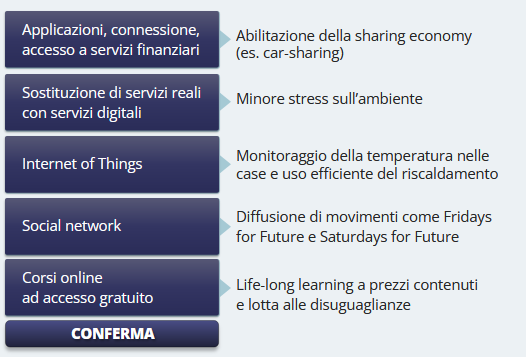


# 4 - Come affrontare il cambiamento

## Introduzione

> [!TIP]
>
> *Lo sai che il Goal 12 - Consumo e Produzione responsabili - è praticamente l'unico SDG che in Italia mostra un trend di continua crescita?* 
>
> Questo dimostra che molte imprese sono fortemente impegnate nel processo di integrazione della sostenibilità nel loro modello di business e svolgono un ruolo trainante per tutta la società.

Secondo il Trust Barometer di Edelman in Italia, a fronte di un indice di fiducia generale in calo di 3 punti rispetto al 2022, le imprese continuano a guidare nel 2024, con 57 punti, la classifica tra le istituzioni e ancor meglio fanno le imprese familiari, a quota 70 punti.

Interessante anche il dato relativo alla cosiddetta **fiducia di prossimità**, vale a dire quella che gli italiani riservano alle persone che sentono più vicine. Tra queste si distinguono al primo posto i colleghi di lavoro (67 punti) e il CEO dell'azienda per cui lavorano al terzo (55).

Tuttavia, il contributo delle imprese allo sviluppo sostenibile potrebbe essere molto maggiore: se il numero delle imprese coinvolte crescesse, e il loro impegno si focalizzasse sui punti nodali dell'interazione tra il proprio modello di business e gli aspetti ambientali e sociali, gli obiettivi dell'Agenda 2030 sarebbero raggiunti più agevolmente.

Selezionando gli aspetti più rilevanti, le imprese possono allo stesso tempo contribuire agli obiettivi dell'Agenda 2030 e gestire meglio i rischi e le opportunità di medio-lungo
termine.

Questo modulo ha l’obiettivo di indicare il cammino da seguire per avviare il cambiamento, e di evidenziare i fattori critici di successo della trasformazione verso un nuovo modello sostenibile.

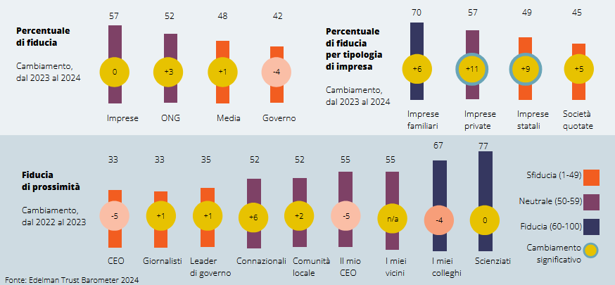

## Come si integra la sostenibilità nel business

In un contesto come quello attuale sempre più esposto a **crisi** (climatiche, sanitarie, sociali), le imprese devono attrezzarsi per riuscire a fronteggiarle: **analisi di scenario, analisi di impatti, analisi di rischi e opportunità, ascolto degli stakeholder, strategia e pianificazione di lungo periodo** sono sempre più importanti per la sostenibilità futura del business.

## Il precorso pee la trasformazione verso modelli di sviluppo sostenibile


|  | 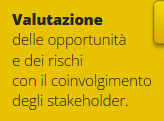 | 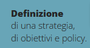 |
| ------------------------------------------------------------ | ------------------------------------------------------------ | ------------------------------------------------------------ |
| 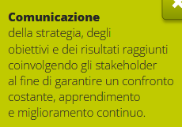 | 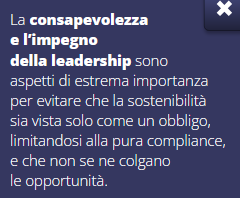 | 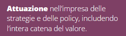 |

Negli ultimi anni sono state anche create piattaforme che supportano le imprese nel loro processo di trasformazione, e che collegano il comportamento e le scelte delle imprese agli obiettivi di sviluppo sostenibile. Nel 2020, il Global Compact e B-Lab hanno infatti reso disponibile gratuitamente a tutte le imprese uno **strumento per facilitare la trasformazione e la misurazione dei progressi raggiunti.**

Non si tratta di uno strumento per il reporting, né per la certificazione, ma può aiutare a confrontarsi con le opportunità e i rischi legati agli SDGs nel proprio settore di appartenenza e garantire un approccio di miglioramento continuo.

Non è pensato per le sole imprese ma anche per le associazioni e gli enti del terzo settore.

## I fattori di successo della trasformazione

| principali fattori di successo della trasformazione sono:

1. la rilettura del modello di business dell'impresa in chiave di sostenibilità

2. la ridefinizione della governance e della cultura aziendale

3. il coinvolgimento degli interlocutori chiave

4. l'identificazione e la pianificazione di un percorso di trasformazione 

5. la misurazione e la rendicontazione di sostenibilità.

Iniziamo ad esplorarli, a partire dalle finalità dell'impresa.

### 1. Rilettura del modello di business in chaive di sostenibilità

L’azienda che **ridefinisce il proprio scopo e il proprio modello di business** e ha una **chiara visione** di come intende contribuire alle sfide ambientali, sociali ed economiche facilita la comunicazione di messaggi coerenti e convincenti sia da parte dei vertici aziendali sia del management sull'importanza strategica della sostenibilità nel successo a lungo termine dell'azienda.

L'Agenda 2030 richiede un **coinvolgimento fortissimo delle imprese** nel cambiare modello di business. Potremmo dire che le imprese sono chiamate ad evadere un “ordine di acquisto per il futuro” del nostro pianeta e della nostra specie. Tuttavia, è anche un'opportunità, sia perché gli SDGs rappresentano le esigenze future della popolazione mondiale, sia perché, come abbiamo visto, offrono opportunità di business significative.

In questa trasformazione del modello di business un ruolo fondamentale è giocato dal concetto di **purpose**, inteso come l'**intento di produrre soluzioni profittevoli ai problemi delle persone e del pianeta anziché trarre profitto dal produrre problemi alle persone e al pianeta**. La presenza del purpose influenza in modo determinante l’interpretazione che le imprese danno alla sostenibilità.

Le imprese tendono infatti ad adottare diversi approcci nei confronti della sostenibilita ma in realta ne esiste uno solo che consente di integrarla all'interno del proprio business e di coglierne a pieno le opportunita.

| 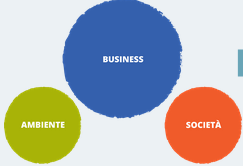 | 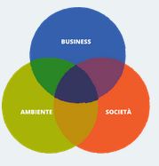 |  |
| :----------------------------------------------------------: | :----------------------------------------------------------: | :----------------------------------------------------------: |
| Il primo è un  **approccio difensivo** che consiste nel **mantenere sostanzialmente lo status quo**, limitandosi ad associare iniziative già in corso a obiettivi dell'Agenda 2030 senza però approfondire l'Agenda nel suo complesso e senza cambiare il modello di business. <br /><br />Si parla in questo caso anche di **“SDG washing”**, perché si pubblicizza un approccio innovativo basato sugli SDGs mentre in realtà il modello di business rimane invariato. | Il secondo approccio è **selettivo** e prevede la **focalizzazione sul goal che è in linea con il proprio business** senza analizzare gli altri. Per esempio, un'azienda farmaceutica potrebbe decidere di rendere disponibile un farmaco che migliora le condizioni di vita anche alle persone più svantaggiate, contribuendo così al Goal 3 e al Goal 10, senza analizzare se per produrre il farmaco si utilizza manodopera sottopagata. <br /><br />Questo approccio è rischioso, perché potrebbe portare un miglioramento di alcuni goal **peggiorando significativamente l'andamento di altri**. | Il terzo è un approccio a 360°, detto anche **olistico**, e porta l'impresa a una vera e propria trasformazione. <br /><br />È anche il solo approccio che riflette la complessità della sfida dell'Agenda 2030: per adottarlo è necessario analizzare gli impatti che un'impresa ha su tutti i goal, identificare i trade- off e analizzarli con l’aiuto dei principali stakeholder. |

#### Analisi degli impatti, dei rischi e delle opportunità

L'approccio trasformativo è dunque la chiave del successo. Ma come avviare la trasformazione?

Molte risposte importanti a questa domanda sono contenute nella **Direttiva europea sulla Rendicontazione Societaria di Sostenibilità**, che rappresenta un punto di arrivo e rielaborazione di molti approcci seguiti e norme introdotte negli anni precedenti. 

Come previsto da questa Direttiva, un approccio vincente è quello di cercare le relazioni tra sostenibilità e modello di business adottando una “doppia prospettiva”, cioè guardando

* da un lato agli **impatti ambientali e sociali generati sugli stakeholder dalle attività dell'impresa**. Esempi di impatti sono gli effetti occupazionali generati dall'impresa, l'utilizzo di risorse naturali scarse per la produzione dei propri prodotti o di materie prime che provenaono da aree dove non è garantito il rispetto dei diritti umani;

* dall'altro **analizzando i rischi e le opportunità che l'evoluzione esterna degli aspetti ambientali e sociali pone rispetto agli obiettivi e alla strategia dell'impresa**, con la potenzialità di modificarne la sostenibilità economica nel medio-lungo termine. Ad esempio: il rischio che gli impatti ambientali eterminino una reazione ostile degli stakeholder, l'opportunità di sviluppare nuovi mercati grazie a un'innovazione che diminuisce il consumo di energia o a un prodotto creato con materie prime seconde o che facilita l'utilizzo condiviso.

> Ma ogni quanto è necessario effettuare un'analisi degli impatti, dei rischi e delle opportunità?

Sempre la Direttiva europea sulla Rendicontazione Societaria di Sostenibilità invita le imprese a dotarsi di processi di due diligence che consentano, **periodicamente**, di identificare gli impatti e valutarne la rilevanza e di intercettare per tempo i rischi emergenti e le nuove opportunità.

> E quali sono i temi da prendere in considerazione?

### 2. Ridefinizione della governance e della cultura aziendale

Una volta definito l'approccio da adottare per la trasformazione del business, è necessario dotare l'azienda di una **struttura di governance adeguata** e diffondere una nuova cultura aziendale a partire dai vertici.

I vertici aziendali devono **rispondere alla crescente complessità degli scenari**. Tutti i livelli di leadership, e a cascata tutta l'organizzazione, devono acquisire nuove competenze.

Attraverso l'acquisizione di queste nuove competenze, l'impresa diventa promotrice di un cambiamento culturale che coinvolge e trasforma il proprio personale, i fornitori, la clientela e la società estesa. 

Una comunicazione efficace del percorso intrapreso, dei cambiamenti messi in atto e dei risultati raggiunti è quindi di fondamentale importanza non solo per garantire trasparenza nei confronti dei propri stakeholder ma anche per diffondere nuovi modi di fare impresa, diventando un modello da seguire. 

>  Ma quali sono queste nuove competenze?

Possiamo fare riferimento a tre tipi di competenze che accompagnano l'integrazione della sostenibilità nei modelli di business, avendo presente che la sostenibilità interessa in
modo trasversale molte funzioni aziendali.

|                     Competenze verticali                     |                    Competenze di raccordo                    |                          Soft Skill                          |
| :----------------------------------------------------------: | :----------------------------------------------------------: | :----------------------------------------------------------: |
|  |  |  |
| In primo luogo, saranno le **competenze verticali dei diversi "mestieri" aziendali** a doversi arricchire, allargando lo sguardo per colloquiare con aspetti tradizionalmente non considerati e adottando una prospettiva di lungo termine per valutare le conseguenze delle scelte e delle decisioni. <br /><br />Ad esempio, la progettazione di impianti dovrà integrare aspetti di **interazione tra gli impianti stessi e il contesto circostante** (emissioni, rumore, induinamento visivo. | In secondo luogo, sono utili **competenze di raccordo** e supervisione dell'integrazione della sostenibilità, generalmente espresse da ruoli come "**Responsabile sostenibilita**" o "Chief sustainability officer", che coniugano una **buona comprensione del modello di business** con un **costante aggiornamento dell'evoluzione della "domanda di sostenibilità"** da parte dell'ambiente esterno, proveniente da investitori, consumatori, autorità di regolazione e stakeholder in generale. | Infine, la cultura aziendale dovrà far emergere valori consoni a interpretare il ruolo dell'impresa nello sviluppo sostenibile, anche attraverso lo sviluppo e la promozione di soft skill utili per dare concretezza all'apertura multidisciplinare e all'**ascolto degli stakeholder.** |

#### Le competenze cardine dello sviluppo sostenibile secondo l'unione europea

Tali competenze sono descritte in 4 aree:

* “**incarnare i valori di sostenibilità**”;
* “**abbracciare la complessità nella sostenibilità**" 
  comprende le competenze di pensiero sistemico, pensiero critico e capacità di inquadramento dei problemi, per guidare l'individuo a valutare e a prendere decisioni;
* **“visione di futuri sostenibili**” include l’alfabetizzazione al futuro, l'adattabilità e il pensiero esplorativo. Il futuro dovrebbe essere percepito come opportunità aperta, come qualcosa che può essere modellato collettivamente;
* “**agire per la sostenibilità**" si compone di azione politica, azione collettiva, azione individuale. 

Queste competenze dovrebbero permettere di diventare agenti di cambiamento, mostrando come le piccole azioni possano avere ampie ripercussioni globali e come il coinvolgimento degli altri con idee e attività che innescano la riflessione possa contribuire anche all'azione politica.

Applicare queste competenze vuol dire innescare un profondo cambio culturale, diventando agenti di cambiamento.

### 3. Coinvolgimentoo degli interlocutori chiave

Nel processo trasformativo un ruolo fondamentale é ricoperto dai processi di coinvolgimento degli interlocutori chiave.

Considerare l’opinione degli stakeholder significa **aprirsi a nuove opportunit**a utili al rafforzamento della catena del valore ma anche ad aumentare il capitale relazionale e il livello di fiducia. La pratica dello stakeholder engagement — strumento di ascolto, dialogo e coinvolgimento — è importante sotto moltissimi aspetti: nel processo di due diligence, per identificare impatti, rischi, opportunità, per definire gli obiettivi e le iniziative da adottare e per capire se hanno avuto successo.

Tale processo ha portato in molti casi a **migliorare la qualità dei rapporti** e ad **avviare**
**partnership innovative**. L'idea è quella di tenere conto delle esigenze degli stakeholder fin
dall'inizio delle fasi di definizione delle strategie aziendali o di nuovi progetti, e non a posteriori agendo con interventi orientati al riequilibrio.

#### Cosa vuol dire stakeholder engagement?

Questo video, realizzato da Future 500, organizzzazione no profit USA specializzata nel coinvolgimento degli stakeholder, descrive l'importanza di tale coinvolgimento in tfase iniziale e le modalità per rendere il confronto efficace.

Stakeholder engagement è una delle parole più popolari del mondo degli affari.  Ma cosa significa veramente?

No, non è un gladiatore. Neanche una che mangia una bistecca. Nemmeno un fidanzamento.

Torniamo  un po' indietro. Supponiamo che la tua azienda realizzi widget e che il business sia in piena espansione. naturalmente la gente comincia a notarti. Un giorno vai a lavoro e trovi manifestanti ai cancelli dell'azienda che sostengono che i widget utilizzano una tossina che fa male per il pianeta. Presto altri stakeholder vengono a sapere della protesta e decidono di partecipare alla campagna. Improvvisamente sei nei notiziari per tutte le ragioni sbagliate. 

Allora cosa fai? Sei un cattivo ragazzo quindi forse chiami le autorità per arrestare gli attivisti e raccontare la tua storia spiegando le tante grandi cose che la tua azienda fa e quanto siano ridicoli gli hippie pazzi. Problema risolto! Giusto?

Non proprio.

Alla fine non importa chi ha ragione e chi ha torto, il ciclo della demonizzazione raramente porta a soluzioni e quasi sempre ad una situazione di stallo e a un marchio offuscato. Per superare questo ciclo noi proponiamo il coinvolgimento degli stakeholder o stakeholder engagement. Tecnicamente è l'integrazione sistematica e proattiva del feedback da parte di tutte le parti interessate dalle operazioni dell'organizzazione. In pratica si tratta di umanizzazione.

Quando riconosciamo la nostra umanità e ammettiamo che nessuno di noi è perfetto possiamo iniziare a lavorare insieme per trovare un terreno comune. Stakeholder engagement significa costruire fiducia anche fra quelli con punti di vista molto diversi, da destra a sinistra, da azienda a ONG. Significa bussare alle porte prima che sorgano problemi anziché dopo.

Significa ascoltare più che parlare ascoltare, e impegnarsi più e più volte a continuare ad alzare l'asticello in modo da trovare le soluzioni migliori per i tuoi stakeholder, il tuo pianeta e i tuoi profitti. Non deve essere formale, dopo tutto la maggior parte delle amicizie non sono costruite nella sala riunioni e divertirsi non fa mai male!

**Eccerto, guarda la sanità americana infatti come funziona bene. Tutti i feedback negativi hanno fatto un saaacco di successo eh. Mica (allegedly) Luigi Mangione. Le aziende guardano agli shareholder, mica agli stakeholder. Che propaganda malmascherata.**

Un processo di stakeholder engagement è un percorso complesso e articolato che può essere riassunto in tre fasi principali:

* **Identificazione** degli stakeholder rilevanti

* **Programmazione e realizzazione**

* **Misurazione**

Come prima fase è importante identificare tutti gli stakeholder che ruotano intorno alla propria attività, creando una “mappa degli stakeholder” che permette di distinguere i diversi gruppi di soggetti. 

Le dimensioni per misurare la rilevanza di uno stakeholder possono essere diverse, ma ruotano attorno al concetto di **influenza**, che può essere **subita** (dipendenza o impatto derivante dall'attività dell'impresa) o **esercitata** (influenza dello stakeholder sugli obiettivi e le strategie dell'impresa). 

a combinazione di questi aspetti costituisce la **rilevanza**, a seconda della quale vengono definite le modalità di coinvolgimento più efficaci per ogni gruppo di stakeholder (dall'informazione fino alla collaborazione strategica) e i relativi strumenti (questionari, workshop, interviste, focus group, ecc.). 

Il processo di coinvolgimento può servire a diversi scopi: **identificare l'importanza degli impatti** derivanti dall'attività dell'impresa, **identificare la posizione degli stakeholder rispetto a progetti** o comportamenti dell'impresa, **identificare i temi per loro più rilevanti** ai fini di determinazione della materialità.

Per ogni attività sarà necessario prevedere una m**isurazione del livello di partecipazione** e di soddisfazione da parte di ogr. aruppo di stakeholder.

Il processo di stakeholder engagement è **continuativo** e **iterativo**.

### 4. Identificazione e pianificazione di un percorso di transizione

A valle dell’identificazione di  temi potenzialmente rilevanti e della loro valutazione in  relazione agli impatti generati e a rischi e opportunità connesse, l'integrazione della sostenibilità nel business procede per obiettivi. 

Non può esistere una strategia della sostenibilità disgiunta dalla strategia dell'azienda stessa in quanto la sostenibilità è trasversale a tutte le aree aziendali.

Gli obiettivi possono essere di vario tipo — per esempio, progetti da portare a compimento con relative milestone, certificazioni da ottenere — ma gli obiettivi **quantitativi misurabili** consentono immediatamente di cogliere, e far cogliere agli stakeholder interessati, **l'ambizione** dell'obiettivo stesso, il suo **effetto** in termini di miglioramento, il grado di **avanzamento**.

Gli obiettivi quantitativi si prestano anche meglio a colloquiare con i **target dell'Agenda 2030**, che in tal modo devono dunque essere integrati nella strategia aziendale e nel processo decisionale quotidiano.

Ad esempio, un obiettivo di riduzione delle emissioni di CO2 coerente con la prospettiva di mantenere l'incremento della temperatura globale ben al di sotto dei 2 gradi è direttamente collegabile agli SDG ed è significativo di un serio impegno aziendale.

Gli obiettivi quantitativi e i piani che li articolano sono anche un elemento di **trasparenza** richiesto dagli standard europei di rendicontazione.  Un approccio strategico alla sostenibilità rende visibile il modo in cui un'azienda affronta il contenimento degli impatti e considera rischi e opportunità derivanti da aspetti ambientali e sociali.

### 5. Misurazione e rendicontazione di sostenibilità

Passiamo ora all'analisi della **misurazione** e della **rendicontazione**, che dovranno tener conto non solo di aspetti economico-finanziari ma anche di aspetti ambientali e sociali.

Investitori, azionisti, consumatori e altre parti interessate si aspettano piu responsabilita e trasparenza in merito alle prestazioni aziendali e al loro impatto sulla società, attraverso l'utilizzo di strumenti di informazione di cui si possano fidare e che possano comprendere.

Per rispondere a questa esigenza sono state emanate sempre più **normative**, soprattutto da parte dell'Unione Europea, per dare vita a un quadro di riferimento chiaro, solido e integrato. Nelle prossime schede vedremo quali sono gli strumenti di reporting di sostenibilità e le normative di riferimento.


#### Dichiarazione di sostenibilità

Come abbiamo visto nel primo modulo, la Direttiva europea sulla rendicontazione non finanziaria è stata superata dall'entrata in vigore della **Direttiva sulla Rendicontazione Societaria di Sostenibilità**, che dal 2025 richiederà a sempre più imprese di redigere un report di sostenibilità.

> Ma cosa s'intende per report di sostenibilità?

Come il bilancio civilistico rendiconta le performance dell'azienda sugli aspetti economico-finanziari, **il report di sostenibilità garantisce la trasparenza per le performance dell'azienda sugli aspetti non finanziari** (ambientali, sociali, ecc.). In particolare, individuati i cosiddetti aspetti significativi (o materiali) con il coinvolgimento degli stakeholder, vengono identificati gli indicatori standard e pianificate attività di raccolta dati finalizzate alla loro misurazione. 

Per capire il quadro di riferimento in cui si inserisce la CSRD faremo una breve panoramica dello status del reporting di sostenibilita a livello internazionale per poi concentrarci sugli aspetti salienti della nuova normativa europea.

#### Standard internazionali per la rendicontazione di sostenibilità

Le imprese europee che operano al di fuori dei confini UE e sono chiamate a presentare una rendicontazione di sostenibilita, devono tenere in considerazione le due principali iniziative di riferimento a questo livello, vale a dire la Global Reporting Initiative e l'International Sustainability Standards Board.

|  | 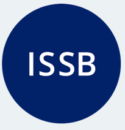 |
| :----------------------------------------------------------: | :----------------------------------------------------------: |
| Per molto tempo le linee guida della **Global Reporting Initiative** sono state lo strumento  maggiormente diffuso a livello internazionale per \|a rendicontazione di sostenibilità, garantendo la comparabilità dei dati tra diverse aziende, dello stesso settore e di settori diversi, facilitando il loro continuo miglioramento.<br /><br />Questi standard adottano la **prospettiva degli stakeholder** dell'impresa e sono ispirati alla cosiddetta **materialità d'impatto**, che ritiene rilevante tutto ciò che riguarda i principali impatti dell’organizzazione su ambiente e società. | L'**International Sustainability Standards Board** è un organismo creato nel 2021 con il compito di emanare standard per il reporting di sostenibilità che forniscano una base comune a livello internazionale.<br/><br/>È importante notare che gli standard ISSB si basano sul concetto di **materialità finanziaria, o single materiality**, che prende in considerazione solo le informazioni relative a tutto **ciò che può influenzare la decisione degli investitori di fornire risorse finanziarie all'impresa**. In tal senso, l'ISSB e i suoi standard riflettono un concetto di **investor-focused materiality**, diversamente dall'impostazione europea che, come abbiamo visto, privilegia la “doppia materialità” che include obbligatoriamente la materialità d'impatto, ovvero l'impatto dell'azienda sul contesto naturale e sociale. |

##### Approfondimento

Il quadro di riferimento internazionale è molto complesso e vede molti attori coinvolti.
Di seguito citiamo solo gli attori principali, mentre la figura rappresenta il quadro completo.

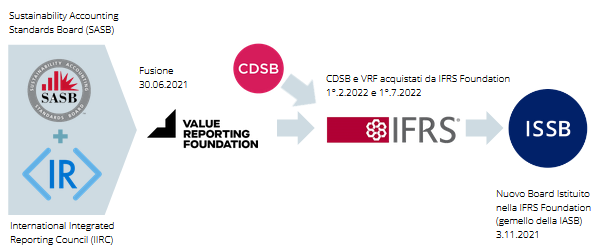

* L’ISSB opera con il supporto dell'associazione mondiale delle Borse valori e fa parte  dell’**International Financial Reporting Standards Foundation** (IFRS), al cui interno troviamo l'**International Accounting Standards Board (IASB)**, che dal 2001 emana gia principi contabili a valenza internazionale.

* All'interno dell’IFRS troviamo anche l’**Integrated Reporting Framework**, i cui standard, ampiamente diffusi nel mondo, permettono di illustrare la strategia mediante la quale l'impresa intende creare valore nel medio e lungo periodo.
  Si basa sul principio secondo cui **il successo di un'organizzazione dipende da come aumentano, diminuiscono o si trasformano i sei capitali alla base dell'azienda**: 

  1. finanziario
  2. produttivo
  3. intellettuale
  4. umano, sociale
  5. relazionale
  6. naturale. 

  Da notare come, secondo questo approccio che **privilegia la prospettiva della rilevanza finanziaria** (ovvero, come i temi di sostenibilità modificano rischi e opportunità dell'impresa) il capitale naturale venga considerato **non tanto per gli impatti che subisce dalle attività** d'impresa, **ma come eventuale vincolo per le stesse** (es. scarsità di materie prime, modifiche climatiche che influenzano il funzionamento degli impianti).

* Tra i fattori che influenzano particolarmente i diversi standard, un ruolo importante è stato ricoperto dalla **Task Force sulle informazioni finanziarie relative al clima** (TCFD) che ha sviluppato le raccomandazioni (articolate in quattro aree tematiche: governance, strategia, gestione dei rischi, metriche e target) per migliorare la divulgazione delle informazioni finanziarie relative al clima e aiutare le aziende a gestire i rischi e le opportunità connessi ai cambiamenti climatici.

#### La direttiva sulla rendicontazione societaria di sostenibilità (CSRD)

> Ma cosa é richiesto, nello specifico, alle imprese europee?

Come abbiamo visto, l'Unione Europea, nel solco delle iniziative legate alla trasformazione sostenibile, ha voluto dare la propria impronta anche in ottica di rendicontazione, utilizzando un approccio molto ampio e inclusivo.

È nata così la **CSRD**, la direttiva che sostituisce la Dichiarazione Non Finanziaria e rende obbligatorio, per le aziende europee di determinate dimensioni o quotate in Borsa, rendicontare la propria sostenibilità attraverso strumenti adeguati. 

La direttiva ha due principali obiettivi:

* portare progressivamente la rendicontazione di sostenibilità allo stesso livello di qualità e rilevanza del tradizionale reporting economico-finanziario 
* stabilire norme di rendicontazione comuni a livello europeo che incrementino la trasparenza del sistema e permettano a investitori, societa finanziarie e cittadinanza l'accesso a dati affidabili e comparabili tra loro, utili anche ad indirizzare il capitale privato verso il finanziamento della transizione verde e sociale.

La nuova normativa coinvolgerà a regime circa 50mila aziende a livello europeo (a fronte delle 11mila circa con la Dichiarazione Non Finanziaria) e in Italia da 5 a 7mila (a fronte delle attuali 200), ma avrà soprattutto un forte impatto trainante sulla filiera, in particolare sulle Piccole e Medie Imprese, chiamate a supportare le grandi aziende nel reperimento dei dati richiesti.

Leggi il testo in approfondimento per conoscere le caratteristiche principali della CSRD. 


##### Approfondimento: CSRD

1. ==Nuovo nome==
   Il nome della reportistica prodotta sarà “**Report di sostenibilità**"

2. ==Ambito di applicazione==
   Avranno l'obbligo di redigere l'informativa di sostenibilità:

     * tutte le imprese, indipendentemente dal fatto che siano quotate o meno, che superano due delle seguenti tre soglie:
       1. numero di addetti superiore a 250 addetti; 
       2. attivo di bilancio superiore ai 25 milioni di euro; 
       3. fatturato superiore ai 50 milioni di euro.

     * tutte le PMI quotate sui mercati europei a eccezione delle microimprese, cioè quelle con meno di 10 dipendenti e con fatturato o bilancio inferiore a 2 milioni di euro.

3. ==Tempistiche==
   Dovranno rendicontare:

   * Dal 2025 (dati 2024) le grandi imprese già assoggettate alla Direttiva sulle informazioni non finanziarie
   * Dal 2026 (dati 2025) le imprese cui si applica per la prima volta questo obbligo informativo
   * Dal 2027 (dati 2026) le PMI quotate e gli enti creditizi piccoli 
   * Dal 2029 (dati 2028) le imprese europee che fanno capo a case madri esterne alla UE, ove il fatturato da esserealizzato nell'ambito della UE sia superiore ai 150 milioni di euro annui.

4. ==Contenuti==
   La rendicontazione dovrà essere collocata in un'apposita sezione (c.d. “Dichiarazione sulla sostenibilità") all'interno della Relazione sulla Gestione, dovrà avere natura quantitativa e qualitativa (narrativa) e dovrà essere di carattere sia retrospettivo che prospettico (forward-looking). Dovrà inoltre descrivere:

   1. a) il modello di business e della strategia aziendale
   2. b) gli obiettivi di sostenibilità e i relativi progressi nel raggiungerli
   3. c) le politiche di sostenibilità dell'azienda
   4. d) la governance della sostenibilità;
   5. e) le procedure di due diligence;
   6. f) le principali ripercussioni negative, effettive o potenziali, legate alla catena del valore dell'impresa;
   7. g) le eventuali azioni messe in atto per prevenire o attenuare ripercussioni negative e dei risultati ottenuti;
   8. h) i principali rischi connessi alle questioni di sostenibilità e come vengono gestite;
   9. i) gli indicatori per comunicare tutti i punti precedenti.

   Viene introdotta inoltre un'assoluta novità, vale a dire l'obbligo di rendicontare in merito agli intangibili internamente generati che non compaiono nello stato patrimoniale delle società, se e solo se legati alla sostenibilità. Intangibili sono definite le **risorse "non fisiche che contribuiscono alla creazione di valore dell'impresa"** e la Direttiva richiede che le imprese comunichino informazioni sulle attività immateriali, comprese informazioni concernenti il capitale intellettuale, umano, sociale e relazionale.

5. ==Doppia materialità (o rilevanza)==
   Le organizzazioni dovranno prevedere la **disclosure di tutte le informazioni “materiali” riguardanti impatti, rischi e opportunità**.
   Gli impatti devono essere individuati attraverso il principio di **doppia materialità**, secondo il quale un'informazione, per essere materiale (cioè significativa), e dunque essere inserita nel report di sostenibilità, deve essere **rilevante o per l'impresa** (**financial materiality**) oppure **per il contesto socio-ambientale** di riferimento **(impact materiality)** con riguardo ai fattori ESG, superando quindi l'impostazione di una rilevanza meramente finanziaria delle informazioni che devono comporre il report di sostenibilità europeo, il quale deve pertanto incorporare ambedue le prospettive.

6. ==Formato==
   Il report dovrà essere obbligatoriamente pubblicato online con digital tagging, in linguaggio **XHTML** e secondo un **unico formato europeo**. Questo per favorire la consultazione e la comparabilità.

7. ==Certificazione==
   I report saranno assoggettati alla limited assurance, vale a dire la v**erifica delle informazioni da parte di ente terzo indipendente** (società di revisione).

#### Gli standard europei per il reporting di sostenibilità (ESRS)

La CSRD prevede che l'Europa abbia dei propri standard per il reporting di sostenibilità su tutte le tematiche ESG, improntati a una prospettiva multi-stakeholder (e non solo dell’investitore) e orientati a un approccio sia generico che settoriale.

Questi standard, denominati European Sustainability Reporting Standards, sono definiti dallo European Financial Reporting Advisory Group.

Gli **ESRS** forniscono alle aziende il **framework per la rendicontazione delle performance di sostenibilità**, specificando le informazioni che le imprese sono tenute a comunicare e la struttura per la loro comunicazione.

Si suddividono in:

* principi **trasversali**, che includono gli standard e i requisiti generali di informativa,

* principi **tematici**, relativi alle tre variabili ESG,

* principi **settoriali**, per rendicontare in modo focalizzato i diversi settori di attività.

E importante ricordare che gli standard di rendicontazione definiti dall'Unione Europea sono stati concepiti per essere **interoperabili con i principali altri standard attualmente in essere** (in particolare GRI e ISSB), sono coerenti con le raccomandazioni della Task Force on Climate Related Financial Disclosures del Financial Stability Board e riflettono gli obblighi derivanti dalle altre normative europee, tra cui in particolare la Tassonomia Europea e della Direttiva sulla Corporate Sustainability Due Diligence che approfondiremo nelle prossime schede.


#### Sviluppo sostenibile e altri strumenti normativi

Come abbiamo visto, per favorire la trasformazione dell'economia è importante che le aziende comunichino le loro  attivita economiche in modo trasparente e comparabile.

A tal fine è stata definita la **Tassonomia europea**, che stabilisce quando un'attività economica può definirsi sostenibile dal punto di vista ambientale e/o sociale e dev'essere rendicontata di conseguenza. Le imprese che sono tenute a pubblicare un report di sostenibilità vi devono quindi inserire anche alcuni indicatori stabiliti dal Regolamento Tassonomia.

Consulta l'approfondimento per sapere quali sono.

##### Approfondimento

Nell'ambito della Tassonomia europea le attivita vengono selezionate in base alla possibilita di contribuire a sei obiettivi:

1. mitigazione del cambiamento climatico 
2. adattamento al cambiamento climatico; 
3. transizione verso l'economia circolare;
4. prevenzione e controllo dell'inquinamento;
5. uso sostenibile e protezione delle risorse idriche e marine;
6. protezione della biodiversità e della salute degli eco-sistemi.

Le attività devono inoltre soddisfare quattro criteri:

1. contribuire positivamente ad almeno uno dei sei obiettivi ambientali;

2. non produrre impatti negativi su nessun altro obiettivo;

3. essere svolta nel rispetto di garanzie sociali minime;

4. rispettare i criteri tecnici identificati da atti delegati adottati dalla stessa Commissione Europea.

Alla base della Tassonomia c'è il **principio Do No Significant Harm - DNSH**, vale a dire del “non arrecare un danno significativo” all'ambiente. L'obiettivo è quello di coniugare crescita economica e tutela dell'ecosistema, garantendo che gli investimenti siano realizzati senza pregiudicare le risorse ambientali.

Prevede che un'attività economica debba contribuire in modo sostanziale ad uno dei sei obiettivi previsti dalla Tassonomia senza arrecare danno a nessuno degli altri.

Le imprese che sono tenute a pubblicare un report di sostenibilità devono inserirvi anche alcuni **indicatori stabiliti** dal Regolamento Tassonomia. Per le imprese non finanziarie, gli indicatori sono tre: % fatturato, % spesa in conto capitale e % spese correnti collegate alle attività allineate alla tassonomia.

Per le imprese finanziarie, gli indicatori sono diversi. Ad esempio, per le banche si applica il **GAR** (Green Asset Ratio) owero la percentuale di attivo corrispondente ad attività allineate alla tassonomia.

#### Corporate Sustainability Due Diligence Directive (CSDDD)

La proposta di **Corporate Sustainability Due Diligence Directive** prevede l'**obbligo di rendicontare l'impatto ambientale e sociale lungo tutta la filiera di attività**. Si basa sul principio di due diligence nella gestione degli impatti negativi che l'attività dell'impresa genera sui diritti umani e sull'ambiente, comprendendo nell'analisi l'intera catena del valore e quindi anche la catena di fornitura. È obbligatorio individuare, prevenire, mitigare e contabilizzare tali impatti negativi e i relativi rischi.

Una volta che la proposta di direttiva sarà stata approvata dal Parlamento e del Consiglio Europeo, diventerà **obbligatoria per le aziende di grandi dimensioni**. In particolare, a partire dal momento dell’approvazione gli Stati membri avranno **due anni di tempo per recepire la direttiva** all'interno del proprio ordinamento. E' chiaro, tuttavia, che anche le imprese piu piccole saranno coinvolte a causa del loro ruolo di fornitori. Potranno dover fornire, anche attraverso audit dedicati, informazioni sui medesimi temi ambientali e sociali, identificare rischi e azioni e misurare gli impatti. A loro potranno anche essere richieste garanzie contrattuali sul rispetto di determinati requisiti ambientali o sociali.

#### Sustainable finance disclosure regulation (SDFR)

Infine, alla luce di quanto evidenziato rispetto al ruolo di indirizzo e trasformazione giocato dal mondo finanziario, è importante sottolineare anche il ruolo del regolamento europeo relativo all’**informativa sulla sostenibilità nel settore dei servizi finanziari**, che si applica ai consulenti finanziari e agli operatori del mercato finanziario.

È importante perché **permette agli investitori di valutare il livello di sostenibilità degli strumenti finanziari emessi sul mercato**. Gli investitori possono così fare scelte consapevoli grazie ad informazioni standardizzate e maggiormente trasparenti su quanto i prodotti finanziari tengano conto degli aspetti ambientali e sociali, e siano investimenti sostenibili o abbiano obiettivi sostenibili.

## Conclusioni

Bene, come hai potuto vedere questi sono i fattori di successo della trasformazione dell'impresa verso un nuovo modello di business. Come dicevamo gia nel Modulo 3, per molte imprese italiane, create sulla base di valori forti e radicati, non sarà necessario un grande sforzo. Si tratterà di focalizzarsi solo sugli ultimi due aspetti, e quindi strutturare, misurare e rendere visibile il lavoro che già svolgono nella direzione dello sviluppo sostenibile. Per altre sarà necessario un processo più lungo che non potrà non partire da un cambio culturale.

Per tutte le imprese italiane varrà comunque la pena rivolgere ancora di più lo sguardo al lungo periodo cercando di rispondere alle esigenze delle future generazioni per aiutarci a fare un balzo in avanti e cogliere le opportunità di questo significativo momento di transizione verso un nuovo modello economico.

```markmap
# .
## ISO 26000
- Misurazione e monitoraggio dei risultati
- Valutazione opportunità/rischi
- Definizione della straregia
- Comunicazione della strategia per coinvolgere gli stakeholder
- Consapevolezza e impegno della leadership
- Attuazione delle strategie
```


```markmap
## Rilettura del modello di business
- ridefinire scopo e modello di business per cambiare
	- Approccio difensivo:
		- ESG washing
	- Approccio selettivo:
		- rischio di peggiorare altro
	- Approccio olistico:
		- unico utile
- Rianalisi periodica
	- Effetto dell'ambiente sull'impresa
	- Effetto dell'impresa su stakeholders
## Ridefinizione della governance 
- Diffusione della nuova cultura aziendale
- Acquisizione di governance adeguata
	- Competenze verticali:
 		- specifica del settore
	- Competenze di raccordo:
		- es. "chief sustainability officer"
	- Soft skills:
		- saper comunicare agli stakeholder
## Coinvolgimento degli interlocutori chiave
- Processo iterato e continuato
	- Identificazione
		- In base a influenza (subita o esercitata)
	- Programmazione e realizzazione
		- Informazione
		- Coinvolgimento
	- Misurazione
		- Questionari
		- Workshop
		- ...
- Obiettivi
	- Identificare l'importanza dell'impatto
	- Sapere posizione degli stakeholder su progetto
	- Identificare temi più rilevanti
##  Identificazione e pianificazione della transizione
- Obiettivi quantificabili
	- Trasparenza
	- Agenda 2030
	- Tracking del progresso
	- Tracking degli effetti
	
## Misurazione e rendicontazione di sostenibilità
- ...
```

```markmap
## Misurazione e rendicontazione di sostenibilità
### Report di sostenibilità
- garantisce la trasparenza sugli aspetti non finanziari
### Standard internazionali
- GRI Global Reporting Initative
	- materialità di impatto
	- prospettiva stakeholder
- ISSB International Sustainability Standard Board
	- materialità finanziaria
	- prospettiva investitori
### EU
- CSRD Direttiva rendicontazione societaria sostenibilità
  - Doppia materialità: impatto e finanziaria
  - Formato unico XHTML
  - Obbligatoria per categoria
  - Verifica da ente terzo
- ESRS standard europei per il reporting di sostenibilità
	- interopera con altri standard
	- principi
		- trasversali
			- standard e principi di informativa
		- tematici
			- tre ESG
		- settoriali	
			- rendicontazione per settore
- Tassonomia europea
	- Obiettivi
		- cambiamento climatico
		- economia circolare
		- inquinamento
		- protezione delle risorse
		- biodiversità
  - Criteri
  	- contribuire a almeno 1 obiettivo
  	- no impatti negativi sugli altri
  	- garanzie sociali minime
  	- criteri tecnici
  - Principio "Do Not Do Significant Harm"
- CSDDD Corporate Sustainability Due Diligence Directive 
	- Obbligatoria per grandi aziende
	- Rendicontazione lungo tutta la filiera
- SDFR Sustainable finance disclosure regulation 
	- Informare gli investitori sull'impatto
	
```
