# L1 - Yoga

"Namo Vah" --> Saluto! 

Namasté (namas + tu) è un saluto di onore verso la divinità. Namo vah è più un saluto normale :)

Gurvi è il femminile di Guru.

Guru vuol dire pesante: l'insegnamento del maestro è importante.

## Il termine Yoga

La parola yoga (con la o chiussa) è un prestito linguistico. Storicamente, origina dal verbo *yuj* che significa "**tenere assieme, aggiogare**". Ossimoricamente, si dà anche l'interpretazione di "**distacco**": il buo *aggiogato* non fa quel che farebbe di solito, se ne distacca per fare altro, similarmente a come gli umani che fanno yoga.

Significa anche **ascesi**, intesa come un tipo di esercizio spirituale che volge alla cura di sé; lo yoga infatti tende a un ritrarsi dal mondo esterno, all'isolamento e a uso di tecniche per il controllo del corpo.

Infine, lo yoga può anche essere ricondotto al concetto di **avere cura**, intesa come un impegno costante dedicato a una pratica o attività.

E la definizione corretta? Ci sono molte definizioni, non solo quelle occidentali. Noi deciamo di tradurlo con "**autodominio**": dobbiamo **dominare** la parte corporea e la parte mentale.

Nelle traduzioni occidentali fatte a partire dalla Bhagavad-gita, vengono usate traduzioni diverse:

* ==Schlegel==
  Porta una tradizione in latino, che era la lingua dotta della sua epoca. Nel testo, trova più volte il termino yoga e lo traduce in base al contesto; spesso lo traduce come ***devotio***, per esplicitare il rapporto col divino.
* ==Humboldt==
  Suggerisce **sprofondamento in sé stessi**, **autodominio** e **approfondimento meditativo**.
* ==Hegel==
  Parla di **devozione astratta**, ovvero un pensiero senza oggetto.

Possiamo tradurlo anche come dottrrina, disciplina, metodo e pratica.

## Dottrina e pratica: la Bhagavad-Gita

La Bhagavad-Gītā è uno dei testi sacri più importanti della filosofia indiana; letteralmente significa "Canto del beato" o "Canto Divino". 

In questo testo si narra di due famiglie che si scontrano per il potere. Ci sono due protagonisti nel dialogo centrale:

* **Arjuna**: principe e guerriero dei Pāṇḍava, che deve combattere
* **Krsna**: eroe della tradizione indiana e avatar di Visnu, che non può combattere ma funge da auriga per Arjuna.

Il dialogo avviene sul campo di battaglia di Kurukṣetra, poco prima dell'inizio della guerra. Arjuna è preso dallo sconforto e non vuole uccidere i propri parenti: la risposta viene trovata nel Dharma, che è l'ordine supremo che va seguito; es. se hai l'ordine di combattere non devi temere di uccidere anche i tuoi parenti, e l'unica vera realtà (il te stesso) non può essere ucciso. Il dovere finale è quello di ottenere la liberazione del sè.

A svelare la dottrina filosofica è Krsna, che rivela di essere la divinità suprema, e questa rappresentazione riguarda non solo la battaglia fra le due famiglie ma anche la battaglia interiore.

Questo guru illustra tre vie:

* ==jinana-yoga==: cammino della **conoscenza** 
* ==bhakti-yoga==: cammino della **devozione** (non lo vediamo)
* ==karma-yoga==: cammino dell'**azione**. E' impossibile non agire, ma dobbiamo agire senza volere ottenere un frutto dall'azione, e agiamo solo perché dobbiamo.

Qualche estratto.

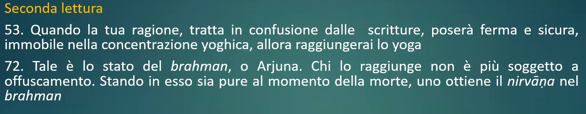

Forte distinzione fra le vie: la prima si ferma sullo studio e sulla conoscenza, ma questa prevede di continuare a pensare mentre dovrebbe essere ferma. Il Brahman è l'assoluto indiscrivibile. Una volta raggiunto si ottiene il nirvana, che quindi in realtà non nasce dal buddhismo ma dalla cultura indiana!

Il nirvana è l'estinzione completa in qualcosa che non si può nemmeno descrivere.

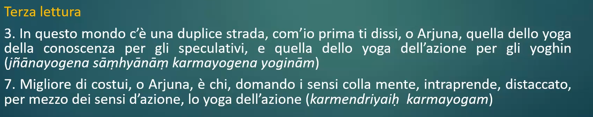

## Origine

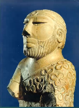Nasce, ovviamente, dal **subcontinente indiano**; Nella civiltà della valle dell'indo (pakistan) sono comunque stati trovati reperti che ci fanno pensare a pratiche meditative tipo lo yoga.

Ha tratti comuni con forme di **sciamanesimo**: entrambe le tradizioni si concentrano su pratiche rituali, trance e contatto con il trascendente. Tuttavia, lo yoga si evolve verso un sistema filosofico e spirituale più strutturato rispetto allo sciamanesimo.

Lo **yogin** è una figura che vive al di fuori della società ed è dedita alla continua pratica meditativa. Esercita timore, ma è vista comunque come santa, e che coltiva il concetto del tapas - ovvero dell'ardore ascetico.

Oltre a essere temute e rispettate, queste figure necessitano di un riparo e offrire loro qualcosa permette di guadagnare karma positivo - o essere maledetti se si fanno loro torti.

Non sono temuti solo dagli uomini, ma anche dagli dei; quindi, mandano semidei che possano distogliere la concentrazione e far loro perdere il tapas (es. LO SESSO!!!)

### Sigillo di Pashupati

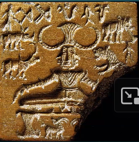Si tratta quasi del famoso **sigillo di Pashupati** (=signore degli animali) proveniente dalla **civiltà della valle dell'Indo** (circa 2600-1900 a.C.). Questa è una delle rappresentazioni più antiche interpretate come legate alla spiritualità indiana.

La figura, che si ipotizza essere l'archetipo dell'asceta (yogin), potrebbe essere una forma di divinità, visti i tre volti. 

Sembra una **forma arcaica di Shiva**, che infatti incarna l'ideale dell'asceta eroico. Possiamo identificare le seguent carateristiche:

* E' circondato da fiere
* Ha un **copricapo con il tridente** (arma di Shiva)
* E' seduto su un seggio, in una asana (=posa) molto particolare, in stato di meditazione.
* Figura itifallica (=che rappresenta il fallo in erezione). Questo particolare ci può fare pensare che potrebbe essere **Visnu**, la grande dea, una divinità che ha a che fare con lo yoga tantrico. E infatti sotto la gonna ha il cazzo lolls

> #### Shiva
>
> E' una delle divinità principali dell'Induismo. Śiva è il dio della trasformazione e della distruzione, ma è anche considerato il signore dell'ascesi, della meditazione e della rigenerazione. È una delle tre principali divinità della Trimurti (trinità hindu), insieme a Viṣṇu e Brahmā. E' il marito di Parvati.
>
> #### Visnu
>
> Viṣṇu è il dio della preservazione e della protezione dell'universo. È la seconda divinità della Trimurti ed è visto come colui che mantiene l'ordine cosmico (*dharma*). Quando il mondo è in pericolo, Viṣṇu interviene incarnandosi in varie forme (avatāra) per ristabilire l'equilibrio.

Sono stati ritrovati diversi sigilli con rappresentazioni simili a questa.

```markmap
# Yoga
## Origine del termine
### Tenere assieme, aggiogare, avere cura, dottrina, disciplina...
### storicamente
#### Shlegel
##### Devotio
#### Humboldt
##### Sprofondamento in sè stessi
#### Hegel
##### Devozione astratta

## Bhagavad-Gita
### Testo sacro "Canto Divino"
### Arjuna e Krsna
### Tre vie
#### Jinana yoga: conoscenza
#### Bhakti yoga: devozione
#### Karma yoga: azione (senza fine)


## Origine
### Subcontinente indiano
### Sciamanesimo ma più strutturato
### Yogin come figure eremite potenti e "magiche"
### Sigillo di Pashupati
#### Proto-shiva col cazzo, animali e tre facce
### Mitologia
#### Il figlio di visnu è vedovo e non vuole scopare, etc etc

```


### *Kumārasambhava* di Kālidāsa

Kalidasa, uno dei poeti più grandi indiani, narra la storia in cui un demone diviene sempre più potente e tramite un'ascesi molto dura ottiene di essere invincibile, con la clausola che **può essere sconfitto solo dal figlio di Shiva** (che al momento non ha figli!). Ma questo aveva perso la moglie Sati, e aveva quindi deciso di dedicarsi a un'ascesi molto dura che chiaramente non prevedeva di figliare. 

Gli dèi, spaventati, decidono di chiamare  Kama (desiderio), una delle forze più antiche, che va da Shiva per farlo innamorare di Pravati, la figlia della montagna. Ma Shiva non è interessato, a causa del lutto della moglie. Essendo una figura molto calma e pacata, Shiva - infastidito da Kama - **apre il terzo occhio e lo fulmina**. LOL. Dopo essere stato bruciato, Kama viene chiamato Ananga ("senza corpo"), poiché continua a esistere come principio astratto del desiderio, ma senza un corpo fisico.

Parvati, determinata a conquistare Shiva, si dedica a un'ascesi severa, supera quasi Shiva nell'ascesa e così alla fine riesce a farlo innamorare e sposarlo.

Da quest'unione tra Shiva e Pravati nasce **Kartikeya** (o Skanda), il dio della guerra, che sconfiggerà Taraka e ristabilità l'ordine cosmico.


## Sistema filosofico indiano

Filosofia è un termine occidentale; in India si parla più di darshana, ovvero visione. I darshana sono vari, ma i principali sono 6 divisi in coppie e si chiamano astika (=ortodosso) in quanto indiscutibili.

* ==Samkhya-Yoga== (vediamo solo queste)
* ==Nyaya-Vaiseshka== (logica indiana - ciò che costituisce la realtà)
* ==Mimamsa-vedanta== (formule magiche e riti - scuola che parte da una serie di testi)

### Samkhya e yoga

Sono due darsana (scuole filosofiche) legati indissolubilmente: il Samkhya presenta la dottrina che si deve conoscere, ed è quindi legato alla conoscenza e alla teoria; lo yoga invece offre i mezzi pratici per la liberazione.

Entrambi puntano alla liberazione e si completano a vicenda. Mirano alla comprensione del sè e come liberarci dalla realtà. Entrambe le correnti sono distinte in base al rapporto col divino:

* Il Samkhya è considerato ateo o non teistico, perché non si occupa di Dio specificamente (pur non negandolo)
* Lo Yoga invece include il rapporto col divino, pur essendo un concetto secondario rispetto alla pratica.

C'è un ampio dibattito tra le scuole filosofiche indiane. Alcuni definiscono lo Yoga come una forma di Samkhya, considerandolo Samkhya "con pratica".

#### Samkhya

Il samkhya non nega la rivelazione contenuta nei Veda, ma non si occupa direttamente dell'esistenza o meno della divinità. Al contrario, si concentra sull'analisi della realtà.

Samkhya viene tradotto con **calcolo**: 25 elementi (tattva) che costituiscono la realtà. I due più importanti sono

* ==Purusha==: possiamo tradurlo come "spirito", ma sarebbe pura coscienza; qualcosa di inattivo e immutabile. Rappresenta il soggetto cosciente, non agisce ma è il testimone della realtà.
* ==Prakti==: possiamo tradurlo come "natura" o "materia primordiale". E' tutto il manifesto, cangiante e in continua evoluzione. Include anche mente, corpo e sensi.
  Quando è in prossimità del **Puruṣa**, sembra "circa cosciente", ma questa coscienza è un riflesso del Puruṣa.

La liberazione (*kaivalya*) avviene quando il **Puruṣa** realizza di essere distinto dalla **Prakṛti**. Questa conoscenza (*jñāna*) fa cessare l'illusione che Puruṣa sia coinvolto nella natura. Quando ciò accade, **Prakṛti "scompare"** dal punto di vista del Puruṣa, nel senso che non esercita più alcun potere su di esso.
### Yoga

Lo yoga è definito anche come Pātañjaladarśana, ovvero "la scuola di Patañjali". Il Patanjali era un tizio, che ha scritto lo Yoga-sutra, un insieme di aforismi (sutra) che costituiscono l abase teorica e pratica dello yoga classico.

Gli **Yoga-sūtra**, per la loro forma sintetica, sono difficili da comprendere autonomamente. Fortunatamente, ci sono stati tramandati anche importanti **commentari** (come quelli di Vyāsa) che aiutano a interpretarli.

E' diviso in 4 parti dedicate a:

* ==Samadhi-pada: Raccoglimento.==
  Viene ripresentata la dottrina e  il concetto centrale di samādhi, il "perfetto raccoglimento" o stato di assorbimento meditativo, che è l'obiettivo finale della pratica.sadhana, pratica ascetica: informazioni sulla condotta dell'asceta
* ==Sadhana-pada: Pratica ascetica.==
  Qui sono spiegate le pratiche ascetiche e i metodi per raggiungere il samādhi. Include anche gli otto passi dello yoga (*aṣṭāṅga-yoga*)
* ==Vibhuti-pada: Poteri sovrannaturali==
  Questi si ottengono con la pratica avanzata, con i mantra, con la nascita o con unguenti. E' la parte che affascina, ma bisogna starne in guarda: l'uso delle vibhuti ci lega all'azione e all'averne un frutto, quindi usarla per i propri scopi vanifica l'intero percorso.
* ==Kavalya-pada: Liberazione==
  Si descrive il kaivalya, ovvero l'isolamento e la non azione; addirittura dovrebbe estinguersi il respiro.

#### Estratti

|                                                              |                                                              |
| ------------------------------------------------------------ | ------------------------------------------------------------ |
|  | Lo yoga è l'estinzione del movimento dei pensieri.           |
|  | Il samadhi non è la fine: una volta che vi arrivo devo perfezionarlo, cercando di estinguere l'oggetto da cui sono partito per estinguere il pensiero. Quindi mi sento bene, e cerco di estinguere il senso di bene. Infine, ho ancora il senso di esistere e estinguo anche quello. |
|  | C'è molta divinità, ma a differenza delle occidentali essa non è d'aiuto ma solo esempio da seguire.L'arresto propedeutico al samadhi può essere ottenuto tramite la dedizione al dio. |
|  |  |

#### Otto stadi dello yoga

Il sistema yogico si basa su un metodo costituito da 8 parti o anga, elencate nel Sadhana-pada. Questo sistema descrive una progressione graduale per raggiungere la liberazione spirituale (*mokṣa*).

* ==Yama==: **forma di astensione o controllo**
  E' un decalogo di cosa non fare (es. non rubare, non mentire, non avere troppe cose, non dedicarti al sesso)
* ==Niyama==: **prescrizioni o ingiunzioni.** 
  Ad esempio pulizia interiore e esteriore,  Rientra anche la devozione alla divinità o il fervore ascetico.
* ==Asana==: **posture o stasi.**
  84 canoniche, ma possono salire a dismisura nelle diverse versioni. Hanno come significato intrinseco quello di "seduta" ma non tutte le pose sono sedute lol. Per Pratanji deve essere una posizione comoda.
* ==Pranayama==: **controllo del respiro.**
  Le fasi sono: respirazione iniziale, mantenere in apnea, lasciare uscire, mantenere ancora apnea, ricominciare. Solitamente poi si punta a estinguere il respiro, ovvero trattenerlo "all'infinito"; altre pose invece richiedono l'iperventilazione
* ==Pratyahara==: **ritrazione o rivolgimento.**
  Significa tartaruga! Consiste nel togliere la distrazione dei sensi
* ==Dharana==: **trattenimento o concentrazione.**
  Consiste nel dedicarsi, intanto, a un singolo oggetto (che poi elimenerò).
* ==Dhyana==: **meditazione o visione ininitenzionata**
  Consiste nel distaccare la concentrazione del passo precedente dall'oggetto su cui mi sono concentrato.
* ==Samadhi==: **estasi**

```markmap
# Sistema filosofico
## Sei darshana "astika" accoppiati
### Nyaya-Vaiseshka
### Mimamsa-vedanta
### Samkya-yoga
```

```markmap

## Samkya (calcolo)
### Non si occupa di Dio
### 25 elementi
#### Pursha: coscienza immutabile
#### Prakti: natura, è un riflesso del Pursha
#### La liberazione è capire che Purusha e Prakti sono distinti
## Yoga
### Definito anche "Scuola di Patanjali"
### 4 parti
#### Samadhi: Raccoglimento
#### Sadhana: Pratica ascetica
#### Vibhuti: Poteri sovrannaturali
#### Kavalya: liberazione
### 8 stadi
- Yama: forme di astensione (es. "non rubare")
- Niyama: prescrizioni (es. "lavati")
- Asana: posture
- Pranayama: respiro
- Pratyahara: ritrazione dei sensi
- Dharana: meditazione/concentrazione
- Dhyana: meditazione inintenzionata
- Samadhi: estasi
### 4 approcci
- **Raja yoga**: regale
- **Hatha yoga**: yoga dello sforzo
- **Laya yoga**: dissoluzione della mente
- **Mantra yoga**: formule esoteriche
- **Kundalini**: serpente femminile
### Altri punti
- Mudra: gesti specifici
- Tantra: signidica trama
```


### Tantra

Tantra significa "trama" , niente di osceno! Acquisisce poi il significato di opera letteraria. Non tutti i testi che sono accompagnati al termine tantra contengono riferimenti a questa forma di rivelazione, così come non tutti i testi che trattano di tantra sono chiamati in questo modo.

I seguaci del tantra (*tāntrika*) proponevano un percorso alternativo a quello vedico tradizionale, che includeva pratiche esoteriche, rituali specifici e una visione inclusiva del mondo. Si trova quindi in antitesi alle forme più ortodosse di rivelazione (vaidika).

Sembrano scandalosi perché in alcuni casi, ma non sempre poi è così nella pratica reale, non rientrano nella purezza. Ma anche la purezza è legata semplicemente alla tradizione.

Noi lo trattiamo legato ai kundalini.

### Tipi di yoga

Questi sono percorsi o approcci differenti allo yoga, ognuno con la propria enfasi e metodi distintivi.

gli otto stadi rappresentano un quadro teorico generale, mentre i tipi di yoga sono percorsi che possono utilizzare e combinare questi stadi in modi diversi, a seconda dell'obiettivo.

* ==Raja yoga==: yoga di Patanjali, o "**sentiero regale**"
  Si basa sul sistema di Patanjali e fa particolare attenzione agli stadi superiori (samadhi).
* ==Hatha-yoga==: **yoga dello sforzo**. 
  Enfatizza il corpo e le tecniche fisiche (es. asana) per purificare mente e corpo e prepararsi agli stati meditativi superiori. La cosa centrale è il dominio sul proprio corpo tendendolo fino a superare i limiti comuni; gli **esercizi** sono duri e faticosi.
* ==Laya-yoga==: **yoga della dissoluzione della mente**
  Alcuni lo uniscono al kundalini, poiché entrambi contemplano il perdersi e la dissoluzione dell'individualità; espone la dissoluzione dello spirito individuale nell'infinito divino.
* ==Mantra-yoga==: **yoga delle formule esoteriche**
  Si concentra su formule esoteriche che vengono ripetute e meditate, in particolare con suoni sacri che vengono affidati da un guru al proprio discepolo.
* ==Kundalini-yoga==: yoga del serpente femminile
  Questo yoga esoterico prende il nome dalla kundalini, il serpente femminile dormiente che risiede alla base della colonna vertebrale ostruendo l'acccesso alla porta di Brahma, ovvero all'apertura inferiore della susumna (canale cenrtale che scorre lungo la spina dorsale). La kundalini, che significa "arrotolata", è la potenza divina che deve essere risvegliata (temo nel senso di stimolazione sessuale...) affinché risalga i chakra, le sedi dell'energia cosmica e divina nel corpo sottile che devono essere perforati fino al raggiungimento del livello finale.
  Nella figura a destra possiamo vedere Indiana Jones che tiene in mano il fallo di shiva: intorno ha le tre spire del serpente, ovvero la potenza creativa qui rappresentata dormiente. c:

### Le Mudrà

Le mudrā fanno parte dello yoga in generale, ma sono particolarmente importanti nello Hatha-yoga e nel Kuṇḍalinī-yoga, dove assumono un ruolo centrale. 

Le mudrà sono gesti che solitamente si fanno con la mano o con altre parti del corpo; addirittura ce n'è una - la khecari mudra - che si fa con la lingua: nello specifico, consiste nella flessione della lingua verso la cavità orale, con l'intento di ostruirla. Si narra, infatti, che dal settimo cakra, extra-corporeo, stilli in continuazione il nettare dell’immortalità e noto principalmente come amṛta. Questo nettare è inevitabilmente destinato a cadere verso il basso, in particolare ad estinguersi nel fuoco (kālāgni) del maṇipūra-cakra, nel quale quindi trovano origine le malattie, l’invecchiamento e, infine, la morte.

## I cakra

La parola *cakra* significa ruota, cerchio, ciclo, disco.  Il termine "disco" è legato anche a un'arma simbolica presente nella cultura indiana, come il disco di Viṣṇu

I cakra sono 7 centri energetici principali:

* 6 si trovano allineati lungo il corpo, dalla base della colonna vertebrale fino alla sommità del capo.
* 1 è posizionato "al di fuori" del corpo fisico, sopra la testa (il Sahasrāra, il loto dai mille petali).

All'interno del corpo sottile, l'energia scorre attraverso innumerevoli canali energetici chiamati nāḍī, tra cui tre sono fondamentali:

* ==Susumna==: canale centrale lungo la colonna vertebrale.
* ==Ida==: il canale che inizia dalla narice sinistra e rappresenta l'energia lunare, la calma e l'intuizione.
* ==Pingala==: il canale che inizia alla narice destra e rappresenta l'energia solare, l'azione e la vitalità.

Ogni cakra è contraddistinto da colore, numero di petali, loti e poteri. 

La Kuṇḍalinī, l'energia dormiente alla base della colonna vertebrale (rappresentata come un serpente arrotolato), risale attraverso il canale centrale (Suṣumṇā) e "attiva" progressivamente i cakra. Questo processo è simbolico del risveglio spirituale e dell'evoluzione della coscienza.

|                                                              | Simbolo                                                      | Colore                     | Mantra                                 | Poteri                                                       | Altro                                                        |
| ------------------------------------------------------------ | ------------------------------------------------------------ | -------------------------- | -------------------------------------- | ------------------------------------------------------------ | ------------------------------------------------------------ |
| ==Muladhara==<br /><br />- Del supporto di base<br /><br />- Tra genitali e ano |  | Rosso sangue               | Lam                                    | Essere in salute, splendenti, saltare come una rana, essere eloquenti e liberi dalle passioni | E' un cakra di terra, e infatti il simbolo ha un quadrato.   |
| ==Svadhisthana== <br />- Del suo luogo proprio<br /><br />- Alla base dei genitali | 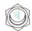 | Vermiglio                  | Vam                                    | Riduzione della dimensione del corpo, del peso e alla levitazione. Libera il senso dell'io dalle inclinazioni negative: ira, lussuria, orgoglio, avidità... | E' chiamato anche giala cakra (acqua). la divinità è Visnu.  |
| ==Manipura==<br /><br />- Della città dei gioielli<br /><br />- Altezza dell'ombelico |  | Dorato o blu               | Dam                                    | Fra i poteri abbiamo la penetrazione del corpo altrui, camminare sotto terra, fabbricare l'oro, trovare tesori, si vince la morte perché dominiamo la questione del corpo. | La divinità è rudhra e shiva, legato al colore rosso. Qui c'è il fuoco del tempo (agni); L'elemento è il fuoco. |
| ==Anahata==<br /><br />- Dal suono non causato<br /><br />- Altezza del cuore |  | Vermiglio                  | Yam                                    | Conoscere il futuro, penetrazione dei corpi altrui, movimento nell'aria. | La divinità è una forma di Shiva. L'elemento è il vento.     |
| ==Visuddha==<br /><br />- Puro<br /><br />- Altezza della gola |  | Grigio scuro o giallo oro. | Ham                                    | Qui il potere è l'onniscenza e potersi muovere fuori dal proprio corpo e negli altri. il proprio corpo è incorruttibile e si è liberi dalla sofferenza |                                                              |
| ==Ajna==<br /><br />- Del comando<br /><br />- Tra le sopracciglia |  | Bianco splendente          | Om                                     | Si parla della distruzione del karma, quindi ci liberiamo dalle azioni precedenti, e c'è una comunione con la divinità. è anche quello del tapas, furore divino | Non ha più elementi associati. La divinità è il linga, il fallo autoesistente di shiva |
| ==Sahasrara==<br /><br />- Dai mille raggi<br /><br />- Oltre la testa, al di fuori del corpo |  | Incolore                   | "H" (Visarga, una leggera aspirazione) | ogni appellativo è legato a una realtà che non è la sua; una specie di gioia, ma infinita e senza un sè | E' rappresentato da un loto a testa in giù dagli infiniti petali. |

```markmap
# Chakra

## Muladhara
### Tra genitali e ano
### Del supporto di base

## Svadhistana
### Alla base dei genitali
### Del suo proprio luogo

## Manipura
### Ombelico
### Della città dei gioielli

## Anahata
### Cuore
### Dal suono non causato

## Visuddha
### Gola
### Puro

## Ajna
### Tra le sopracciglia
### Del comando

## Sahasrara
### Sopra la testa
### Dai mille raggi
```


## Esempi di asana

|                                                              |                                                              |
| :----------------------------------------------------------: | ------------------------------------------------------------ |
|  | Tadasana<br />Posa dell'albero di palma o della montagna     |
| 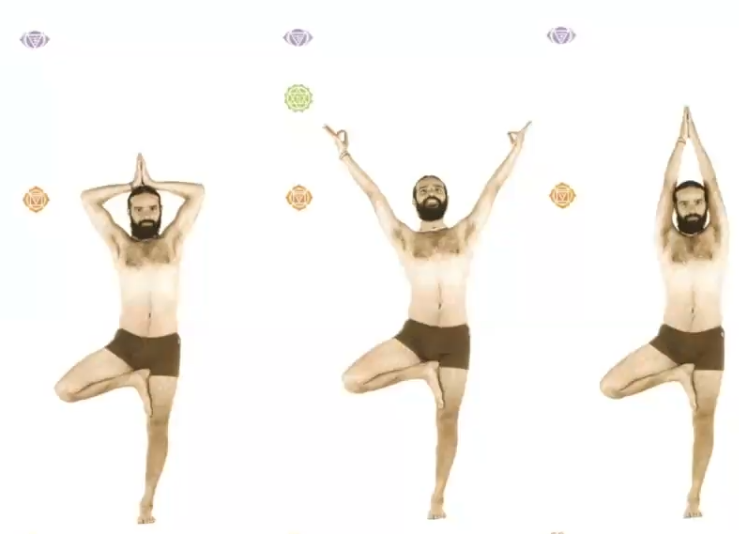 | Albero di fico                                               |
| 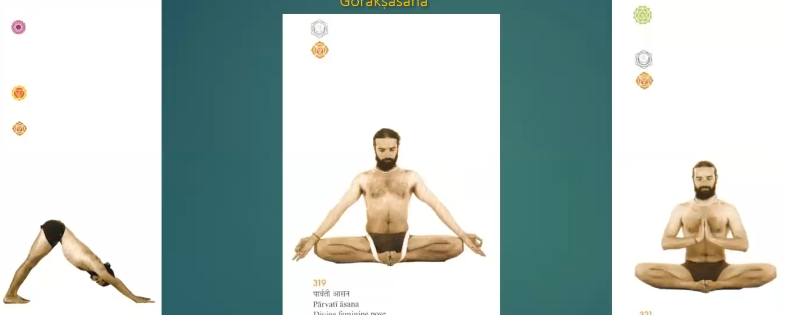 | Goraksasana<br />Pose montane                                |
| 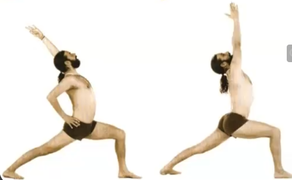 | Vira bhadra<br />Pose dell'eroe                              |
| 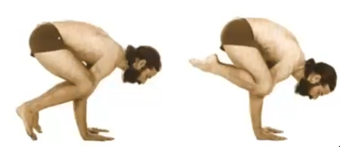 | Baka asana<br />Posa della gru e della semigru               |
| 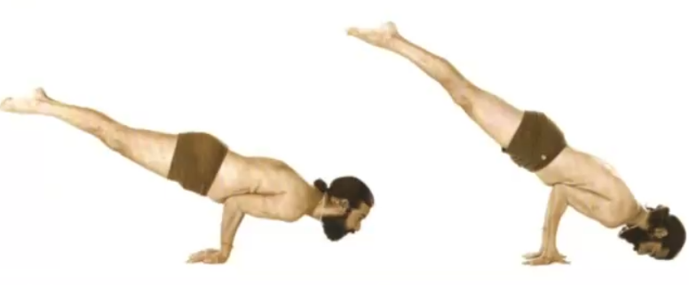 | Mayura asana<br />Posa del pavone                            |
| 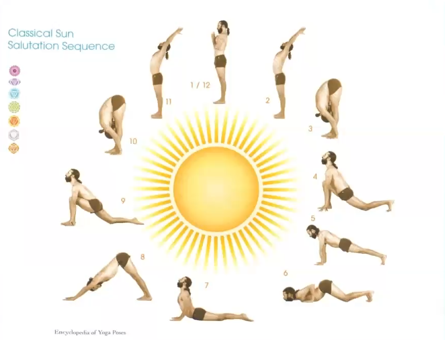 | Saluto al sole<br />Sono 12 fasi ma il 1 e il 12 sono lo stesso. |

# L2 - Buddhismo

Non nasce dal nulla, nasce da quanto abbiamo già visto :) La prassi meditativa è chiaramente un elemento fondamentale per il buddhismo (oltre all’impegno etico) ed esso quindi pur partendo dallo yoga **sviluppa e reinterpreta alcuni dei suoi concetti chiave**.

Dhyana era una parte dello yoga, quella meditativa in cui mi ritraevo dai sensi fino ad arrivare al samadhi. Abbiamo nel buddhismo delle similarità, ma **il samadhi viene molto ridimensionato e non è più lo stato finale della mente**.

Individuiamo due pratiche meditative rilevanti:

* ==**Samatha** - acquietamento==
  Mira a portare uno stato duraturo di acquietamento della mente, che rimane fissa su un punto senza distrazioni, attenta e consapevole.
* ==**Vipassyana** - visione penetrante==
  Meditazione profonda, incentrata non più su un solo oggetto ma su sé stessa. Indaga ogni processo conoscitivo e movimento in quanto tale, comprendendo come questi abbiano origine e, soprattutto, come si estinguano. 

La consapevolezza attiva porterebbe quindi a un maggiore distacco e al nirvana.

Anche il buddhismo rientra fra i darsana, ovvero l'alveo delle filosofie indiane. A differenza del Samkhya e dello yoga il bauddha-darsana appartiene ai darsana "nastika"

## Gli stati meditativi (come gli 8 step dello yoga)

Nel buddhismo, i **dhyāna** (o jhana in pāli) sono stati di meditazione profonda suddivisi in otto o nove livelli progressivi. Essi si sviluppano passando da una focalizzazione sulla forma (i primi quattro stadi) fino a stati sempre più elevati e astratti.

| ==**Rupadhyana**== <br />(legati alla forma)                 | ==**Arupadhyana**== <br />(legati alla sfera senza forma)    |
| ------------------------------------------------------------ | ------------------------------------------------------------ |
| 1. La mente si **ritira dai sensi**, cerchiamo di avere uno stato di gioia <br />2. Riduzione del pensiero attivo/discorsivo **mantenendo lo stato di gioia<br />**3.  Solo concentrazione **senza pensiero ma con benessere <br />**4. Eliminiamo la percezione di sofferenza/piacere e rimaniamo solo con la concentrazione | 1. **Spazio infinito** <br/>2.  Coscienza infinita<br />3.  Il niente <br />4. Percezione del niente<br />5.  Non percepire Nirvana, al di fuori di tutto |

## Il buddhismo

E' una delle filosofe indiane. Il **buddismo era il *darsana* di Buddha**; a differenza di quelle dello yoga, è vero che il buddhismo mette in discussione alcuni dei dogmi dello yoga, ma cerca comunque di mantenere una connessione con i suoi insegnamenti pratici e meditativi.

### Differenze fra buddhismo e induismo

Nel buddhismo, il concetto del sé è profondamente diverso: **non si considera parte di un assoluto immutabile, ma viene visto come illusorio (*anātman*)**, e si cerca di liberarsene per raggiungere l'estinzione del ciclo delle rinascite (*nirvāṇa*). 

* ==Yoga/induismo==: **Il sé (*ātman*) esiste ed è eterno, e la liberazione è la realizzazione della sua identità con il Brahman.**
* ==Buddhismo==: **Il sé (*anātman*) è un'illusione, e la liberazione avviene tramite il superamento di questa illusione e il distacco completo**.

### L'interpretazione induista del Buddha

Nella tradizione induista, Viṣṇu si incarna quando il dharma è in pericolo, ovvero quando l'ordine morale, sociale e cosmico rischia di essere distrutto. **Quindi, vedere il Buddha come un *avatāra* di Viṣṇu diventa un modo per "integrare" il buddhismo nel quadro dell'induismo e ridimensionarne la portata rivoluzionaria.**

Secondo i NON buddisti, Buddha è quindi un'incarnazione di Visnu: **sotto mentite spoglie del Buddha, Visnu vuole allontanare dal dharma tutti coloro che avrebbero potuto corrompere il dharma.** 

Il Buddha mette in discussione il sistema delle caste, mentre mantiene altri concetti come il karma e la reincarnazione. Per le caste, ognuno è fisso nella casta e può solo sperare di reincarnarsi in un'altra; al contrario il buddha dice che tutti possono lavorare per ottenere la liberazone.

Questo tentativo di "integrazione" del Buddhismo quindi è utile, perché chi si converte del tutto al Buddhismo potrebbe non assolvere più al dovere della sua casta, portando a problemi per il resto della società: il Buddha non va seguito, proprio per i motivi detti sopra.

### Altri punti chiave

Le correnti fondamentali e piu antiche sono

- ==Theravada==: quella dei primi Buddhisti, soprattutto ora in sri lanka ma ora è andata a spegnersi.
- ==Mahayana==/==Hinayana==: inizialmente vista come meno importante (hina = piccola). Se inizialmente il monaco rinunciava a tutto, questo non era molto d'aiuto quindi con il Mahayana nasce l'idea che il monaco sia il cammino veloce, ma esista anche un cammino più lento e dolce che è laico e ha la possibilità di liberarsi; eventualmente farò il medico in una vita prossima.

Esistono tre canoni principali, chiamati Tipitaka o Tripitaka

1. ==Vinayapitaka==: **canestro o cesto della disciplina**
   Sono le regole da seguire all'interno della comunità di monaci (sanga). 

2. ==Suttapitaka==: **canestro dei discorsi**
   E' il più ampio; è una raccolta di vari sermoni e racconti del Buddha.
3. ==Abhidhammapitaka==: **cesto di ciò che riguarda il dharma**
   E' una riflessione successiva sulle parole del Buddha.

```markmap
# Rapporto con Induismo
## B. Il sè è del tutto illusorio vs. Y. Il sè è parte dell'assoluto
## I. vede Buddha come un'incarnazione di Vsinu che allontana gli impuri
# Meditazioni
- Samatha: acquietamento
- Vipassyana: visione penetrante
- 9 stati
  - Rupadhyana: legati alla forma
  - Arupadhyana: legati alla sfera senza forma
 # Correnti principali
 - Theravada: duri e puri iniziali
 - Mahayana: più soft
# Canoni principali
- Vinayapitaka: canestro della disciplina
	- Regole per monaci
- Suttapika: canestro dei discorsi
	- Raccolta di sermoni del Buddha
- Abhidammapitaka: cesto di ciò che riguarda il dharma
	- Riflessione sulle parole del buddha
```

##  Il Buddha

Solitamente viene datato al 560-480 a.C, ma queste date sono messe in dubbio e si pensa che vada un abbassata al V-IV secolo.

Non era una figura ignota all'occidente antico: ci sono riferimenti anche in epoca greca e cristiana. Alessandrino, uno dei maggiori filosofi cristiani, vi si riferisce direttamente (in greco):

> "Ci sono poi, tra gli Indi, i seguaci delle dottride del Budda, che essi venerano come un dio per la sua straordinaria austerità".

E' conosciuto anche con altri appellativi, tra cui: 

* ==Siddharta==, "colui che porta a compimento il suo scopo"
* ==Tathagata==, che significa... bella domanda, ci sono più interpretazioni: "colui che ha seguito il cammino" o "colui che ha raggiunto il Nirvana"
* ==Sakya-muni==, sinonimo di Buddha; muni è "asceta"
* ==Jina==, vittorioso.
* ==Bhagavat==, beato.


### Vita

È **figlio di un *rajan***, termine che possiamo tradurre come re, ma non si tratta di un monarca assoluto: era uno dei tanti sovrani di città-stato belligeranti. La sua regione è al confine con il Nepal. Appart iene a una casta guerriera, la Kṣatriya.

Nasce in modo miracoloso: **la madre Maya ha un'epifania in cui si sente attraversare da un elefante bianco.** Si dice che sia nato mentre lei camminava, **completamente senza doglie nè dolore**, e la nascita sarebbe stata testimoniata da entità divine.

Dopo pochi giorni la madre muore, quindi viene allevato dalla sorella di Maya, Mahāprajāpatī Gautamī, che era anch'ella moglie del re.

Viene profetizzato che il Buddha avrebbe avuto dei tratti distintivi identificativi; sarebbe diventato o un guerriero superiore, come il padre, oppure sarebbe stato ugualmente grande ma partecipando a una **vita diversa da quella della sua famiglia**.

Il padre non apprezza la seconda opzione, quindi cresce il figlio negli agi per tenerlo vicino alla famiglia e alienato dal mondo. Secondo la tradizione, riesce infine a sfuggire a questa gabbia dorata e incontra:

* Un vecchio (incontro con la vecchiaia)
* Un malato
* Corteo funebre: comprende l'esistenza della morte
* Un monaco.

A **29 anni** decide quindi di abbandonare la famiglia e divenire un **asceta itinerante**, con un'ascesi lunga 6 anni. Incontra vari maestri, tra cui uno che voleva riconciliare le varie dottrine (samkye? ???) e un altro che eseguiva una mortificazione del corpo.Il Buddha segue entrambi i maestri e li elogia per la profondità delle loro dottrine, ma comprende che queste pratiche non conducono alla vera liberazione. Intanto, inizia ad attirare un proprio seguito, di cui 5 discepoli principali.

Il Buddha, affaticato dalle pratiche estreme, decide di interromperle, scegliendo una **via di mezzo tra l'automortificazione e il piacere**. Si ritira in meditazione profonda sotto l'albero della bodhi, abbandonando i propri discepoli, e qui si risveglia. Il termine 'Buddha' significa infatti 'risvegliato' o 'illuminato'.

Il Buddhismo si fonda sulla compassione e sulla diffusione degli insegnamenti per aiutare tutti gli esseri senzienti a liberarsi dal ciclo delle rinascite. Attraverso la sua illuminazione, il Buddha ottiene conoscenza superiore, tra cui la capacità di sapere dove si trovano i suoi ex discepoli e che i suoi maestri erano già deceduti.

Tiene il primo sermone -predica di Bernares - a Sarnath, dove insegna le Quattro Nobili Verità e l'Ottuplice Sentiero. Il simbolo del buddhismo è proprio il dharmachakra, una ruota con otto raggi che rappresentano l'Ottuplice Sentiero.

Il Buddha muore **dopo aver già raggiunto il nirvana terreno** (*nirvana con residuo*). Secondo la tradizione, gli fu offerto un pasto da Cunda, un fabbro, che avrebbe involontariamente causato la sua morte. Le fonti non sono concordi sul piatto: potrebbe essere stato un cibo a base di carne di maiale o un fungo chiamato *sukara-maddava*. Tuttavia, il Buddha rassicurò i discepoli, affermando che Cunda non aveva colpa ed era benedetto per aver contribuito al suo ultimo passo verso il grande nirvana. **Si dice che persino gli dèi scesero ad ascoltare l'ultimo discorso del Buddha, prima che entrasse nel *parinirvana* (il grande nirvana), lasciando definitivamente il ciclo delle rinascite.**

### Il risveglio

Come spiegato poco fa, durante il periodo delle mortificazioni corporali, il Buddha si chiese se tali pratiche estreme fossero davvero utili. **Decise quindi di nutrire il corpo, ma solo con l'obiettivo di mantenere le forze necessarie per raggiungere il nirvana.**

Si racconta che una fanciulla di nome Sujata gli offrì una ciotola di riso, ridonandogli forza per continuare il suo cammino verso l'illuminazione. Questo momento si verificò sotto un **pippala**, un albero di ficus religiosa, che secondo la tradizione fiorì miracolosamente fuori stagione.

L'illuminazione non fu priva di ostacoli: il Buddha fu **tentato da Māra**, una divinità malevola che cercò di dissuaderlo offrendogli piaceri, potere e ricchezze. on il risveglio, il Buddha comprese le Quattro Nobili Verità e acquisì poteri di conoscenza superiore, tra cui la comprensione di come liberarsi dal ciclo delle rinascite e dalla morte.

### Rappresentazione del Buddha

#### Buddha cosmici

L'illuminazione e gli insegnamenti del Buddha non sono solo narrati nei testi, ma vengono anche rappresentati attraverso **simboli iconografici** e figure cosmiche. I cinque Buddha cosmici o i *pañca tathāgata* (cinque Buddha trascendentali),  simboleggiano i momenti chiave della vita del Buddha, accompagnati da specifiche posture (*āsana*) e gesti delle mani (*mudrā*).

1. 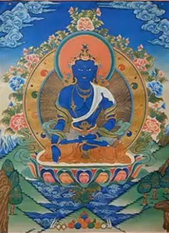Vairocana
2. ==Aksobhya==: è rappresentato con le **gambe in posizione del loto** e **una mano che tocca la terra** (*bhūmisparśa mudrā*). Questo gesto simboleggia il momento in cui **il Buddha chiama la terra a testimoniare la sua illuminazione**. Akṣobhya è raffigurato seduto su un trono di loto, che rappresenta purezza e distacco, e questa iconografia richiama anche l’immagine archetipica del *proto-Śiva* (Śiva nella sua forma primordiale).
3. Ratnasmbhava
4. Amithaba
5. Amoghasiddhi

#### Buddha emaciato (digiunante) del Gandhara

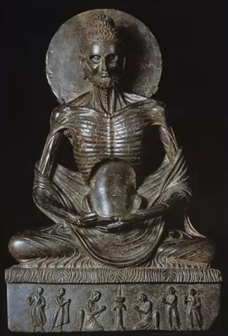E' evidentemente anoressico. Ha un ciuffo sul capo che in realtà è una protuberanza cranica.

#### Rappresentazioni dei piedi del Buddha

Esistono anche rappresentazioni simboliche del Buddha che mostrano solo i suoi piedi. Questi simboli (*buddhapāda*) erano comuni soprattutto nelle prime tradizioni buddhiste, dove si evitava di raffigurare direttamente il Buddha in forma umana. I piedi possono essere incisi con simboli sacri, come la ruota del Dharma (*dharmachakra*), rappresentando la presenza divina del Buddha e il suo percorso spirituale.


```markmap
# Buddha
## Siddharta, Thagata, Sakya-muni, jina, bhagavat...
## Vita
- Figlio di un rajan
- Protetto dalle sofferenze, scoprendole si dedica all'ascetismo a 29yo
- Segue i maestri ma manca qualcosa
- Sceglie la via di mezzo e raggiunge il risveglio
- Muore avendo raggiunto il nirvana terreno

# Buddha cosmici
## Sono rappresentazioni dei momenti cruciali
### Aksobhya
- Momento del risveglio
- Tocca la terra, testimone
- Posizione del loto
```

## Il Dharma

Abbiamo già visto questa parola in contesti diversi: può significare **giustizia, costumi, virtù, rettitudine, religione o insegnamento**. 

Nel Buddhismo, il Dharma assume il principale significato di Legge, a dire la Dottrina stessa che il Buddha insegna e sui cui insegnamenti si sviluppa. Questo insegnamento si basa sulle quattro verità, sull'ottuplice pensioro e sul controllo della mente, che si realizzano tramite:

* ==Dhyana==: pratiche **meditative**
* ==Prajna==: è la "**saggezza** suprema" che ci permette di comprendere in profondità e istantaneamente l'insegnamento buddhista.

Per ottenere questi, sono utili l'acquietamento (samatha), la piena consapevolezza (sati) e la visione penetrante (vipasyana).

Il Dharma fa quindi parte dei ==tre gioielli== - triratna - del buddhismo: Dharma, comunità dei monaci (sangha) e il Buddha stesso.

### Le 4 nobili verità

Sono dette nobili, *arya*.

1. ==La nobile verità del **dolore** - **duhkka**==
   Esiste il dolore, che è dato da tutto: essere vicini a qualcosa che ci dà dolore, nascere, la vecchiezza, la morte. Basically tutto :) Insomma individuiamo il problema dai.
2. ==La nobile verità dell'**origine del dolore** - **samudaya**==
   Il dolore è dato dalla brama, dalla sete; io desidero qualcosa che non posso ottenere, ed è questo a causare il dolore. Il desiderio è la causa fondamentale del dolore, e la nostra ignoranza riguardo alla natura impermanente delle cose lo alimenta.
3. ==La nobile verità della **cessazione del dolore** - **nirodha**==
   Nirodha significa "cessazione" o "estinzione", La sofferenza può essere completamente estinta quando si eliminano la brama e l'attaccamento. La fine della sofferenza avviene quando cessiamo di desiderare, comprendendo la natura transitoria delle cose.
   E' una parola che era presente anche nel Patanjiri.
4. ==La nobile verità del **sentiero che conduce alla cessazione del dolore** (dukkhanirodagaminipatipada)==
   Sono le vie concrete per raggiungere il 3, e consiste nell'Ottuplice Sentiero.

### L'ottuplice sentiero

L'ottuplice sentiero, o aryastanga-marga, che il Buddha insegna come una terapia da seguire per la cura della sofferenza sono:

1. ==Retta visione==
   Era tradotto anche come retta fede. In effetti, questa visione mira alle 4 verità: **dobbiamo avere la nostra mente diretta alle 4 verità.**

2. ==Retta intenzione==
   Si riferisce alla volontà di **distaccarsi dai desideri egoistici e dannosi**, e sviluppare intenzioni di non nuocere, di compassione e di benevolenza verso gli altri. Dobbiamo comprendere il distacco e l'astensione dal voler nuocere, dall'essere crudeli...

3. ==Retta parola==
   La parola deve essere usata per promuovere la verità e la compassione, **evitando menzogne**, parole dannose o inutili. Non dobbiamo usarla per arrecare danno.

4. ==Retta azione==
   Consiste nel compiere azioni giuste, che non arrechino danno a nessuno, ma che siano moralmente e eticamente corrette. Ciò include **evitare uccisioni, ruberie, e comportamenti dannosi (per proprio scopo).**

5. ==Retti mezzi di vita (sostentamento)==
   Si riferisce al **lavoro che si fa per vivere**. La società è organizzata in diversi lavori; essere guerrieri è un'azione che crea dolore, ma può essere necessario per difendersi; creare veleni è pericoloso ma può essere medicinale, mangiare cibandosi non di animali per quanto possibile...

6. ==Retto sforzo==
   È l'**impegno attivo nella pratica spirituale**, facendo sforzi per mantenere pensieri, parole e azioni positive. Se ho l'intenzione positiva  devo fare sforzo per mantenerla

7. ==Retta attenzione==
   E' la **mindfulness**, che significa memoria. E' una concentrazione viva che implica dominio di sè e attenzione al presente (il passato è passato, il futuro non c'è ancora)

8. ==Retta concentrazione==

   Questa è la **meditazione profonda** che porta alla realizzazione spirituale. Si dice che essa superi lo samādhi descritto nello yoga, poiché il suo scopo è il raggiungimento del Nirvana, piuttosto che semplicemente un'alta condizione meditativa.

```markmap
# Dharma
## Tre gioielli
- Buddha
- Dharma
- Sangha (monaci)
## 4 nobili verità
- Verità del dolore
- Verità dell'origine del dolore
- Verità dela cessazione del dolore
- Verità del cammino per la cessazione del dolore
## Ottuplice sentiero
- Retta visione
- Retta intenzione
- Retta parola
- Retta azione
- Retto sostentamento / mezzi di vita
- Retto sforzo
- Retta attenzione
- Retta concentrazione
## Altro
- Tetralemma
- Coproduzione condizionata
- Meditazioni (dhyana)
- Il non sè: non nel senso di nichilismo, ma per staccarci da ciò che è inutile


```


### Concetti filosofici

Oltre alle quattro nobili verità e al cammino etico e spirituale contenuto nella quarta, il buddhismo presenta molteplici riflessioni filosofiche, compiute dal buddha stesso e dai suoi discepoli. 

Nel Buddhismo esiste il concetto di via di mezzo (che implica non danneggiare il corpo, evitando gli estremi di eccesso e privazione).

Alcuni concetti per eccellenza della filosofia buddhista includono:

* ==Tetralemma==
  Un'argomentazione logica che esplora la natura della realtà attraverso quattro possibilità contrapposte, sfidando le concezioni ordinarie di esistenza e non-esistenza.
  Questa logica viene utilizzata nel contesto del Buddhismo per superare la rigida divisione tra il "vero" e il "falso". L'obiettivo è far comprendere che la realtà non può essere semplicemente ridotta a dicotomie come "esiste" o "non esiste". In particolare, il tetralemma è utilizzato per esplorare il concetto di "impermanenza" e per mettere in discussione la percezione che abbiamo delle cose come entità fisse e separate. Un'affermazione può essere vera, falsa, sia vera che falsa e nè vera nè falsa.
* ==Coproduzione condizionata==
  L'idea che tutti i fenomeni esistano solo in relazione ad altri e che nulla esista in modo indipendente. Questo principio descrive il modo in cui tutte le cose sono interconnesse e influenzate a vicenda, il che implica che nulla abbia un'esistenza intrinseca.
* ==Meditazioni== (dhyana)
  La meditazione è una pratica fondamentale nel Buddhismo per sviluppare consapevolezza, distacco e compassione. Diversi stadi di meditazione conducono alla realizzazione del Nirvana.
* La realtà è rappresentata come un’aggregazione (skandha, aggregato) di elementi o entità ridottissime, i dharma o dhammā, che costituiscono anche i complessi psicofisici.

Diverse scuole negano la sostanzialità dei dharma, che quindi vengon oritenuti privi di sè; questo porta spesso a definire il buddhismo come dottrina nichilista. Ma allora a che pro non nuocere agli altri e seguire il karma? La risposta è, sostanzialmente, perché il Buddha ha detto così.

### Il non sè

La speculazione buddhista arriva a negare l’esistenza stessa della realtà ultima, dichiarando quindi il concetto filosofico dell’ anātman (anattā in pāli).

Il concetto di "non-è" (o assenza di esistenza intrinseca) deriva dall'anatman, cioè l'idea che non esista un sé permanente. Tutti i fenomeni, incluso il sé, sono composti da cause e condizioni e non hanno un'esistenza propria.

|                                        |                                                              |
| -------------------------------------- | ------------------------------------------------------------ |
| L'entità finale è priva di sé          | Nel Buddhismo, non c'è un'anima immortale o un'essenza eterna (anatman). Questa è una delle idee principali che lo distingue dall'Induismo, dove si crede che il sé (atman) sia identico al Brahman, cioè alla realtà ultima.<br />Il Buddhismo dice che il concetto di un'entità ultima, come il Brahman, è una "vana teoria" perché non può essere dimostrata ed è inutile nel percorso verso il nirvana. |
| Se non esiste un sé, non è nichilismo: | Questa negazione del sé non significa che il Buddhismo sia "nichilista" nel senso occidentale (cioè che niente ha valore o senso).<br/>Piuttosto, l'anatman serve a invalidare altre teorie metafisiche che distrarrebbero dal percorso spirituale. Lo scopo non è negare tutto, ma mostrare che certe credenze fisse non sono utili per liberarsi dalla sofferenza. |

Secondo il Buddhismo, non esiste un'entità ultima (come il Brahman nell'Induismo) perché tutto è privo di un'essenza propria. Il concetto di Brahman (la realtà eterna e immutabile dell'Induismo) è considerato una "vana teoria" dal Buddhismo, poiché non è utile al percorso di liberazione dalla sofferenza.

**Il punto è che l'anatman (*assenza di sé*) non serve a distruggere tutto in senso nichilista, ma a liberarci da attaccamenti e concetti che ostacolano il cammino verso il nirvana**. Non serve credere in un sé o in un'entità finale per vivere senza sofferenza.L'idea del "non-è" non mira a negare tutto, ma a evitare che si creino teorie inutili che ostacolino il progresso spirituale. Il Buddhismo si concentra sull'eliminare la sofferenza, non sul formulare speculazioni metafisiche.

Nāgārjuna è un filosofo buddhista fondamentale, fondatore della scuola Madhyamaka (*via di mezzo*). La sua filosofia si basa sul concetto del vuoto (*śūnyatā*), cioè che nulla ha un'esistenza intrinseca. Nāgārjuna distingue tra la verità relativa (utile nella vita quotidiana) e la verità assoluta. Secondo la verità assoluta, niente esiste intrinsecamente, nemmeno le dottrine buddhiste come le 4 verità, il Buddha o il nirvana.

Quindi, Nagarjuna pur essendo buddhista critica l'attaccamento alle sue stesse dottrine.  Questo non è un attacco al Buddhismo, ma un modo per mostrarne la vera essenza, cioè superare ogni attaccamento. Questo studioso era della casta superiore, e aveva un intelletto acuto; lo definiscono criptobuddhista perché era così alto.

La sua spiegazione è che ci sono due tipi di verità: a un livello più basso, quotidiano, è utile dire che esistono perché devo tendere al nirvana, il Buddha mi aiuta nella comprensione e a liberarmi dalle sofforene; a un livello superiore (scuola del vuoto) capisco che non ha senso parlare di queste cose, perché in questo stato di nirvana ho superato queste cose. Le 4 verità sono un solo strumento, perché altrimenti potrei agganciaramici e non fare il passo ultimo. 

La scelta di Nāgārjuna si spiega quindi con la teoria della Via di Mezzo, della vacuità e dei due tipi di verità, una assoluta e una relativa.

## Fuori dall'India: lo Zen

>  Si dice con la z sonora, non con la z!! 

```markmap
# Zen
## Origine e differenze
- Arriva in giappone grazie a un regalo di un re coreano 
- Poi si evolve oltre la sola meditazione e si associa al satori
- L'illuminazione è improvvisa ed è l'annullamento della contrapposizione sogg/ogg
- Il satori fa superare il samsara
## Scuole
- Rinzai: brevi enunciati paradossali per stimolare il risveglio
- Soto: meditazione, anche condivisa.
## No-mente (mu-shin)
- Annullamento della coscienza attiva
- Adottato dai samurai

```


Il buddhismo si diffonde con la via della seta e piano piano **arriva fino in Giappone**, dove piano piano si unisce allo shintoismo.

Tramite un'ambasciata, un re coreano regala in dono una statua di Sakyamuni, che è sempre il Buddha. Questo dono è prezioso non tanto per la statua, ma per **l'insegnametno** (bokkyou) del Buddha. Dopo l'introduzione iniziale, monaci cinesi e coreani viaggiarono in Giappone per insegnare il Buddhismo e influenzarono notevolmente la sua evoluzione. Portarono testi, rituali e pratiche che si adattarono gradualmente alla cultura giapponese.

Lo *zen* deriva dal termine sanscrito *dhyāna*, che significa "meditazione". **Con il tempo, il significato si è ampliato: mentre inizialmente si riferiva alla pratica meditativa, nello Zen viene associato all'illuminazione (*satori* in giapponese).**

Alcuni pensatori ritengono che ridurre lo Zen a semplice meditazione non colga la sua essenza, che è il raggiungimento di un livello di consapevolezza e intuizione oltre il dualismo. Nello Zen, la **meditazione (*dhyāna*) conduce a *prajñā*, una saggezza intuitiva che trascende la distinzione tra soggetto e oggetto, tra pensatore e pensiero.**

L'idea è che, una volta raggiunto questo stato di illuminazione, tutte le distinzioni concettuali diventano inutili, perché si percepisce la realtà per quello che è, al di là delle categorie mentali.

Insomma parte come imitazione ma poi si orienta a suo modo.

Questa illuminazione in giapponese viene tradotta con il termine ***satori***, risveglio. Esso permette di superare il ciclo di nascite e di morti, il samsara, e raggiungere lo stato nirvanico. **Il risveglio può avvenire in un attimo, all’istante**, improvviso e non come qualcosa che si acquisisce seguendo uno schema determinato; ciò ovviamente non esclude l’importante e costante lavoro di pratica meditativa Di particolare rilevanza, per trascendere lo stato attivo di partecipazione del reale si ricorre alla dottrina della vacuità, śunyatā 

Due scuole principali:

* ==Rinzai==: utilizza i *koan*, **brevi enunciati o domande paradossali, per stimolare la meditazione e il risveglio**. Anche l'ambiente esterno deve aiutarmi a questa meditazione interiore, e ripetere queste frasi mi aiuta a non distrarmi: questi *koan* servono a spingere la mente oltre la logica convenzionale, conducendo a un'intuizione improvvisa (*satori*).
  * Esempio di *koan*: "Qual è il suono di una sola mano che applaude?"
* ==Soto==: è rilevante la pratica della **meditazione**, anche **condivisa** con più persone. L'illuminazione non è considerata come un evento improvviso, ma come un processo graduale che si sviluppa attraverso la pratica costante della meditazione.. Si fa incrociando le gambe e meditando.

Un innocente cartone animato ha sulla schiena kanji molto più ampi e profondi (stesso kanji di Satori.) Il ku di Goku è il kanji per vuoto!

### No-mente (mu-shin)

La dottrina del «vuoto» (śunya, 空) è stata interpretata come l’equivalente psicologico nella forma di **mu-shin**, ovvero un’**assenza di coscienza attiva** (non-mente). Lo Zen, con la sua idea di svuotamento mentale (*mu-shin*, o "no-mente"), è stato accolto dalla classe guerriera dei samurai, che deve rimanere legati al senso di liberazione e di immediato simili allo zen.

*Mu-shin* si riferisce a uno stato mentale libero da distrazioni, pensieri o emozioni superflue, fondamentale per i samurai in battaglia. Questo stato mentale li aiutava a reagire istintivamente e con immediatezza, senza essere frenati da dubbi o paure.

Se si parla di samurai bisogna parlare anche di spada. E' un simbolo di fedeltà ma anche di abnegazione (es. devono essere i grado di ammazzarsi). La spada del nemico non deve essere il focus, e può essere usata per ucciderlo; una volta che la spada altrui si ferma su di te diventa una non spada, tua, e può uccidere l'avversario. (citazioni ma non so da dove). Non pensare nemmeno a te stesso: trascendi oggetto-soggetto. In altre parole, il samurai non si concentra sulla paura della spada dell’altro, ma la "neutralizza" mentalmente e la usa a proprio vantaggio. Questo approccio rispecchia il superamento della dualità tra sé e il nemico. Questo stato mentale di "no-mente" elimina la separazione e consente di agire in armonia con la situazione, senza esitazione.

Il Buddhismo promuove la non-violenza (*ahimsa*), ma **i samurai adattarono i principi zen alle necessità della guerra**. L'idea è che in battaglia non si combatte per desiderio personale o per vendetta, ma per un **dovere superiore** (ad esempio, la fedeltà al proprio signore o per proteggere). Questo ricollega alla filosofia zen: agire senza attaccamento al sé o agli esiti, in un modo puramente focalizzato sul dovere del momento.

## Nirvana

Il nirvāṇa (nir+√vā) rappresenta nella dottrina buddhista il non-divenire, l’opposto del saṃsāra e la cessazione dei moti che sconvolgono gli esseri, supera la concezione di non-stato e pensiero.

Il nirvāṇa è ineffabile e difficilmente, quindi, definibile tramite parole determinate, anche al negativo è di difficile decifrazione. Questo è in realtà dovuto proprio alla necessità di un distacco dalle forme mentali, esso è una cessazione dei moti e del divenire, è non-divenire.

Il nirvāṇa inoltre rappresenta due momenti differenti, raggiunti dal Buddha e che possono essere raggiunti da tutti/e. Quello finale, la cui concezione è stata indicata sopra, e un nirvāṇa invece da identificarsi come ottenibile ancora in vita, secondo il quale ci si priva della brama, dall’odio e dall’egocentrismo. 

l Nirvana può essere realizzato anche in vita (*nirvana con residui*), quando si è liberi da ogni desiderio e attaccamento. In questo stato, si continua a vivere ma non si è più condizionati dal karma o dalle emozioni che normalmente causano sofferenza.

L’assenza di *brama* (*tanha*) elimina l’azione egoistica, rendendo una persona imperturbabile di fronte alle situazioni del mondo. Questo concetto ha un suo successo con quelle figure semidivine che decidono di rinunciare a divenire dei Buddha. Sono persone che abbracciano il nirvana ma decidono di rivolgersi a coloro che ancora non la hanno raggiunta; si rinuncia al proprio risveglio per aiutare gli altri a raggiungerlo.

La concezione di non-mente precedentemente esposta e nota anche come mente-priva-di-mente permette di avere un’idea di come il nirvāṇa non sia un qualcosa che si possa raggiungere.

E' di contraltare alla teravada, alla dottrina degli antichi, che vedeva nel monachesimo un atto solo "per sè". Chi segue un cammino buddhista per liberare sè stesso segue una forma quasi contaminata. L’idea del Mahayana, invece, critica questa visione come troppo individualista, sottolineando che la vera illuminazione deve includere il desiderio di aiutare tutti gli esseri a liberarsi.

L'idea è che la buddhità ottenuta in questa vita è "di primo livello", e quella finale si ottiene con l'estinzione del corpo. 

## Avalokitesvara

Una peculiare figura del buddhismo (mahāyānico) è quella del **bodhisattva** (colui la cui essenza è la buddhità/risveglio o che è pronto per il risveglio) che sostituirà o supererà il concetto di arhat (arahant in pāli), perfetto, poiché compie il sacrificio supremo e ultimo, rinunciando all’entrata nel nirvāṇa per rimanere come guida a tutti gli esseri nel saṃsāra per un tempo pressoché infinito.

Il nirvāṇa è quindi difficile da raggiungere, ma a disposizione di tutti e l’immagine del benevolo buddha che entra nello stato finale di liberazione è l’esempio che egli invita a seguire.

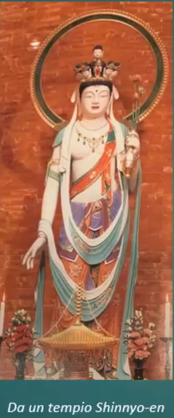Avalokitesvara è una delle figure più importanti del Buddhismo Mahayana, spesso venerato come il bodhisattva della compassione infinita. Si manifesta per aiutare tutti gli esseri a liberarsi dalla sofferenza, rinunciando al Nirvana completo per assistere gli altri.

I paradisi nel Buddhismo, come il Paradiso Puro (Sukhavati), sono luoghi simbolici o stati di coscienza associati a beatitudine e piacere spirituale, creati da figure illuminate come Amitabha Buddha. Tuttavia, questi paradisi non rappresentano il Nirvana, perché il Nirvana implica il completo superamento di ogni forma di attaccamento, persino al piacere e alla beatitudine.

## Esempi di domande da esame

|                                                              |                                                              |
| ------------------------------------------------------------ | ------------------------------------------------------------ |
| 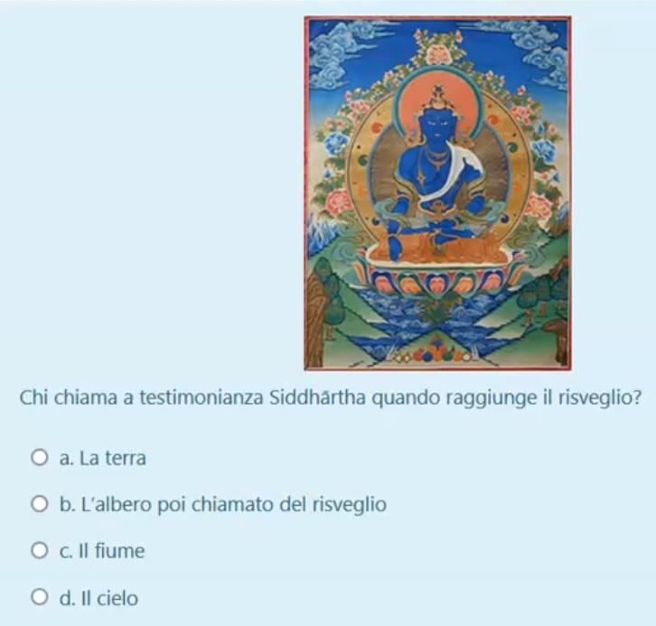 | La terra                                                     |
| 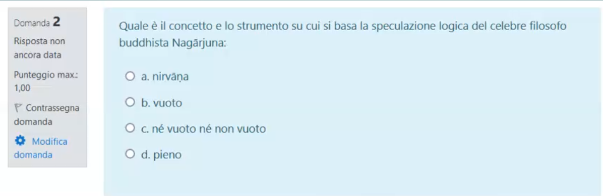 | Al buddha non piacciono le espressioni tipo nè vuoto nè non vuoto; è il vuoto. |

# 3 - Mindfulness

## La psicologia positiva

E' una psicologia che raggiunge una sua definizione di felicità negli ultimi anni.

Nasce negli Stati Uniti da due autori, spostando il focus della ricerca dal tema del disagio al tema del benessere.

Mihaly Csikszentmihalyi elabora il concetto di flow, flusso di coscienza ottimale; uno stato di felicità può essere ottenuto raggiungendo, attraverso un'attività o una situazione non permanente, una situazione in cui ci sentiamo completamente coinvolti e presenti in quello ceh facciamo; abbiamo una percezione del tempo alterata (molto veloce o lento). Oppure, stiamo affrontando una sfida in cui le nostre capacità sono molto adeguate.

Seligman, altro autore, ha sviluppato ulteriormente questi concetti arrivando alla definizione delle caratteristiche sostanziali della felicità:

1. Emozioni **p**ositive: le emozioni del momento sono prevalentemente positive
2. Coinvolgimento (**e**ngagement) : siamo completamente impegnati in quel che stiamo facendo.
3. **R**elazioni positive: per esempio quelle familiari
4. Significato (**m**eaning):
5. Realizzazione(**a**cccomplishment): raggiungere obiettivi

La nostra concezione della felicità quindi è abbastanza universale, ma legata alla nostra cultura.

Qualche cit:

> 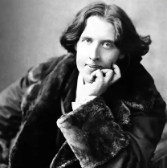Oscar Wilde scrive: 
> *Vivere è la cosa più rara del mondo; la maggior parte della gente esiste e nulla più.*

Lui insomma definisce una forte differenza fra il vivere e l'esistere.

> 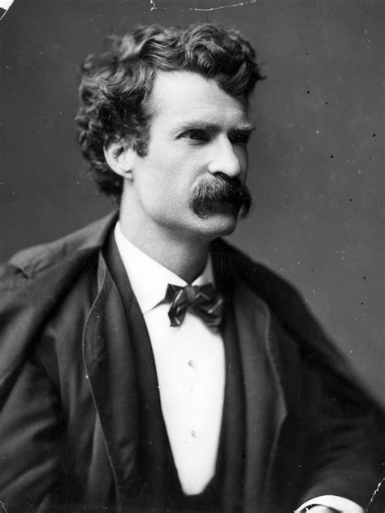Mark Twain dice:
> I due giorni più importanti nella tua vita sono il giorno in cui sei nato e il giorno in cui scopri il perché; introduce l'elemento dello scopo della vita.

## Etimologia

La felicità è un tema che fa discutere sin dai tempi più antichi. Il termine parte dal termine eudamonìa: **eu = bene e daimonia = demone, spirito guida**.

Umberto Galimberti è un nostro studioso del mondo antico, che per esempio spiega come la tradizione filosofica antica dell'occidente pensa sia possibile raggiungere la felicità. Vediamo cosa ci dice con un video:

[video "come raggiungere la felicità" - umberto galimberti]

Il sunto è:

* **Conosci te stesso**
* **Fai ciò che ti rende felice ma con MISURA**

Alla base del benessere c'è l'impegnarsi nelle cose che sentiamo nostre e che desideriamo; purtroppo pi nella vita dobbiamo scegliere a compromessi, e ci vuole coraggio per inseguire la nostra vocazione più profonda.

>  Gianluca Gotto, scrittore., scopre che la scrittura è la sua vocazione; lascia tutto e comincia a girare il mondo. Attraverso l'incontro con le persone riesce a metteee a fuoco la sua vocazione più profonda.

Come occidentali siamo molto più legati al fare; una riflessione su cosa abbiamo perso a causa della tecnica e del rischio di disastro totale dato dalla nostra incapacità di prevedere le conseguenze e avere misura.

```markmap
# Psicologia positiva
## Felicità
### Attività non permanente che ci coinvolge e ci fa sentire adeguati
- P ositive
- E ngagement
- R elationships
- M eaning
- A ccomplishments
### Galimberti
- "conosci te stesso"
- "fai ciò che ti rende felice con MISURA"
## Situa in occidente
### Cristianità
 - Non ci pensano dato che la felicità è nella prossima vita
 - Ostacoli
 	- Iperconnessione 
 	- Sovraccarico e obesità di informazioni
 	- Multitasking
 	- Vita frenetica
 	
 
```

## La situazione attuale

Abbiamo visto qual è il concetto di cosa abbiamo noi e quel che ha elaborato la nostra filosofia occidentale.

**Il mondo cristiano non ha sviluppato una riflessione sulla felicità in questo mondo, in quanto è qualcosa che appartiene all'altro mondo; ci rimane quindi solo il concetto greco.**

Molto diversa è la concezione della felicità in oriente. In oriente, Thich Nhat Hanh dice che il fondamento della felicità è la piena consapevolezza del momento presente. Se fossiimo consapevoli attimo per attipo potremmo essere sempre felici (ma vafanculo lol)

La consapevolezza per noi occidentali (e ormai pure per gli orientali occidentalizzati...) è nulla; abbiamo un'attività della mente intensa e continua, spesso non collegata all'attività presente poiché schiacciata dal peso del passato e del futuro.

**Viviamo la maggior parte del tempo con il pilota automatico inserito, senza consapevolezza del momento presente.**

Ci perdiamo in pensieri stressanti, rimurginiamo sul passato o sul futuro. Se invece è il presente a farci soffrire cerchiamo di negarlo e rifuggiamo le emozioni negative e dolorose.

Le tradizioni orientali invece ci icono di abbracciare tutte le emozioni.

> Scriveva Aristippo di Cirene : 
> La maggior parte degli uomini sopporta la propria esistenza, o indugiando nel passato o aggrappandosi al futuro. Pochi esseri suepriori riescono a vivere immergendosi nel presente.

quindi ecco, questo c'era anche in occidente ma si è perso.

## Ostacoli alla consapevolezza del momento presente

Quali sono oggi gli elementi che ostacolano la consapevolezza del presente e che determinano la diffusione di mindfulness?

- ==Sovraccarico di informazioni==
  
  >Libro "Ecologia Inferiore", Daniel Lumera e Immaculata de Vivo
  *"Una persona, mediamente, elabora fino a 74GB di informazione al giorno."*
  
  Si produce una sorta di alterazione percettiva. La chiamano anche **info-obesità;** stiamo affrontando un **bombardamento sensoriale e cognitivo senza precedenti**. Il sovraccarico informativo è la situazione in cui si è sottoposti a un'inondazione di informazioni senza avere i tempo di assorbirle, metabolizzarle e analizzarle con spirito critico. A lungo andare, questa situazione ci rende più stanchi e ha ripercussioni sull'aspetto emotivo.
- ==Iperconnessione==
  E' quella che non ci permette di staccare realmente la spina e di vivere realmente il presente; il cellulare non è più solo messaggi, ma **tutto il web a portata di mano**. 
  Ovunque siamo, è come se non ci fossimo; **perdiamo il contatto con la realtà** e le nuove tecnologie danno pure dipendenza.
  Studi recenti dimostrano che queste tecnologie sviluppano dipendenza, al punto da superare la dipendenza da droga, e questo crea seri problemi. La maggior parte di noi però non ne è consapevole. Questo causa una grave perdita di relazionalità.
- ==Ritmi di vita sempre più frenetici==
  Le giornate diventano una corsa con la sensazione di essere **pilotati** anziché padroni delle nostre azioni.
- ==Multitasking==
  E' stato dimostrato che il multitasking **riudce la produttività** del 40%, poiché i meccanismi neuronali attivati portano a una dispersione di concentrazione e energia non auspicabili per il nostro benessere.

  - Nel 2009 uno studio dell'università di Standford dimostra che non siamo programmati per multitaskare. Nel passaggio da un'azione all'altra non siamo più capaci di attenzione selettiva.
  - Inoltre, peggiora il livello di efficienza anche perché nel bombardamento di stimoli passando da un'informazione all'altra diventiamo incapaci di distinguere le informazioni importanti da quelle non.
  - Nel 2013, studio del Michigan State University, si mostra una relazione stretta tra depressione/ansai e multitasking. Il rapido passaggio fra azioni causa un sovraccarico cognitivo e aumenta la produzione di cortisolo.


## Conseguenze negative

Entro il 2030, l'OMS prevede che la depressione causata da questo stile di vita potrebbe essere la malatti apiù diffusa.

Non esseer consapevoli durante la nostra esistenza significa:

- sprecare la vita che stiamo vivendo
- Perdere informazioni importanti
- Perdere espereienze e occasioni importanti
- Non sfruttare a fondo il nostro potenziale
- Comunicare in maniera superficiale
- Rischiare maggiori incomprensioni nei rapporti con gli altri
- Rischiamo più infortuni e incidenti.
  Le morti sul lavoro sono spesso legate alla disattenzione e alla non presenza mentale. (ma anche no onestamente se sono in catena di montaggio grazie al cazzo che preferisco distrarmi)

> [!WARNING]  
>
> Vivere nell'inconsapevolezza rende più infelici di quanto ci si renda conto, e più esposti allo stress e ai problemi psicologici con tutte le conseguenze fisiche e mentali negative che ne possono derivare.

Quindi distinguiamo due concetti:

* ==Mindfulness==: stato mentale in cui si è consapevoli e pienamente presenti in cià che sta accadendo nell'istante presete
* ==Mindlessness==: Confusione mentale e inconsapevolezza del qui e ora.

Una mente che vaga è una mente infelice. La mente umana si distrae per circa la metà del tempo, qualunque cosa faccia. La mindfulness è l'opportunità di condurre un'esistenza migliore, scegliendo dove guidare la propria attenzione.

## Pratiche di consapevolezza del Plum Village

* ==Campana==: installiamo sul pc un programma che fa un suono ogni 15-30 minuti. Sentendolo, torniamo al respiro/corpo e alla consapevolezza di questo.
* ==Meditazione del semaforo==: al semaforo rosso, cogliamo l'occasione per respirare e sorridere.
* ==Rispondere al telefono==: quando squilla il telefono, lo lasciamo suonare per 3 volte per concentrarci per la chiamata e creare uno spazio per accogliere la sofferenza di chi ci chiama.
* ==Lavarsi i denti==: Quando ci laviamo i denti, apprezziamo la presenza dei nostri denti.

La mindfulness:

* aumenta la consapevolezza
* abbandonare i giudizi
* riduce stress e ansia
* sostituisce meccanismi distruttivi con funzionali.

# 3  - Mindfulness

```markmap
# Mindfulness
## Radici nel buddhismo, arriva da noi nei 60-70
## Thich Nath Hanh
- Si batte per la pace in Vietnam
- Crea i primi Plum Village in francia e poi li diffonde in giro
```


La mindfulness è la pratica del prestare attenzione che ci aiuta a vivere consapevolmente il presente; ci permette di riconoscere dov'è la nostra attenzione e di riportarla al qui e ora, assaporando il momento.

La tradizione buddhista promuove la pratica dell'attenzione piena come strumento per svegliarsi dallo stato di coscienza dormiente secondo il quale agiamo prevalentemente in automatismo, senza quasi renderci conto di ciò ceh facciamo-pensiamo-sentiamo-diciamo.

## Origini della mindfulness

Il concetto di mindfulness affonda le sue **radici nelle tradizioni contemplative buddhiste**, anche se in occidente è stato formalizzato senza riferimenti religiosi o filosofici.

Tuttavia troviamo alcuni degli elementi chiave della mindfulness in tutte le grandi tradizioni del mondo.

### Occidente: anni 60-70

L'invasione cinese del Tibet e decenni di guerra nel sud-est siatico hanno costretto all'esilo in occidente molti monaci e molti maestri buddhisti. I giovani occidentali che sono andati in oriente a imparare la meditazione nei monasteri sono poi diventati insegnanti in Occidente.

I maestri Zen di altre tradizioni sono venuti in Occidente in visita o a insegnare, richiamati dal crescente interesse.

## Thich Nhat hanh

Monaco buddista vietnamita, scrittore e attivista per la pace, Thich Nhat Hanh è una delle figure spirituali più influenti del XX secolo. Durante la guerra del Vietnam, si batte instancabilmente per promuovere la pace, diventando un simbolo del movimento non violento.

Lo stesso Martin Luther King lo propone come premio nobel per la pace.

Dopo che lavora per la trattativa di pace **rimane in francia**, dove continua a impegnarsi per la non violenza.

In Francia fonda il primo **Plum Village**; pianta migliaia di pruni in un terreno desolato, e da quello in tutto il mondo ne sorgono molte altre.

Sono **comunità monastiche che durante l'estate vengono aperte alle persone esterne**; la più vicina è a Bordeaux. Le persone possono passare un periodo di consapevolezza e meditazione.

Da Plum Village, si è spostato in altri paesi per diffondere i suoi insegnamenti, creando comunità simili in America, Asia e Australia. La sua visione di una vita consapevole ha raggiunto milioni di persone in tutto il mondo, trasformando non solo i luoghi in cui ha vissuto, ma anche le vite di chi ha incontrato.

Le sue opere sono state tradotte in tutte le lingue. Diffonde lel tecniche di meditazione e le integra con le pratiche occidentali.

Nel corso dei decenni Thich Nhat Hanh **condivide il suo ideale di leadership compassionevole.** Grazie alla sua esperienza personale, spesso dolorosa, elabora un codice etico semplice ma potente con il quale orientare il cammino dell'umanità. **Chiama la mindfulness "disciplina essenziale";**  nel suo ultimo libro affronta il tema della crisi ecologica, e spiega che dobbiamo guardare dentro di noi per trovare una via di uscita non solo come individui ma anche come collettività.

Il suo libro "Il miracolo della presenza mentale" è il primo libro che porta all'attenzione generale l'argomento della consapevolezza, aprendo nuovi orizzonti della scena della emditazione e aprendo la praticha fuori dalla sala di meditazione, applicabile a tutti i giorni.

### Testi

> "Ci sono due modi per lavare i piatti. Il primo è lavare i piatti per averli puliti, il secondo è lavare i piatti per lavare i piatti."

> "Un mandarino è fatto a spicchi. Se sai mangiare uno spicchio probabilmente potrai mangiarlo tutto, ma se non sai mangiare uno spicchio non puoi mangiare il mandarino."

Altri suoi libri sono

* ==La vida di Siddharta il Buddha==
* ==La pace è ogni passo==: è un libro in cui espone la camminata consapevole.
* ==Respira! Sei vivo==: arriviamo a una delle pratiche che sono al centro, ovvero l'attenzione al respiro. Il respiro è un mezzo per risvegliarsi e mantenere la piena attenzione.
* ==Spegni il fuoco della rabbia==: gestione delle emozioni e della vita emotiva
* ==Buddha cristo vivente==: rintraccia negli insegnamenti della religione cattolica le assonanze e i principi fondamentali della vita consapevole.

La presenza mentale è il processo di limentare la consapevolezza del presente; per restare consapevoli bisogna praticare proprio adesso, nella quotidianità e non solo durante le sedute di meditazione.

### Indicazioni

"Ai principianti suggerico il metodo del seguire il corso del respiro"

- Contare i respiri: posizione comoda, cominciamo a contare i respri da 1 a 10. Questo calma il respiro, che deve diventare lieve regolare e fluido.
- Tenere il viso rilassato, atteggiandoci ad un sorriso

**Il momento presente è il solo momento di cui disponiamo ed è la fonte di ogni momento; vivere in piena coscienza e rallentare il proprio passo è suffciente.**

Ispirando e espirando, respirando consapevolmente, cominciamo a riordinare la nostra casa.

Un altro interessante aspetto legato a queste pratiche è il **riconoscimento e l'accettazione delle nostre emozioni**. Riconoscere ed essere in contatto con le emozioni senza giudicarle o respingerle.

Per Tikh, la tua felicità e pace interiore sono la cosa migliore non solo per noi stessi ma anche per gli altri; essere in armonia con sè stessi e gli altri è il contributo migliore per la pace.

## La mindfulness e tradizione medico psicologica occidentale

* 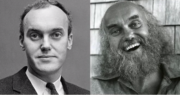Facciamo un po' di approfondimento su **Richard Alport**, che ci spiega come la mindfulness è entrata nella tradizione medica degli US.

  Ci sono stati molti giovani studiosi che si sono recati in oriente per apprendere le pratiche dai monaci orientali. Richard, uno psichiatra medico clinico psicologo, è stato per tanto tempo in oriente a praticare e ha preso anche il nome orientale **Ram Dass** (Servo di Dio) per poi tornare in occidente e diffondere la pratica.

  Il suo testo bestseller "Be here now" è molto diffuso in US.

* 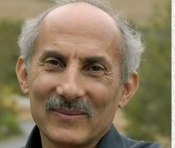Un altro importante è **Jack Kornfield**, psichiatra che vive per molto tempo in oriente dove apprende la pratica della meditazione e diffonde quel che ha imparato.

  Scrive "Il cuore saggio", una guida agli insegnamenti  fonamentali della psicologia buddhista.

Ce ne sono molti altri.

### Job Habat-Zinn

Una delle persone che hanno più contribuito alla meditazione, partendo dalla scienza, è **Job Kabat-Zinn**; newyorkese, è stato un **medico** che ha praticato la meditazione con Thikh Nah Than ma anche altri monaci. Era anche insegnante di yoga. Poi piano piano ha pensato di integrare queste pratiche anche nella sua medicina. 

**Negli anni 70 definisce la mindfulness in modo laico. Praticava Vipassana.**

Quando il suo lavoro lo mette in contatto con i malati terminali si inizia a chiedere come questa meditazione potesse aiutare. Poichè i primi risultati furono significativi, scrive il protocollo "Mindful Meditation for Stress Reduction". Un suo merito è stato quello di **tradurre il concetto di sofferenza/dukkha con stress.**

**Nel 79 fonda la Clinica per la Riduzione dello Stress e poi il Centro della Mindfulness in Medicina. Crea una rete per le persone che il sistema sanitario non è in grado di aiutare.**

Questa si chiama **medicina partecipativa**, perché offre la possibilità di coinvolgersi più pienamente verso il persorso verso una maggiore salute.

Il programma che lui propone è un programma di gruppo di **8 settimane**, complementariamente alla medicina tradizionale, per un'ampia gamma di disturbi.

## Protocollo MBSR (Mindfulness Based Stress Reduction)

E' fondato sull**'esperienza diretta** e sulla **confivisione in gruppo.**

Il percorso parte con la fondazione di un gruppo di persone che si ritrovano per imparare la mindfulness. I gruppi sono dai **15 ai 30 partecipanti**. Ci si riunisce 1 volta alla settimana per 2 ore e mezza. Attraverso questi incontri si pratica **meditazione formale** seduta, camminata, body scan, yoga... ma anche **meditazione informale** che aiutino la finalità di favorire l'acquisizione della consapevolezza dei momenti di vita quotidiana.

I gruppi di MBSR sono misti e includono persone con problematiche età ed estrazione sociale diverse, poiché si focalizza su ciò che le persone hanno in comune in quanto esseri umani.

Secondo la pratica di Kabat-Zinn, i successi relativi a questa pratica hanno fatto sì nel corso del tempo che i protocolli venissero sempre più perfezionati. Il protocollo è diffuso ed è passibile di analisi scientifica

### Atteggiamenti fondamentali

1. **Non giudizio**: evitare di giudicare ciò che ci sta accadendo.
2. **Pazienza**
3. **Assumere l'atteggiamento mentale del principiante**
4. **Fiducia**: fidarsi di noi stessi e delle nostre sensazioni è il passo fondamentale per iniziare a fidarsi degli altri.
5. **Accettazione**: serve ad amarci da subito, nel presente. Questo rende addirittura più facile cambiare (es. perdere peso) perché questo diventerà meno importante.
6. **Non cercare risultati**
7. **Lasciare andare**

Questi atteggiamenti fondamentali non bastano: ci sono altre qualità di mente e cuore che aiutano ad allargare la consapevolezza, e sono simili a quelle di TNT: **non nuocere, essere generosi, praticare la gratitudine, tolleranza, perdono, gentilezza, compassione, gioia empatica ed equanimità.**

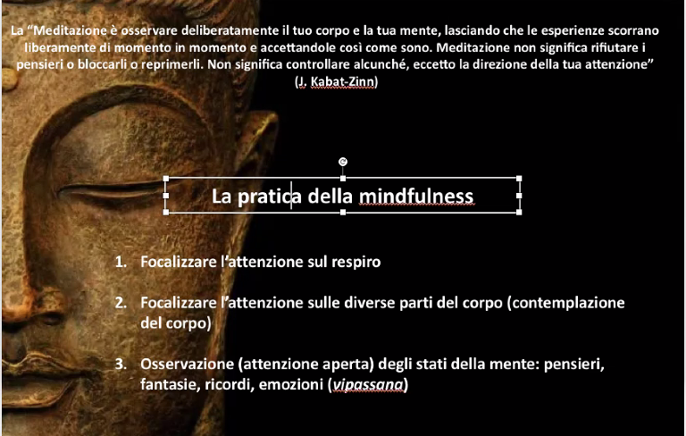

## Collegamento con le neuroscienze

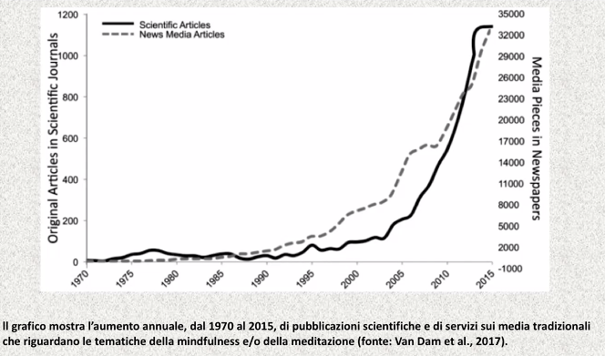

Nasce il mind&life institute, dove troviamo alcuni personaggi già visti

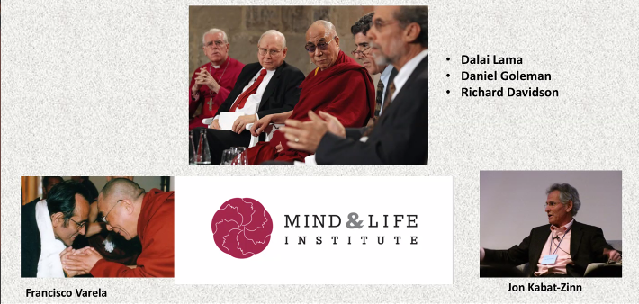

Richard Davidson fonda questo primo laboratorio di ricerca, che permette di pubblicare su riviste ad alto impatto portando allo sviluppo esponenziale.

Sotto questo istituto sono avviate diverse azioni di ricerca che si svolgiono in tutto il mondo, finalizzate allo scambio ravvicinato di ideee fra i massimi scienziati e i monaci che meditano.

### Neuroplasticità

Il principio è che il nostro cervello è dotato di una plasticità, ovvero una caratteristica tipica dei circuiti neuronali di riadattarsi attraverso dei meccanismi di interdipendenza fra qquello che pensiamo e le strutture fisiche del cervello. Possiamo quindi influenzare e plasmare fisicamente la conformazione di diverse regioni cerebrali e delle loro interconnessioni.

### Esperienza nello sviluppo cerebrale

Emerge che l'esperienza ha un ruolo centrale nell'attivazione dei circuiti cerebrali: sollecitando la mente nei tempi opportuni e con continuità possiamo fare la differenza.

### Neuroscienza contemplativa

Branca che è molto collegata alla mindfulness. L'obiettivo è studiare gli effetti delle pratiche meditative per cogliere il rapporto fra mente, corpo e consapevolezza.

Questi risultati si basano su esperienze di laboratorio che mostrano come la meditazione induca, nei praticanti di lunga data ed esperti, un ispessimento sia dell'area cerebrale prefrontale sia dell'insula (struttura in profondità che fa comunicare i lobi).

Esiste una correlazione scientificamente dimostrata fra meditazione e conformazione del cervello.

approfondimenti


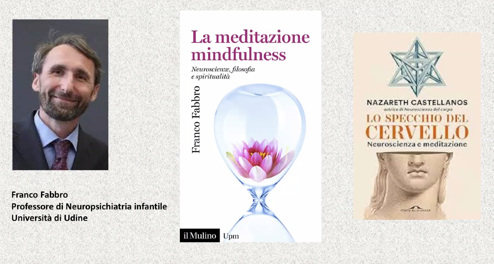


